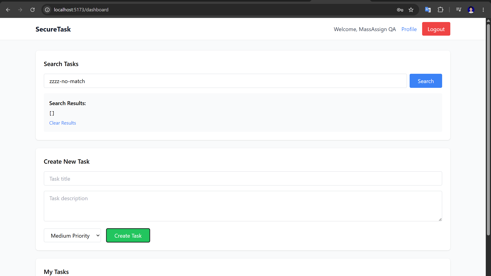
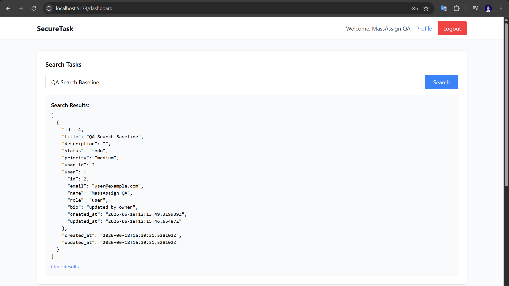
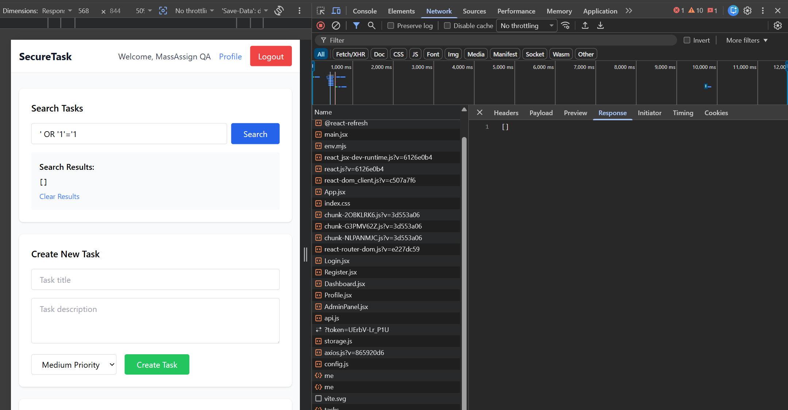
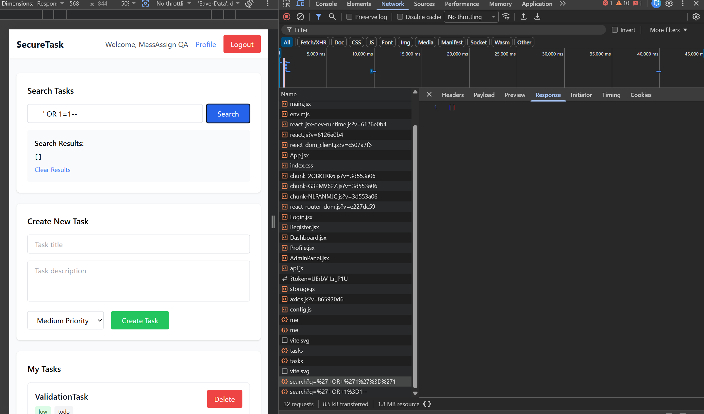
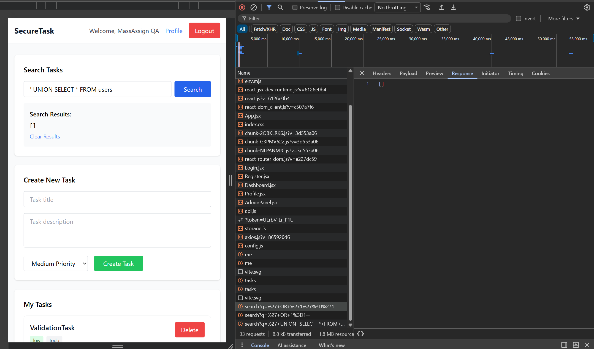
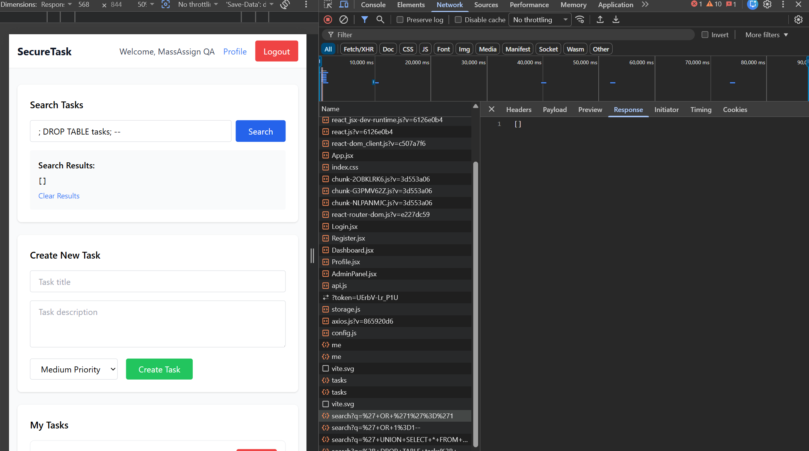
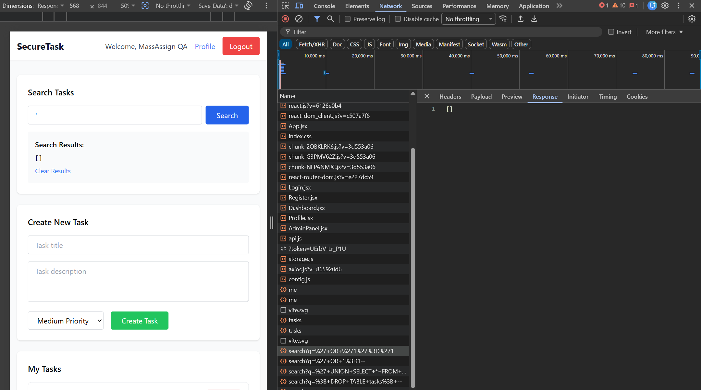
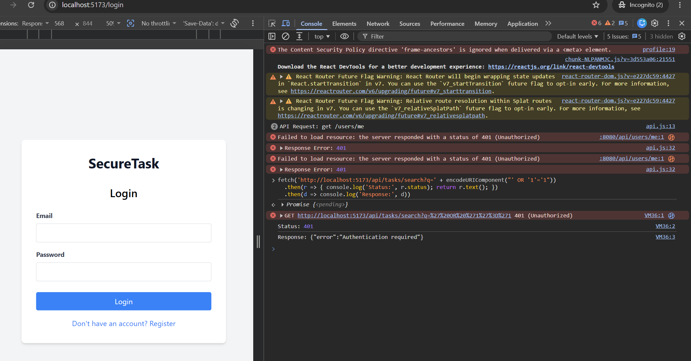
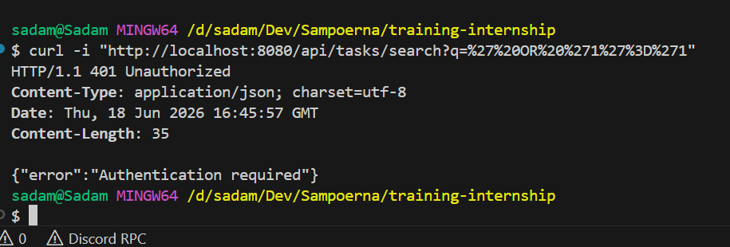

# SQL Injection Manual Test Cases

## TC-SQL-001: Task Search Handles SQL Injection Payloads Safely

**Source Finding**: `SQL-001`  
**Priority**: Critical  
**Category**: SQL Injection  
**Component**: Backend, API, Database  
**Endpoint/Page**: `GET /api/tasks/search?q=[query]`, Dashboard search

### Objective

Verify that task search treats user input as literal search text and cannot be manipulated through SQL injection payloads.

### Preconditions

- Database, backend, and frontend are running.
- A regular user account exists.
- At least one task exists with a normal title/description.
- If testing the fixed implementation, the tester is logged in because search should require authentication.

### Test Data

```text
' OR '1'='1
' OR 'a'='a
' OR 1=1--
admin'--
' UNION SELECT * FROM users--
; DROP TABLE tasks; --
' OR SLEEP(5)--
'
')'
```

### Test Steps

1. Login as `user@example.com / password123`.
2. Create a task with a unique title, for example `QA Search Baseline`.
3. Search for a random non-matching string such as `zzzz-no-match`.
4. Record the baseline result count.
5. Search with each SQL injection payload from **Test Data** through the Dashboard search box.
6. Repeat the same payloads through the API.

```bash
curl -i "http://localhost:8080/api/tasks/search?q=%27%20OR%20%271%27%3D%271"
curl -i "http://localhost:8080/api/tasks/search?q=%27%20UNION%20SELECT%20%2A%20FROM%20users--"
curl -i "http://localhost:8080/api/tasks/search?q=%27"
```

7. Observe whether unrelated tasks, user data, SQL errors, or delayed responses are returned.

### Expected Vulnerable Result

- Search returns unrelated tasks or all tasks.
- Search may expose user data through union payloads.
- SQL/database errors may be visible to the user or API caller.
- Anonymous API requests may be accepted.

### Expected Secure Result

- Payloads are treated as literal search text.
- Results are empty or contain only legitimate matching tasks owned by the authenticated user.
- No SQL errors or database details are exposed.
- Anonymous requests return `401 Unauthorized`.
- No response delay is triggered by time-based payloads.

### Actual Result

Diuji 2026-06-19.

- Payload SQL injection (`' OR '1'='1`, `' UNION SELECT * FROM users--`, `' OR SLEEP(5)--`, dll) dimasukkan melalui search box dan API.
- Semua payload diperlakukan sebagai teks literal — hasil pencarian kosong atau hanya task milik user yang cocok.
- Tidak ada SQL error, data user lain, atau delay response.
- Request anonim (tanpa login) → `401 Unauthorized`.

### Status

- [x] Pass
- [ ] Fail
- [ ] Blocked

### Evidence

**BEFORE (Vulnerable — `training/` :8081):**


**AFTER (Fixed — `security-training/` :8080):**











### Retest Notes

Retest after search is protected by authentication, scoped by user ID, and implemented with parameterized queries.
