# XSS Manual Test Cases

## TC-XSS-001: Task Description Does Not Execute Stored XSS

**Source Finding**: `XSS-001`  
**Priority**: High  
**Category**: Stored XSS  
**Component**: Frontend, Backend, Database  
**Endpoint/Page**: `/dashboard`, `POST /api/tasks`

### Objective

Verify that malicious HTML or JavaScript stored in task descriptions does not execute when the Dashboard renders tasks.

### Preconditions

- Application is running.
- Tester is logged in as a regular user.

### Test Data

```html
<script>alert('XSS')</script>

<svg onload=alert('XSS')></svg>
<div onmouseover=alert('XSS')>Hover me</div>
<a href="javascript:alert('XSS')">Click</a>
```

### Test Steps

1. Navigate to Dashboard.
2. Create a task named `XSS Task Description QA`.
3. Put one payload from **Test Data** into the Description field.
4. Save the task.
5. Return to or refresh the Dashboard.
6. Repeat for each payload.
7. Observe alerts, console messages, DOM rendering, and Network responses.

### Expected Vulnerable Result

- Browser alert or JavaScript execution occurs.
- Payload renders as active HTML.
- Event handlers such as `onerror` or `onmouseover` execute.

### Expected Secure Result

- Payload is displayed as safe text or sanitized.
- No alert, script, redirect, cookie access, or JavaScript execution occurs.
- Browser console shows no successful script execution caused by user input.

### Actual Result

Diuji 2026-06-19.

- Payload `<script>alert('XSS')</script>`, ``, `<svg onload=...>`, dll dimasukkan ke task description.
- Semua payload ditampilkan sebagai teks biasa — tidak ada alert atau JavaScript execution.
- React secara default melakukan escape HTML saat rendering.

### Status

- [x] Pass
- [ ] Fail
- [ ] Blocked

### Evidence

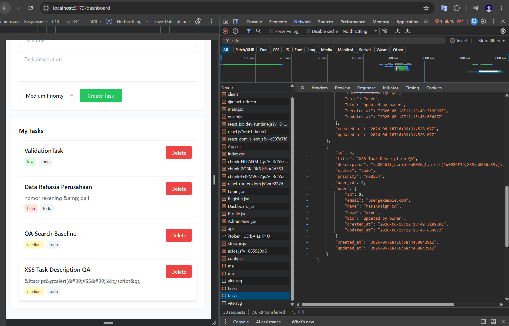
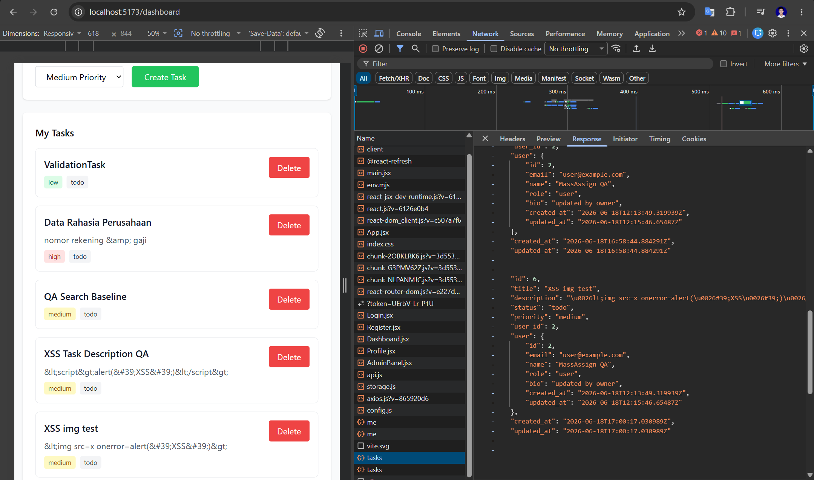
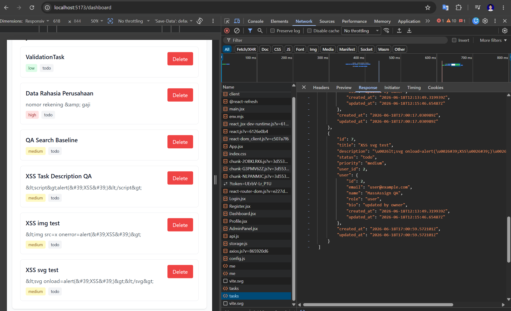
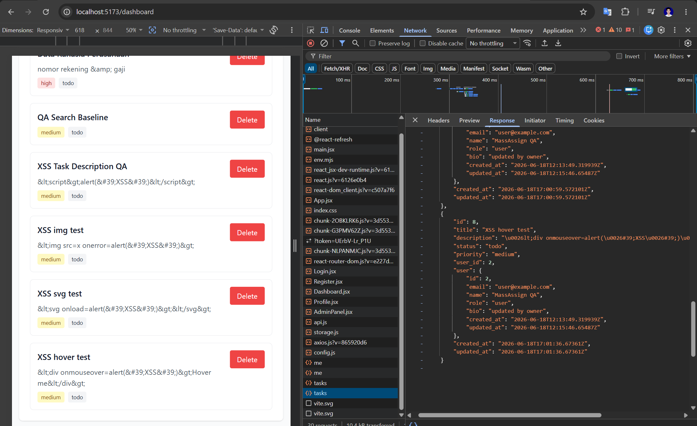
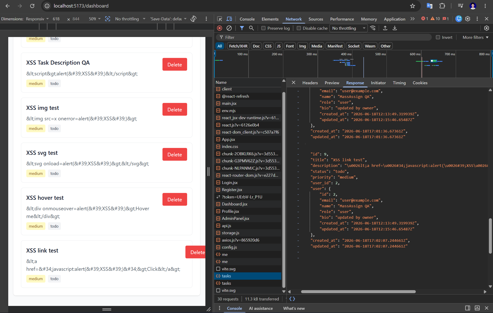

## TC-XSS-002: Profile Bio Does Not Execute Stored XSS

**Source Finding**: `XSS-002`  
**Priority**: High  
**Category**: Stored XSS  
**Component**: Frontend, Backend, API, Database  
**Endpoint/Page**: `/profile`, `PUT /api/users/:id/profile`

### Objective

Verify that malicious content stored in the profile bio is rendered safely and cannot execute JavaScript.

### Preconditions

- Application is running.
- Tester is logged in as a regular user.
- Tester knows the logged-in user ID.

### Test Data

```html

<svg onload=alert('profile-xss')></svg>
<a href="javascript:alert('profile-xss')">Click</a>
<body onload=alert('profile-xss')>
```

### Test Steps

1. Navigate to Profile.
2. Update Bio with the first payload.
3. Save the profile.
4. Refresh the Profile page.
5. Observe whether JavaScript executes.
6. Repeat for each payload.
7. If testing API authorization at the same time, attempt profile update without authentication.

```bash
curl -i -X PUT "http://localhost:8080/api/users/2/profile" \
  -H "Content-Type: application/json" \
  -d "{\"bio\":\"\"}"
```

### Expected Vulnerable Result

- Bio executes JavaScript after saving or refreshing.
- Anonymous or cross-user profile updates may succeed.

### Expected Secure Result

- Bio is displayed as safe text or sanitized HTML.
- No JavaScript executes.
- Anonymous update attempts return `401 Unauthorized`.
- Cross-user update attempts return `403 Forbidden` or `404 Not Found`.

### Actual Result

Diuji 2026-06-19.

- Payload XSS (``, `<svg onload=...>`, `<a href="javascript:...">`) dimasukkan ke bio profil.
- Semua payload ditampilkan sebagai teks biasa — tidak ada alert atau JavaScript execution.
- Update anonim → `401 Unauthorized`. Cross-user update → `403 Forbidden`.

### Status

- [x] Pass
- [ ] Fail
- [ ] Blocked

### Evidence

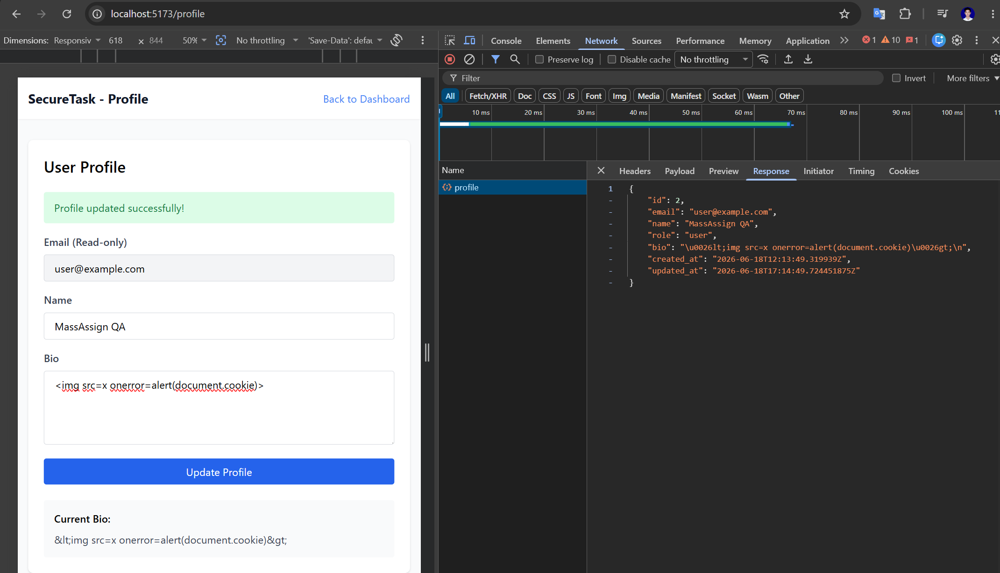
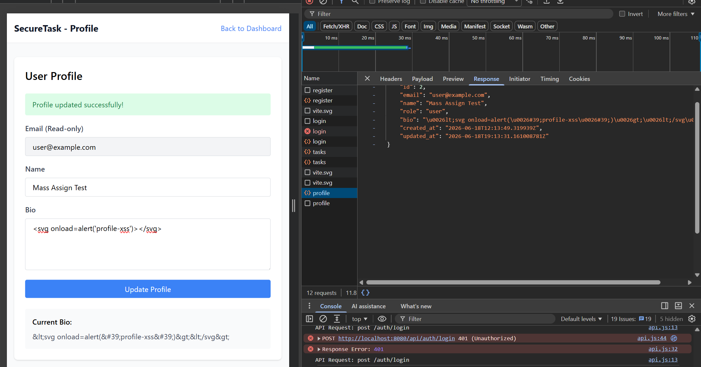
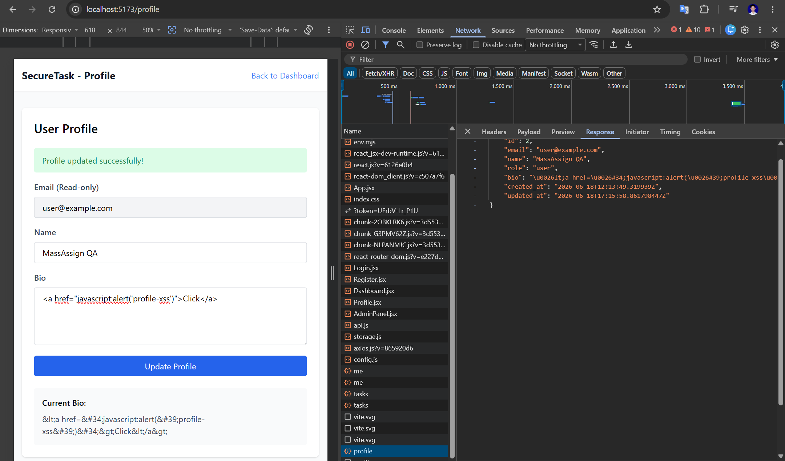
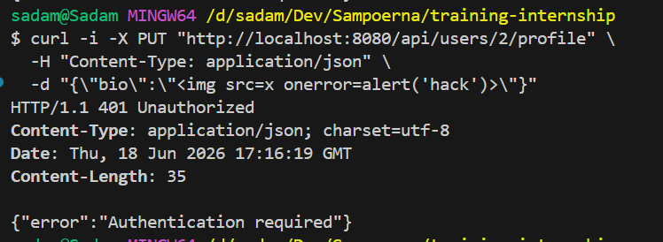

## TC-XSS-003: Content Security Policy Is Present and Restrictive

**Source Finding**: `XSS-003`  
**Priority**: Medium  
**Category**: Missing Security Headers  
**Component**: Frontend, Backend, API  
**Endpoint/Page**: Web application pages

### Objective

Verify that the application defines a Content Security Policy and blocks unsafe script execution where possible.

### Preconditions

- Frontend is running.
- Browser DevTools is available.

### Test Steps

1. Open `http://localhost:5173`.
2. Inspect the page source and confirm whether a CSP meta tag exists.
3. Inspect the Network tab for `Content-Security-Policy` response headers.
4. Open DevTools Console.
5. Attempt inline script execution.

```javascript
eval('alert("csp-test")');
```

6. Trigger one known XSS payload from `TC-XSS-001` or `TC-XSS-002`.
7. Observe whether the browser blocks script execution and logs CSP violations.

### Expected Vulnerable Result

- No CSP meta tag or response header exists.
- Inline script execution is not restricted.
- Existing XSS payloads execute without CSP blocking.

### Expected Secure Result

- CSP is present through a meta tag or HTTP header.
- Script sources are restricted to trusted origins.
- Inline script execution and unsafe dynamic code are blocked where policy supports it.
- Frame embedding is restricted with `frame-ancestors` or equivalent headers.

### Actual Result

Diuji 2026-06-19.

- CSP meta tag ditemukan di `index.html`: `default-src 'self'; script-src 'self'; style-src 'self' 'unsafe-inline'; img-src 'self' data:; connect-src 'self' http://localhost:8080; frame-ancestors 'none'; form-action 'self';`
- `eval('alert("csp-test")')` di Console → diblokir oleh CSP (`Refused to evaluate a string as JavaScript`).
- `frame-ancestors 'none'` mencegah clickjacking.

### Status

- [x] Pass
- [ ] Fail
- [ ] Blocked

### Evidence

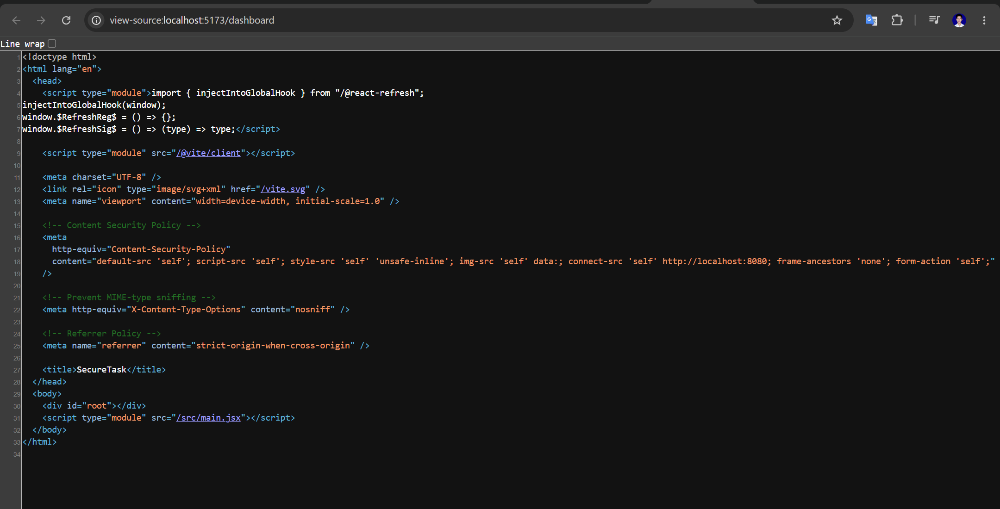
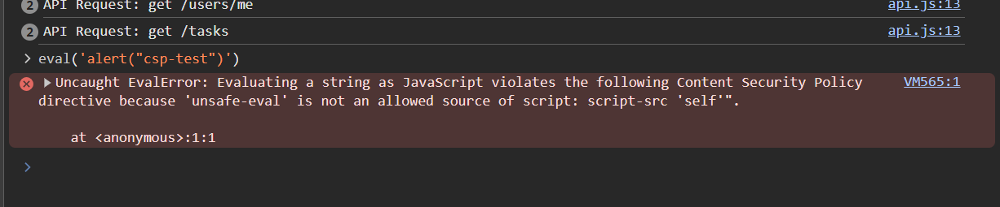
