# Authentication and Authorization Manual Test Cases

## TC-AUTH-001: Task Search Requires Authentication and User Scoping

**Source Finding**: `AUTH-001`  
**Priority**: High  
**Category**: Authentication, Authorization, Data Exposure  
**Endpoint/Page**: `GET /api/tasks/search?q=[query]`

### Objective

Verify that task search cannot be used anonymously and only returns tasks owned by the authenticated user.

### Preconditions

- Backend is running.
- At least one task exists for User A.
- If possible, at least one task exists for User B.

### Test Steps

1. Logout from the application.
2. Send a search request without any cookie or authorization header.

```bash
curl -i "http://localhost:8080/api/tasks/search?q=test"
```

3. Login as a regular user.
4. Search for text that exists in another user's task, if available.
5. Observe HTTP status and returned data.

### Expected Vulnerable Result

- Anonymous request returns `200 OK`.
- Search returns task data without a valid session.
- Search returns tasks owned by other users.

### Expected Secure Result

- Anonymous request returns `401 Unauthorized`.
- Authenticated search only returns tasks belonging to the current user.

### Actual Result

Diuji 2026-06-18.

- **BEFORE (old build `training/` :8081):** anonim `GET /api/tasks/search?q=leaked` → `200 OK`, mengembalikan task tanpa login (data bocor). Vulnerable result terkonfirmasi.
- **AFTER (fixed build `security-training/` :8080):** anonim → `401 {"error":"Authentication required"}`; User A (login) → `200` berisi **hanya** task miliknya (`SecretTaskA`); User B (login) → `200 []` (tidak melihat task User A).

### Status

- [x] Pass
- [ ] Fail
- [ ] Blocked

### Evidence

Output curl: `_evidence/API-EVIDENCE-old.md` (AUTH-001) & `_evidence/API-EVIDENCE-fixed.md` (AUTH-001).

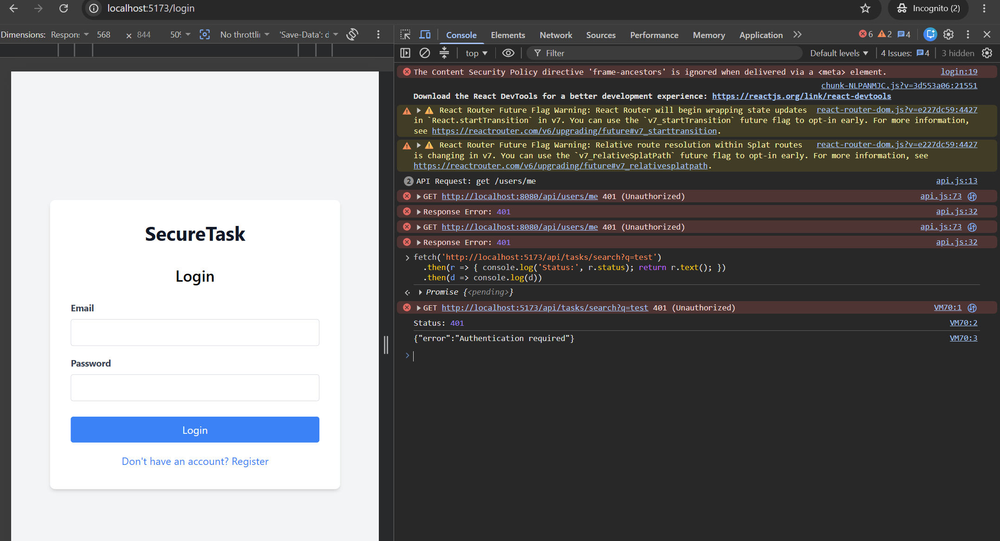
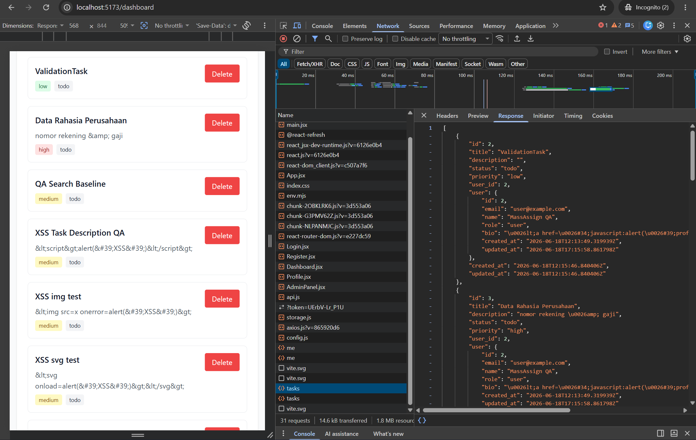

## TC-AUTH-002: Task Delete Requires Authentication and Ownership

**Source Finding**: `AUTH-002`  
**Priority**: Critical  
**Category**: Authentication, Authorization  
**Endpoint/Page**: `DELETE /api/tasks/:id`

### Objective

Verify that anonymous users cannot delete tasks and authenticated users cannot delete tasks they do not own.

### Preconditions

- At least one task exists.
- Tester knows the task ID.
- Two regular users are available for cross-user testing.

### Test Steps

1. Create a task as User A and record the task ID.
2. Logout or use a terminal without cookies/tokens.
3. Attempt to delete the task anonymously.

```bash
curl -i -X DELETE "http://localhost:8080/api/tasks/1"
```

4. Login as User B.
5. Attempt to delete User A's task.
6. Login as User A.
7. Delete User A's own task.

### Expected Vulnerable Result

- Anonymous request deletes the task.
- User B can delete User A's task.

### Expected Secure Result

- Anonymous request returns `401 Unauthorized`.
- Cross-user delete returns `403 Forbidden` or `404 Not Found`.
- Owner delete succeeds.

### Actual Result

Diuji 2026-06-18.

- **BEFORE (`training/` :8081):** anonim `DELETE /api/tasks/1` → `200 {"message":"Task deleted"}`, task benar-benar terhapus tanpa auth. Vulnerable result terkonfirmasi.
- **AFTER (`security-training/` :8080):** anonim → `401`; User B menghapus task User A → `404 {"error":"Task not found"}` (query difilter `user_id`); User A menghapus task sendiri → `200`.

### Status

- [x] Pass
- [ ] Fail
- [ ] Blocked

### Evidence

Output curl: `_evidence/API-EVIDENCE-old.md` (AUTH-002) & `_evidence/API-EVIDENCE-fixed.md` (AUTH-002).

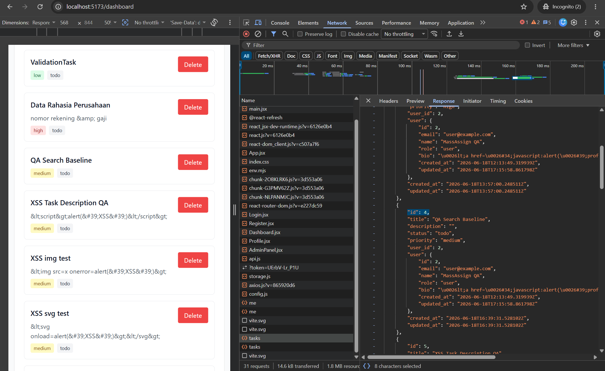
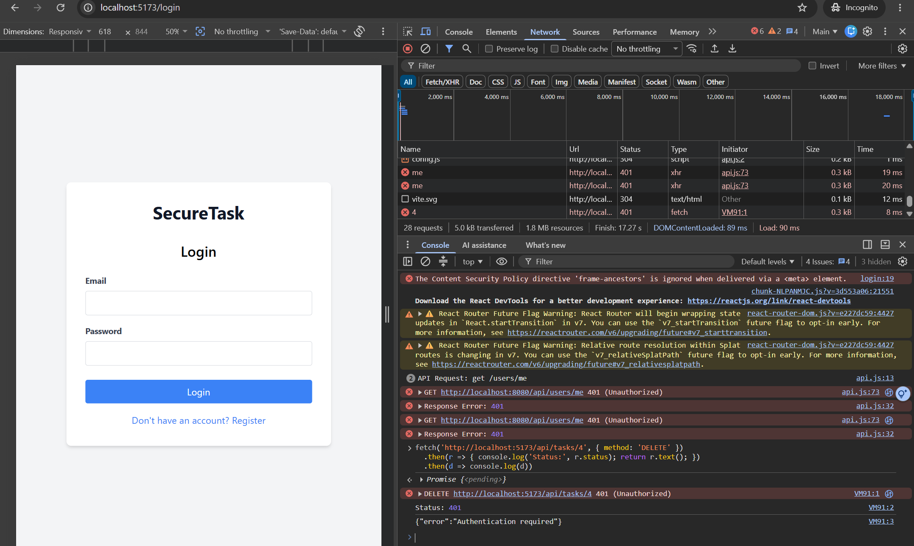

## TC-AUTH-003: Profile Update Requires Authentication and Ownership

**Source Finding**: `AUTH-003`  
**Priority**: Critical  
**Category**: Authentication, Authorization, Data Exposure  
**Endpoint/Page**: `PUT /api/users/:id/profile`

### Objective

Verify that anonymous users cannot update profiles and users can only update their own profile.

### Preconditions

- Backend is running.
- Two user accounts exist.

### Test Steps

1. Logout from the application.
2. Attempt to update User 2's profile anonymously.

```bash
curl -i -X PUT "http://localhost:8080/api/users/2/profile" \
  -H "Content-Type: application/json" \
  -d "{\"name\":\"Changed By Anonymous QA\",\"bio\":\"Anonymous update\"}"
```

3. Login as User 1.
4. Attempt to update User 2's profile.
5. Login as User 2.
6. Update User 2's own profile with safe values.

### Expected Vulnerable Result

- Anonymous or cross-user update succeeds.
- Target user's profile data changes.

### Expected Secure Result

- Anonymous update returns `401 Unauthorized`.
- Cross-user update returns `403 Forbidden`.
- Owner update succeeds.

### Actual Result

Diuji 2026-06-18.

- **BEFORE (`training/` :8081):** anonim `PUT /api/users/1/profile` → `200`, profil **admin** berubah jadi `name:"Owned By Anon"` tanpa login (horizontal/vertical priv-esc). Vulnerable result terkonfirmasi.
- **AFTER (`security-training/` :8080):** anonim → `401`; User A meng-update profil User B → `403 {"error":"You can only update your own profile"}`; User A update profil sendiri → `200`.

### Status

- [x] Pass
- [ ] Fail
- [ ] Blocked

### Evidence

Output curl: `_evidence/API-EVIDENCE-old.md` (AUTH-003) & `_evidence/API-EVIDENCE-fixed.md` (AUTH-003).

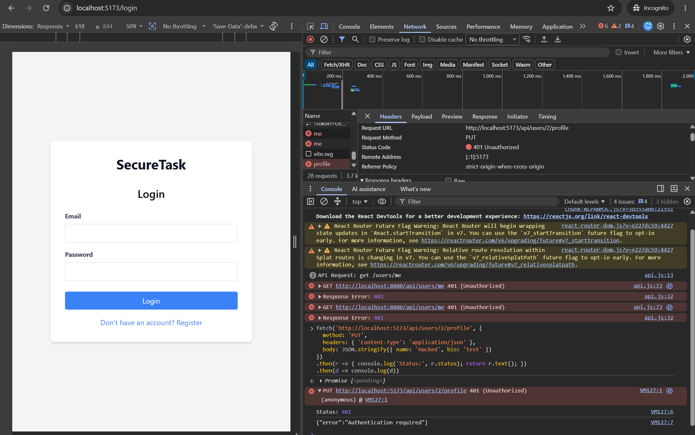
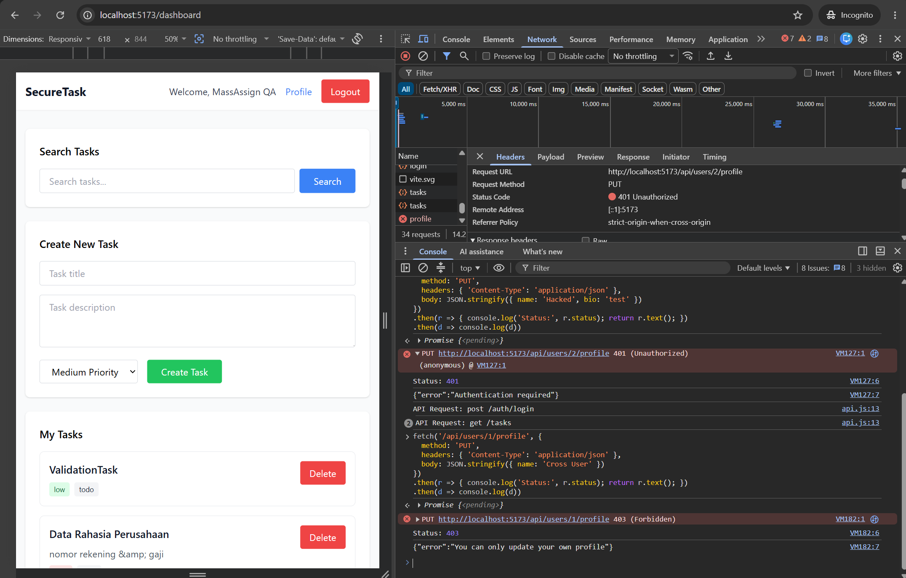

## TC-AUTH-004: Admin User Listing Requires Admin Role

**Source Finding**: `AUTH-004`  
**Priority**: Critical  
**Category**: Authentication, Authorization, Data Exposure  
**Endpoint/Page**: `GET /api/admin/users`, `/admin`

### Objective

Verify that the admin users endpoint rejects anonymous and non-admin users and never returns password fields.

### Preconditions

- Backend is running.
- Regular and admin users exist.

### Test Steps

1. Send an anonymous request to the admin users endpoint.

```bash
curl -i "http://localhost:8080/api/admin/users"
```

2. Login as a regular user.
3. Attempt to open `/admin`.
4. Attempt to call `GET /api/admin/users`.
5. Login as an admin user.
6. Call `GET /api/admin/users`.
7. Inspect the response fields.

### Expected Vulnerable Result

- Anonymous or regular user receives `200 OK`.
- Response includes all users.
- Response includes password fields.

### Expected Secure Result

- Anonymous request returns `401 Unauthorized`.
- Regular user returns `403 Forbidden`.
- Admin request succeeds.
- Password fields are absent from all responses.

### Actual Result

Diuji 2026-06-18.

- **BEFORE (`training/` :8081):** anonim `GET /api/admin/users` → `200`, mengembalikan semua user **termasuk field `password` plaintext** (`admin123`, `password123`). Vulnerable result terkonfirmasi.
- **AFTER (`security-training/` :8080):** anonim → `401`; user reguler → `403 {"error":"Admin access required"}`; admin → `200`, dan **tidak ada field `password`** di response manapun.

### Status

- [x] Pass
- [ ] Fail
- [ ] Blocked

### Evidence

Output curl: `_evidence/API-EVIDENCE-old.md` (AUTH-004) & `_evidence/API-EVIDENCE-fixed.md` (AUTH-004).

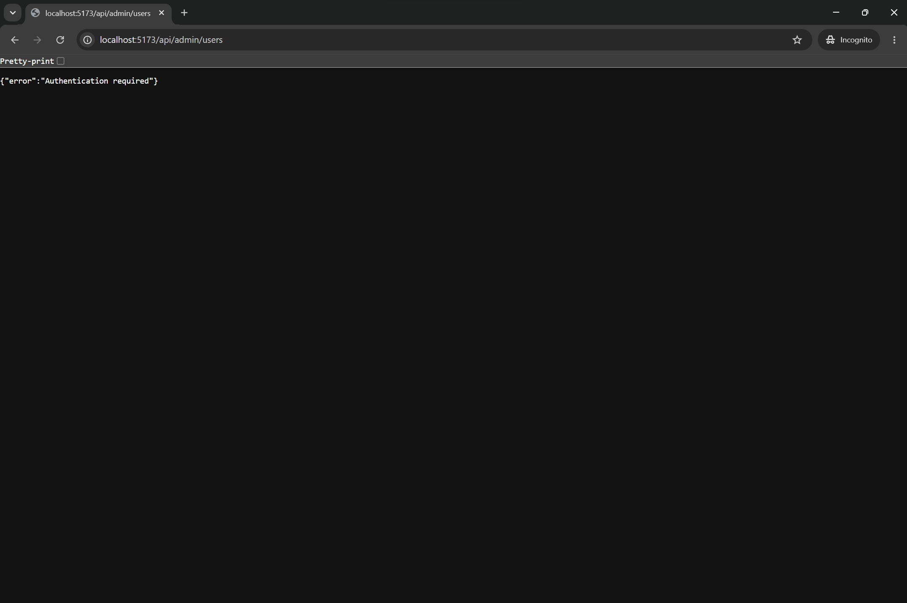
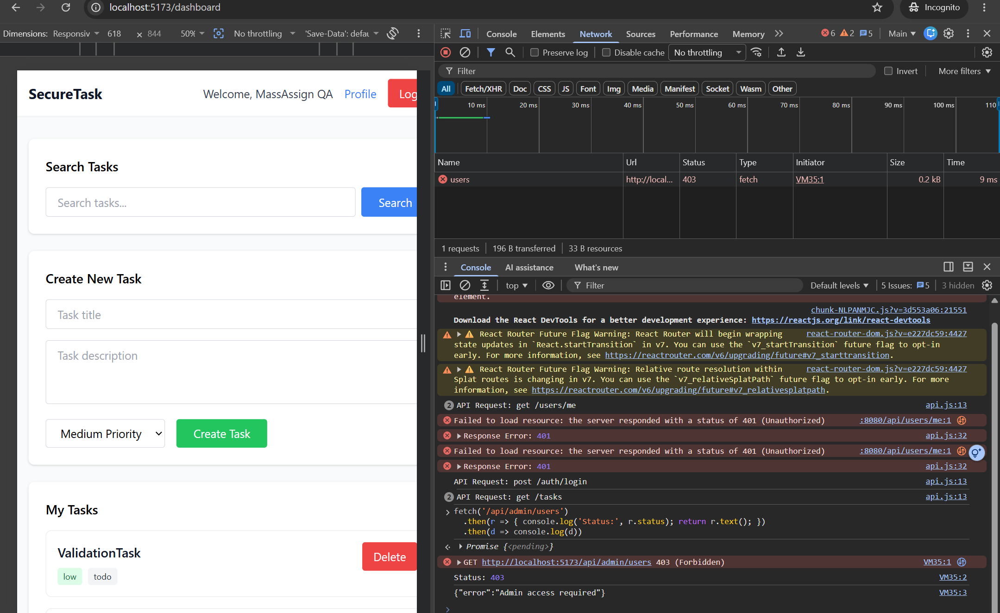
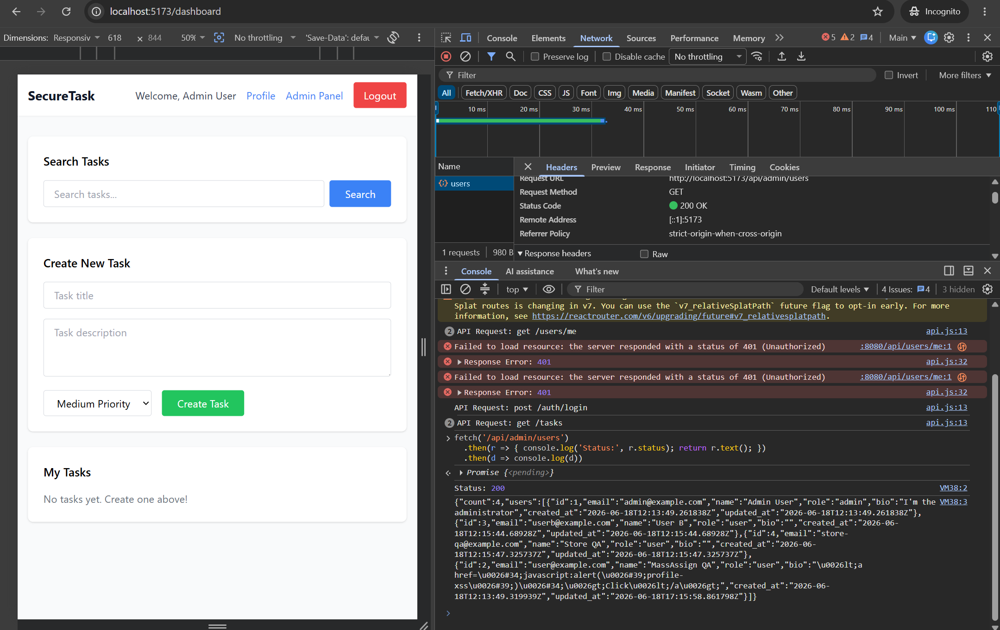

## TC-AUTH-005: Client-Side Role Changes Do Not Grant Admin Access

**Source Finding**: `AUTH-005`  
**Priority**: High  
**Category**: Client-Side Authorization  
**Endpoint/Page**: `/admin`, `GET /api/admin/users`

### Objective

Verify that modifying localStorage role data does not grant backend admin privileges.

### Preconditions

- Frontend and backend are running.
- Tester is logged in as a regular user.

### Test Steps

1. Login as `user@example.com / password123`.
2. Open DevTools > Application > Local Storage.
3. Change the stored user's role from `user` to `admin`.

```javascript
const user = JSON.parse(localStorage.getItem("user"));
user.role = "admin";
localStorage.setItem("user", JSON.stringify(user));
location.href = "/admin";
```

4. Navigate to `/admin`.
5. Observe whether the page loads.
6. Inspect the `GET /api/admin/users` response.

### Expected Vulnerable Result

- Admin panel loads as a regular user.
- Admin API returns user data.

### Expected Secure Result

- UI may hide or redirect from admin routes.
- Backend returns `403 Forbidden` even if localStorage is modified.
- No admin data is returned to non-admin users.

### Actual Result

Diuji 2026-06-18 (sisi server diverifikasi via API; langkah localStorage perlu browser).

- **BEFORE (`training/`):** otorisasi admin ditentukan di klien dari localStorage (`frontend/src/pages/AdminPanel.jsx:17-20`) sehingga mengubah `role` di localStorage membuka panel admin & menampilkan password (`:114`). Vulnerable.
- **AFTER (`security-training/` :8080):** backend memvalidasi `role` dari JWT, bukan localStorage. Bukti: user reguler `GET /api/admin/users` → `403`, dan token palsu `alg:none` berisi `role:admin` → `401`. Mengubah localStorage tidak mengubah cookie/JWT, jadi backend tetap `403`.

### Status

- [x] Pass
- [ ] Fail
- [ ] Blocked

### Evidence

`_evidence/API-EVIDENCE-fixed.md` (AUTH-004 user→403, TC-FIX-001). Source: `_evidence/README.md` (AUTH-005).

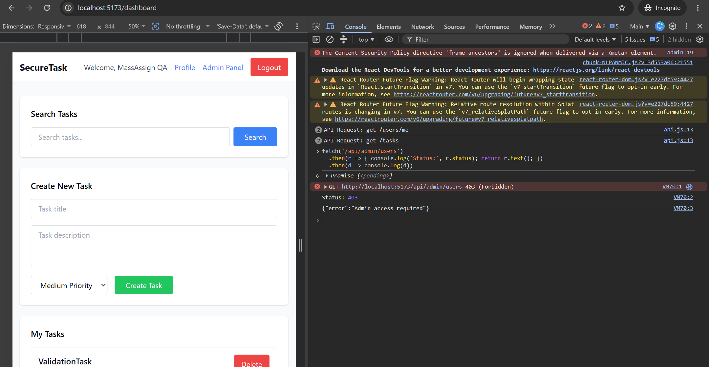

## TC-AUTH-006: Update Endpoints Reject Mass Assignment

**Source Finding**: `AUTH-006`  
**Priority**: High  
**Category**: Authorization, Input Validation, Mass Assignment  
**Endpoint/Page**: `PUT /api/users/:id/profile`, `PUT /api/tasks/:id`

### Objective

Verify that update endpoints only allow whitelisted fields and reject protected or invalid fields.

### Preconditions

- Backend is running.
- Tester is authenticated.
- At least one task exists for the tester.

### Test Data

```json
{"role":"admin","password":"newpass123","name":"Mass Assignment QA"}
{"user_id":1,"status":"invalid_status","priority":"urgent","title":"Mass Assignment Task"}
```

### Test Steps

1. Login as a regular user.
2. Identify the logged-in user's own user ID.
3. Submit a profile update against the logged-in user's own profile containing protected fields.

```bash
curl -i -X PUT "http://localhost:8080/api/users/{own_user_id}/profile" \
  -H "Content-Type: application/json" \
  -d "{\"role\":\"admin\",\"password\":\"newpass123\",\"name\":\"Mass Assignment QA\"}"
```

4. Inspect the user record through `/api/users/me` or admin listing if available.
5. Submit a task update containing protected or invalid fields.
6. Inspect the task response and database-visible behavior.

### Expected Vulnerable Result

- Protected fields such as `role`, `password`, or `user_id` are accepted.
- Invalid status or priority values are stored.

### Expected Secure Result

- Only allowed profile fields such as `name` and `bio` can be updated.
- Only allowed task fields and enum values are accepted.
- Protected fields are ignored or rejected with `400 Bad Request`.

### Actual Result

Diuji 2026-06-18.

- **BEFORE (`training/` :8081):** `PUT /api/users/2/profile` dengan `{"role":"admin","password":"pwned123",...}` → `200`, dan via admin listing user id 2 berubah jadi `role:"admin"` & `password:"pwned123"` (mass assignment). Vulnerable.
- **AFTER (`security-training/` :8080):** kirim `role`+`password` ke profil sendiri → `200` tapi **diabaikan**; `GET /api/users/me` menunjukkan `role` tetap `"user"`. Update task `status:"invalid_status"` → `400`; `priority:"urgent"` → `400`; create task tanpa title → `400`.

### Status

- [x] Pass
- [ ] Fail
- [ ] Blocked

### Evidence

Output curl: `_evidence/API-EVIDENCE-old.md` (AUTH-006) & `_evidence/API-EVIDENCE-fixed.md` (AUTH-006).

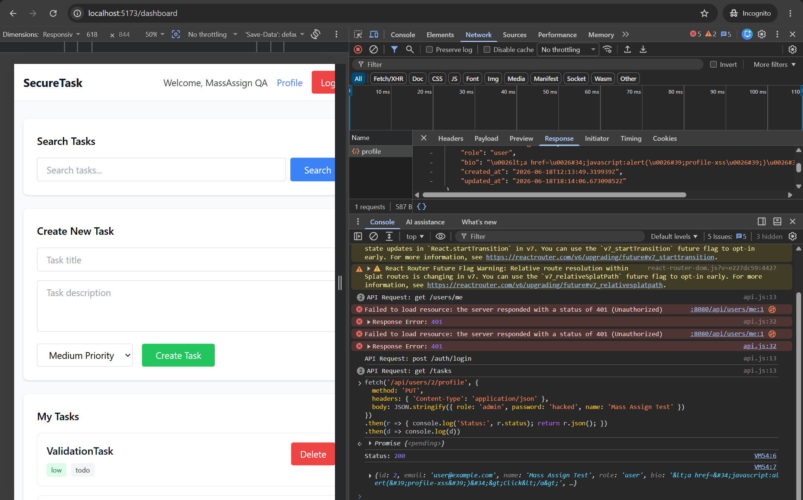
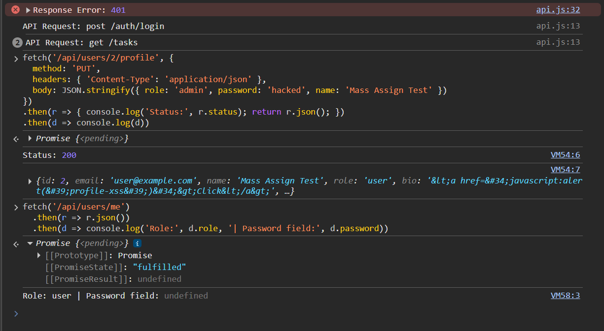

## TC-AUTH-007: CORS Only Allows Trusted Origins

**Source Finding**: `AUTH-007`  
**Priority**: Medium  
**Category**: CORS Misconfiguration  
**Endpoint/Page**: All API endpoints

### Objective

Verify that the API only allows trusted frontend origins and rejects untrusted origins.

### Preconditions

- Backend is running.

### Test Steps

1. Send a request with the trusted frontend origin.

```bash
curl -i -H "Origin: http://localhost:5173" "http://localhost:8080/api/users/me"
```

2. Send a request with an untrusted origin.

```bash
curl -i -H "Origin: http://attacker.example" "http://localhost:8080/api/users/me"
```

3. Compare `Access-Control-Allow-Origin`, `Access-Control-Allow-Credentials`, and allowed headers/methods.
4. Repeat from a browser context if possible because CORS is browser-enforced.

### Expected Vulnerable Result

- API reflects or allows any origin.
- Untrusted origin receives permissive CORS headers.

### Expected Secure Result

- Trusted origin is allowed.
- Untrusted origin is not allowed in CORS response headers.
- Credentials are only allowed for trusted origins.

### Actual Result

Diuji 2026-06-18.

- **BEFORE (`training/` :8081):** origin asing `http://attacker.example` dibalas `Access-Control-Allow-Origin: *` bersamaan `Access-Control-Allow-Credentials: true` (sangat permisif). Vulnerable.
- **AFTER (`security-training/` :8080):** origin tepercaya `http://localhost:5173` → `Access-Control-Allow-Origin: http://localhost:5173` + `Allow-Credentials: true`; origin asing → **tidak ada** header `Access-Control-Allow-*`.

### Status

- [x] Pass
- [ ] Fail
- [ ] Blocked

### Evidence

Output curl header: `_evidence/API-EVIDENCE-old.md` (AUTH-007) & `_evidence/API-EVIDENCE-fixed.md` (AUTH-007).

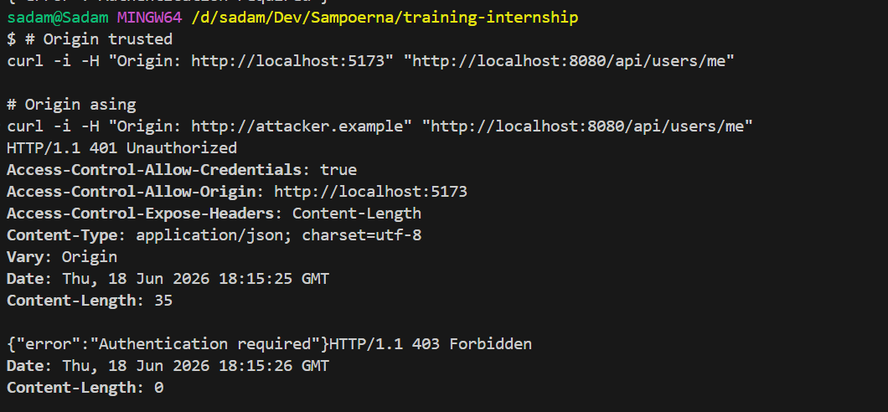
