# Insecure Data Storage Manual Test Cases

## TC-STORE-001: Passwords Are Hashed and Never Returned by APIs

**Source Finding**: `STORE-001`  
**Priority**: Critical  
**Category**: Data Exposure, Password Storage  
**Component**: Backend, API, Database  
**Endpoint/Page**: `POST /api/auth/login`, `POST /api/auth/register`, `GET /api/users/me`, `GET /api/admin/users`

### Objective

Verify that passwords are stored as hashes and are never serialized in API responses.

### Preconditions

- Backend and database are running.
- Tester can login and optionally inspect the database.
- Admin credentials are available for admin-only response checks.

### Test Steps

1. Register a new test user.

```bash
curl -i -X POST "http://localhost:8080/api/auth/register" \
  -H "Content-Type: application/json" \
  -d "{\"email\":\"store-password-qa@example.com\",\"password\":\"StrongPass123!\",\"name\":\"Store QA\"}"
```

2. Confirm the register response does not include `password`.
3. Login as the new user.
4. Confirm the login response does not include `password`.
5. Call `GET /api/users/me`.
6. Confirm the response does not include `password`.
7. As admin, call `GET /api/admin/users`.
8. Confirm no user object includes `password`.
9. Inspect database values if database access is available.

```sql
SELECT email, password FROM users WHERE email = 'store-password-qa@example.com';
```

### Expected Vulnerable Result

- Passwords are stored in plain text.
- API responses include password fields.
- Admin panel displays password values.

### Expected Secure Result

- Stored password values are bcrypt-style hashes or equivalent secure hashes.
- Password fields are absent from all API responses.
- Admin panel does not show passwords.

### Actual Result

Diuji 2026-06-18.

- **BEFORE (`training/` :8081):** login membalas `"password":"password123"` di body; `GET /api/admin/users` menampilkan password semua user; DB menyimpan plaintext (`admin123`, `pwned123`). Vulnerable terkonfirmasi.
- **AFTER (`security-training/` :8080):** response register/login/`/users/me`/`/admin/users` **tanpa** field `password`; DB menyimpan hash bcrypt — `SELECT` menunjukkan prefix `$2a$` dengan panjang `60` untuk semua user.

### Status

- [x] Pass
- [ ] Fail
- [ ] Blocked

### Evidence

Output curl + query DB: `_evidence/API-EVIDENCE-old.md` (STORE-001) & `_evidence/API-EVIDENCE-fixed.md` (STORE-001, DB check).

**BEFORE (Vulnerable — `training/` :8081):**


**AFTER (Fixed — `security-training/` :8080):**

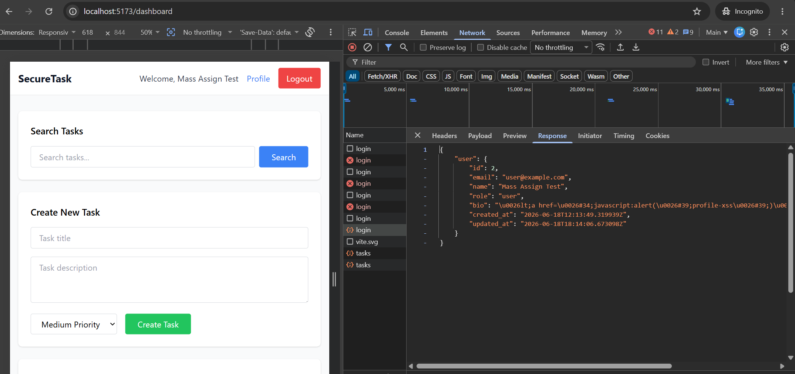
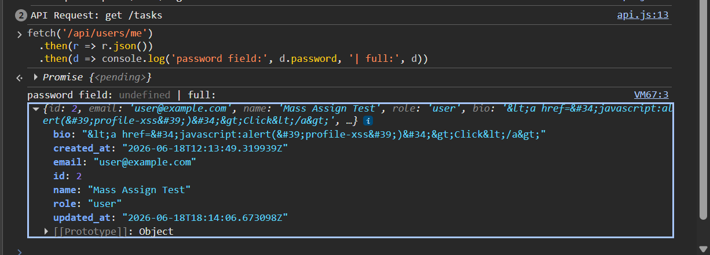
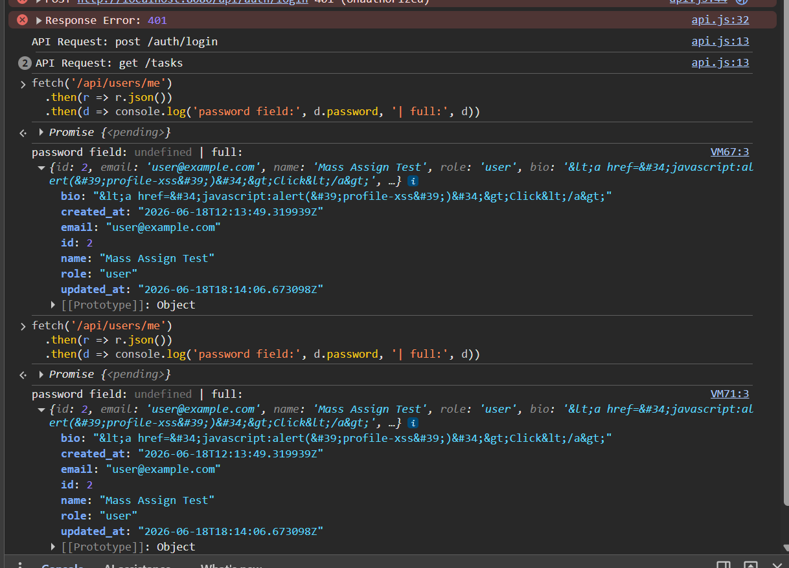

## TC-STORE-002: JWT Is Not Stored in localStorage or sessionStorage

**Source Finding**: `STORE-002`  
**Priority**: High  
**Category**: Session Storage  
**Component**: Frontend  
**Endpoint/Page**: Login flow and authenticated API calls

### Objective

Verify that authentication tokens are not accessible to JavaScript storage APIs.

### Preconditions

- Frontend and backend are running.
- Browser DevTools is available.

### Test Steps

1. Clear browser storage for `localhost`.
2. Login as a regular user.
3. Open DevTools > Application > Local Storage.
4. Check for keys such as `token`, `authToken`, `jwt`, or bearer values.
5. Open DevTools > Application > Session Storage and repeat.
6. Run console checks.

```javascript
localStorage.getItem("token");
sessionStorage.getItem("token");
Object.entries(localStorage);
Object.entries(sessionStorage);
document.cookie;
```

7. Inspect Cookies for the auth cookie and its flags.

### Expected Vulnerable Result

- JWT token is visible in localStorage or sessionStorage.
- Token can be read by JavaScript.

### Expected Secure Result

- No token is present in localStorage or sessionStorage.
- Auth token is stored in an httpOnly cookie or otherwise inaccessible to JavaScript.
- Cookie uses SameSite and Secure where appropriate for the environment.

### Actual Result

Diuji 2026-06-18 (sisi server diverifikasi via API; isi localStorage perlu browser).

- **BEFORE (`training/`):** token disimpan ke localStorage (`frontend/src/utils/storage.js:5` `localStorage.setItem('token', token)`, dipanggil di `Login.jsx:20`). Bisa dibaca JS → rawan XSS. Vulnerable.
- **AFTER (`security-training/` :8080):** login **tidak** mengembalikan token di body; server mengeset cookie `Set-Cookie: auth_token=...; Path=/; Max-Age=86400; HttpOnly; SameSite=Lax`. `HttpOnly` = tidak terbaca JS; `utils/storage.js` tidak menyimpan token.

### Status

- [x] Pass
- [ ] Fail
- [ ] Blocked

### Evidence

Header `Set-Cookie`: `_evidence/API-EVIDENCE-fixed.md` (STORE-002). Source before/after: `_evidence/README.md` (STORE-002).

**BEFORE (Vulnerable — `training/` :8081):**


**AFTER (Fixed — `security-training/` :8080):**

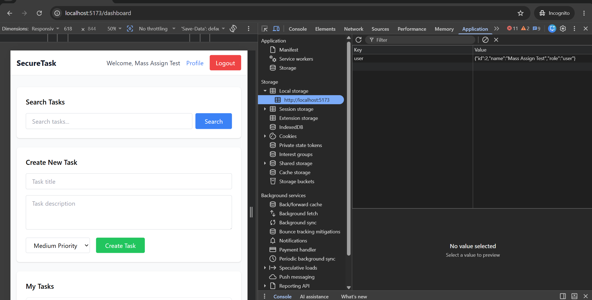
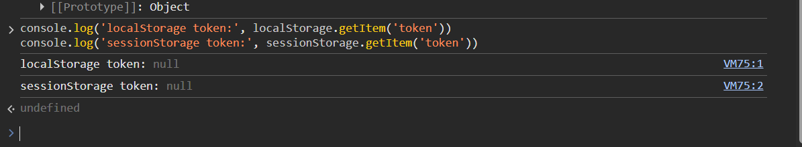
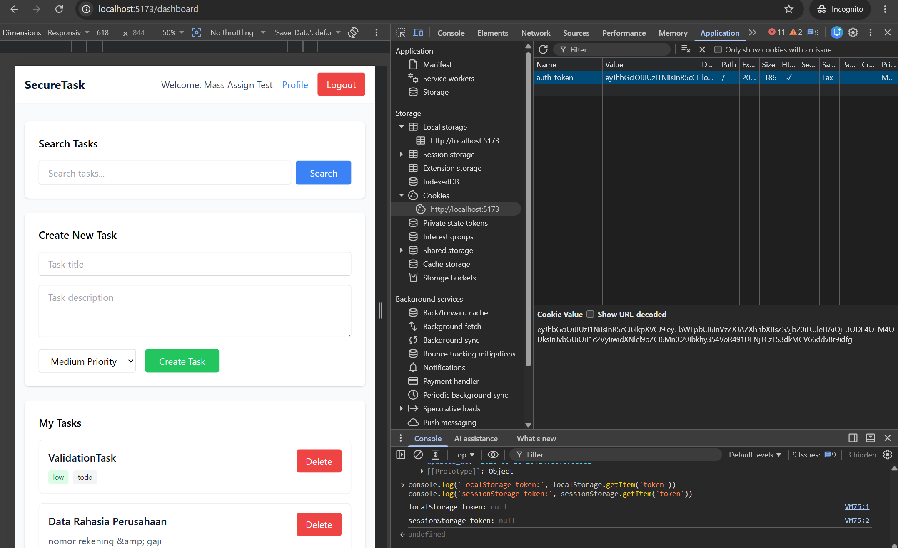
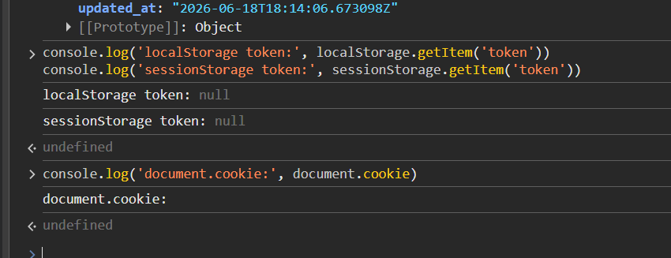

## TC-STORE-003: Browser Storage and Profile UI Do Not Expose Sensitive User Data

**Source Finding**: `STORE-003`  
**Priority**: High  
**Category**: Insecure Client Storage, Debug Data  
**Component**: Frontend, Backend, API  
**Endpoint/Page**: Login flow, `/profile`

### Objective

Verify that localStorage/sessionStorage only contain minimal non-sensitive data and that debug UI does not expose full user objects.

### Preconditions

- Frontend and backend are running.
- Tester is logged in.

### Test Steps

1. Clear browser storage.
2. Login as a regular user.
3. Inspect localStorage key `user`, if present.
4. Inspect sessionStorage for `currentUser` or similar keys.
5. Navigate to Profile.
6. Look for debug panels, JSON dumps, password fields, token values, or internal objects.
7. Logout.
8. Confirm browser storage is cleared of application data.

### Expected Vulnerable Result

- Full user object is stored in localStorage/sessionStorage.
- Password, token, or other sensitive fields are present.
- Profile page displays debug JSON or sensitive user data.
- Logout leaves sensitive data behind.

### Expected Secure Result

- Browser storage contains only minimal non-sensitive display data, if anything.
- No password, token, or sensitive data is stored.
- No debug JSON panel is visible.
- Logout clears application storage.

### Actual Result

Diuji 2026-06-18 (verifikasi via source code; tampilan runtime perlu browser).

- **BEFORE (`training/`):** `utils/storage.js:18-22` menyimpan **objek user lengkap (termasuk password)** ke localStorage **dan** sessionStorage; `:45` menyimpan `debugInfo`; `Dashboard.jsx:79` menampilkan data sensitif dari localStorage. Vulnerable.
- **AFTER (`security-training/`):** `utils/storage.js:6-12` hanya menyimpan `{id, name, role}` (safeData, tanpa password/token); `logout()` (`:21-22`) memanggil `localStorage.clear(); sessionStorage.clear()`.

### Status

- [x] Pass
- [ ] Fail
- [ ] Blocked

### Evidence

Source before/after: `_evidence/README.md` (STORE-003).

**BEFORE (Vulnerable — `training/` :8081):**


**AFTER (Fixed — `security-training/` :8080):**

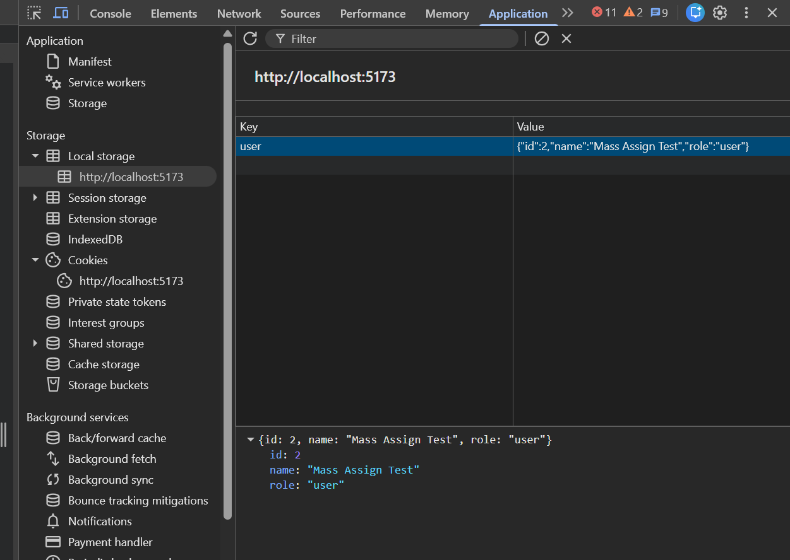
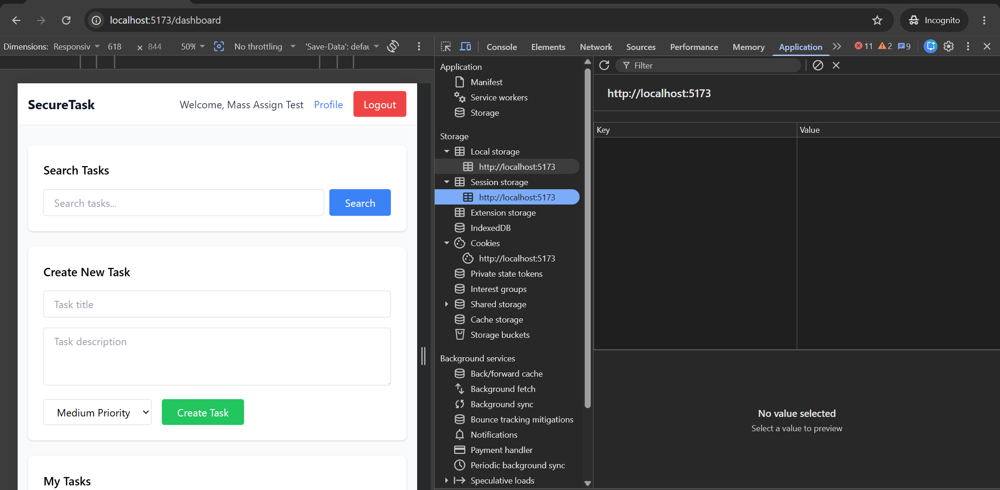
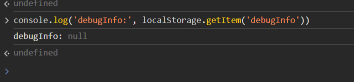
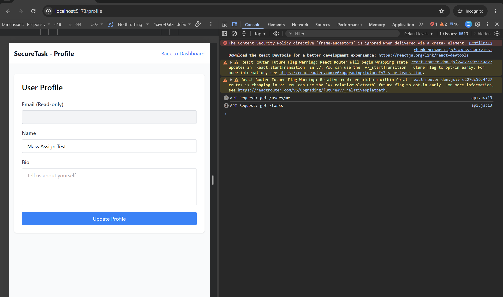

## TC-STORE-004: API Requests and Responses Do Not Log Sensitive Data to Console

**Source Finding**: `STORE-004`  
**Priority**: Medium  
**Category**: Information Disclosure  
**Component**: Frontend, API  
**Endpoint/Page**: All frontend API calls

### Objective

Verify that browser console logs do not expose credentials, tokens, passwords, or sensitive API response bodies.

### Preconditions

- Frontend and backend are running.
- Browser DevTools Console is open.

### Test Steps

1. Open DevTools Console.
2. Login with valid credentials.
3. Register a new account if needed.
4. Navigate to Dashboard, Profile, and Admin Panel if authorized.
5. Create and delete a task.
6. Review console output for request bodies, response bodies, tokens, passwords, user records, or stack traces.

### Expected Vulnerable Result

- Console logs include login request body or password.
- Console logs include full API response bodies.
- Console logs include tokens, password fields, or sensitive user records.

### Expected Secure Result

- No credentials, tokens, passwords, or sensitive response bodies are logged.
- Development-only logs, if present, are minimal and redacted.
- User-facing errors are generic.

### Actual Result

Diuji 2026-06-18 (verifikasi via source code; tampilan runtime perlu browser).

- **BEFORE (`training/`):** `services/api.js:19` `console.log('API Request:', config.method, config.url, config.data)` mencetak body request (termasuk password saat login); `:33` `console.log('API Response:', response.data)` mencetak seluruh body response. Vulnerable.
- **AFTER (`security-training/`):** `services/api.js:13` hanya mencetak `config.method, config.url` (tanpa body) dan hanya saat `NODE_ENV === 'development'`; `:32` hanya `error.response?.status`. Tidak ada credential/token/body sensitif yang ter-log.

### Status

- [x] Pass
- [ ] Fail
- [ ] Blocked

### Evidence

Source before/after: `_evidence/README.md` (STORE-004).

**BEFORE (Vulnerable — `training/` :8081):**


**AFTER (Fixed — `security-training/` :8080):**

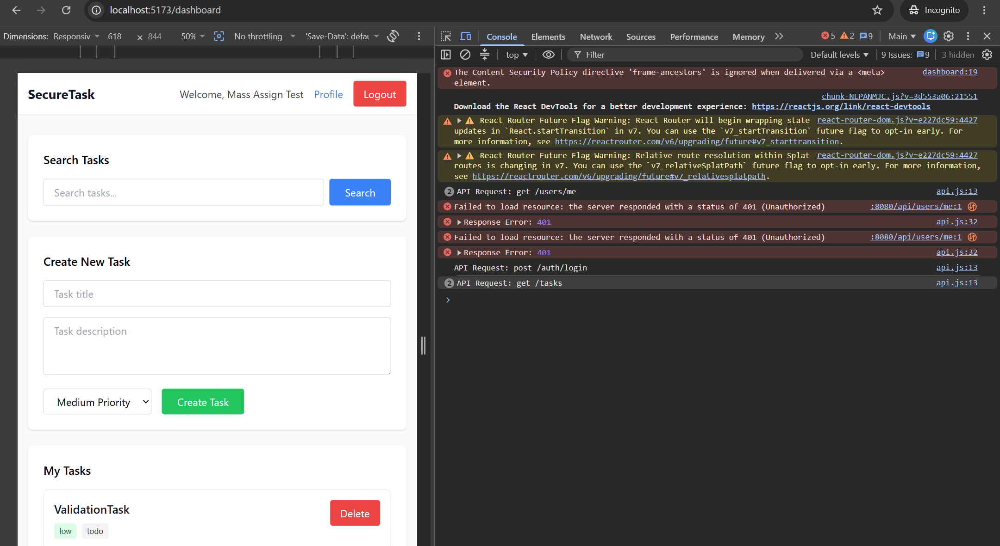
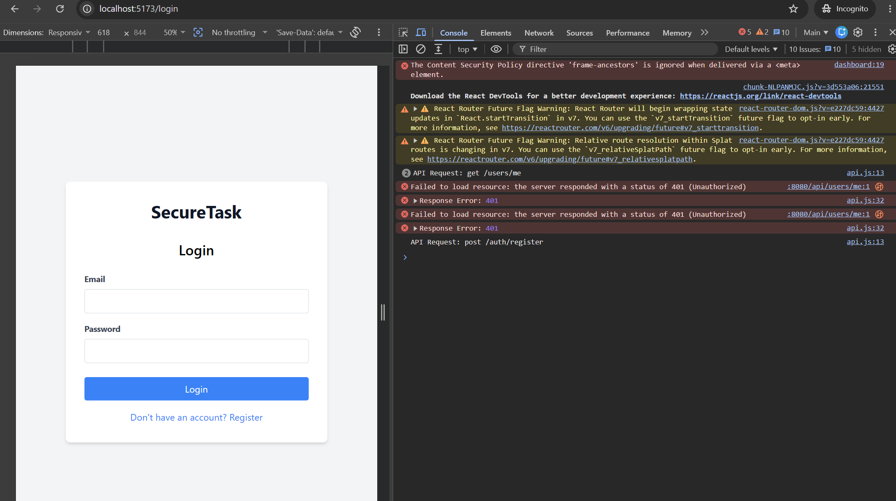
