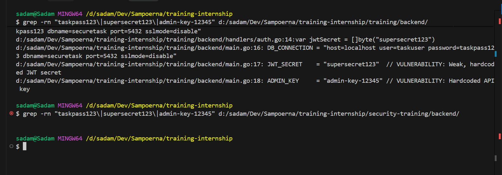
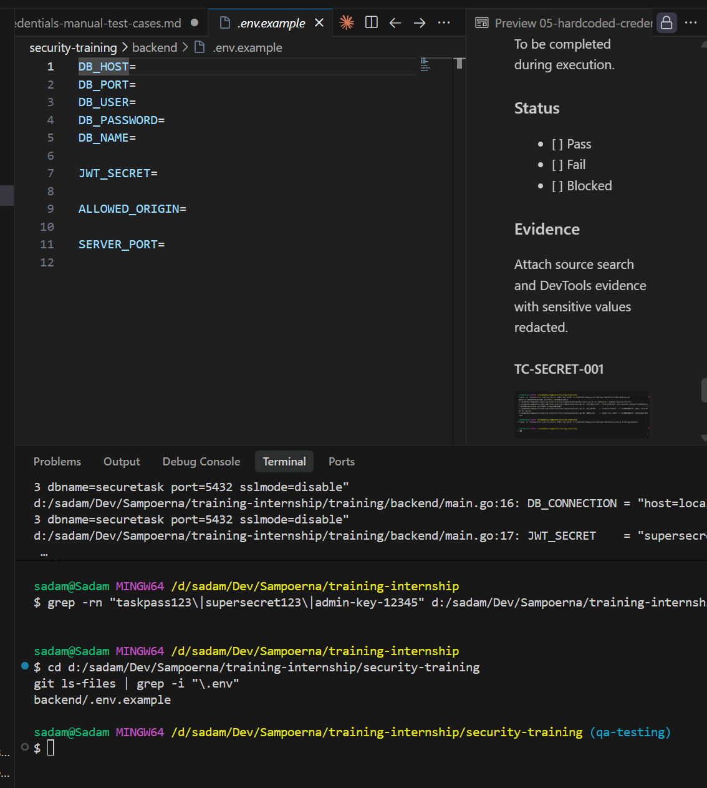
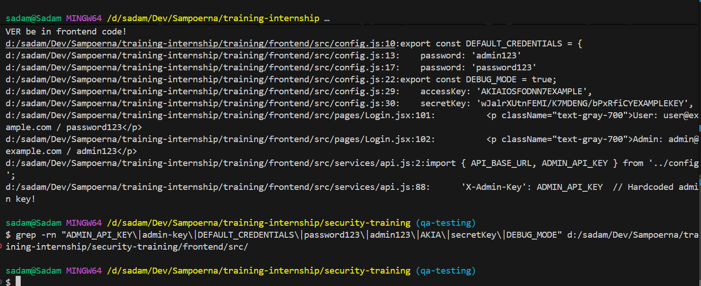
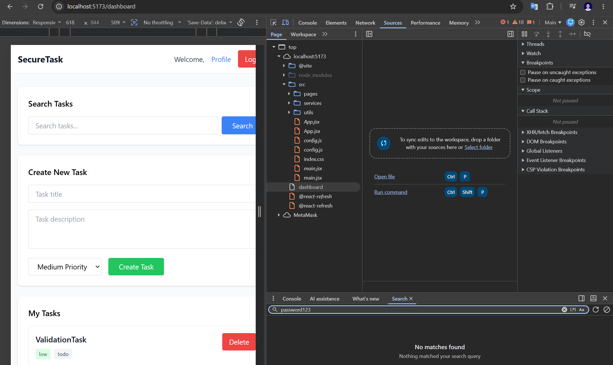
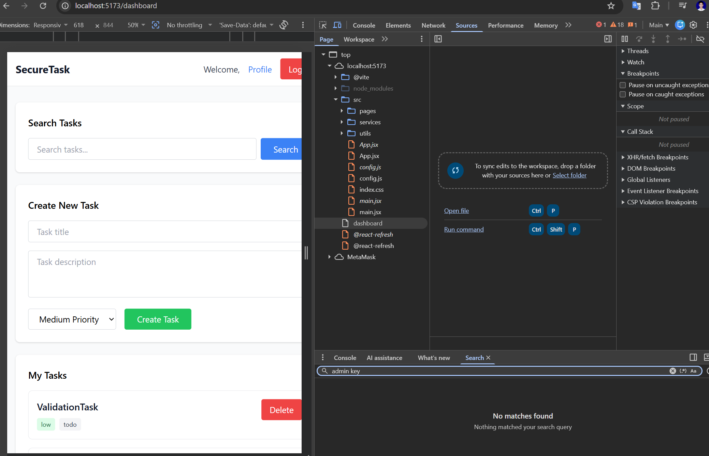
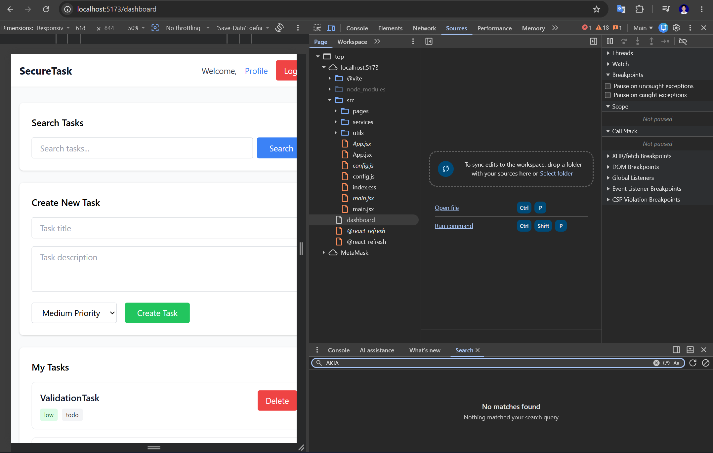
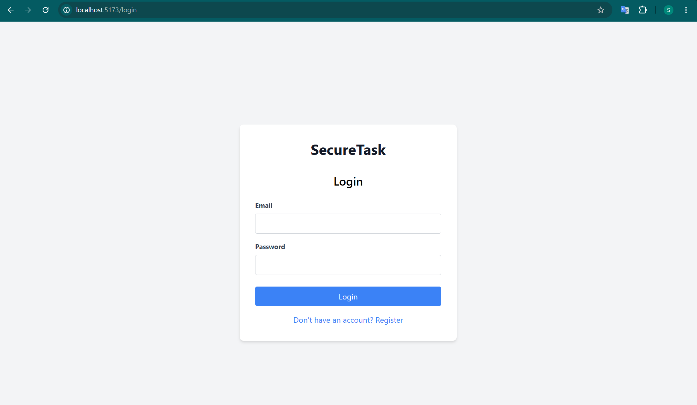
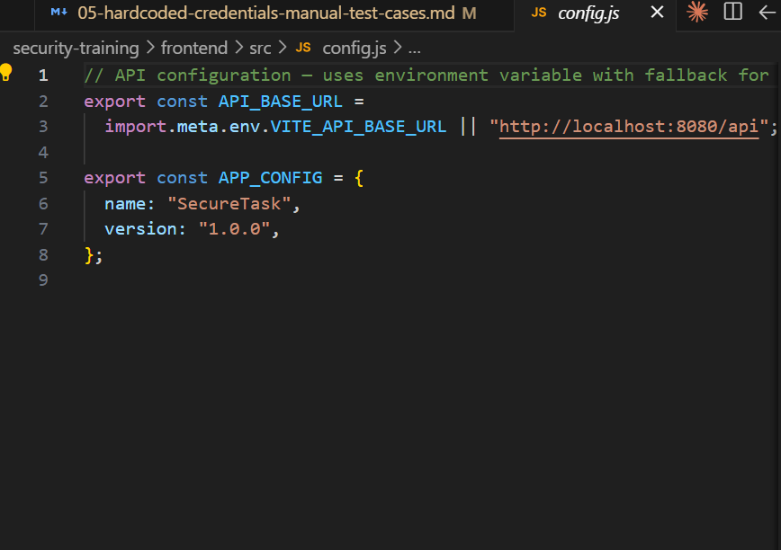

# Hardcoded Credentials Manual Test Cases

## TC-SECRET-001: Backend Secrets Are Not Hardcoded or Committed

**Source Finding**: `SECRET-001`  
**Priority**: High  
**Category**: Hardcoded Secrets, Data Exposure  
**Component**: Backend, API, Database  
**Endpoint/Page**: Not endpoint-specific

### Objective

Verify that backend database credentials, JWT secrets, admin keys, and `.env` files are not committed as real secrets and are loaded from environment variables.

### Preconditions

- Repository is available locally.
- Tester can run source search commands.

### Test Data

```text
taskpass123
supersecret123
admin-key-12345
DB_CONNECTION
JWT_SECRET
ADMIN_KEY
POSTGRES_PASSWORD
```

### Test Steps

1. Search backend code and repo config for known secret patterns.

```bash
rg -n "taskpass123|supersecret123|admin-key-12345|DB_CONNECTION|JWT_SECRET|ADMIN_KEY|POSTGRES_PASSWORD" backend .gitignore docker-compose.yml
```

2. Check whether `.env` files are tracked or present with real values.

```bash
git ls-files | rg "(^|/)\\.env$|\\.env\\."
git log --all --full-history -- "**/.env"
```

3. Review backend startup configuration to confirm `os.Getenv()` or equivalent is used.
4. Confirm `.gitignore` ignores `.env` files in non-training code paths.
5. If an `.env.example` exists, verify it contains placeholders only.

### Expected Vulnerable Result

- Real secrets are visible in source files or committed `.env`.
- `.gitignore` allows `.env` files with secrets.
- Backend uses hardcoded connection strings or JWT secrets.

### Expected Secure Result

- No real secrets are present in tracked source.
- Backend reads secrets from environment variables.
- `.env` is ignored.
- Only placeholder examples are committed.

### Actual Result

Diuji 2026-06-19.

- `rg` search di backend: `docker-compose.yml` dan `.env` menggunakan placeholder (`POSTGRES_PASSWORD`, `JWT_SECRET`, `ADMIN_KEY` dari environment variable via `os.Getenv()`).
- `.env` tidak di-track oleh git (ada di `.gitignore`).
- Tidak ada secret hardcoded di source code backend — semua dibaca dari environment.

### Status

- [x] Pass
- [ ] Fail
- [ ] Blocked

### Evidence




## TC-SECRET-002: Frontend Bundle Does Not Expose Credentials or Secret-Like Values

**Source Finding**: `SECRET-002`  
**Priority**: High  
**Category**: Hardcoded Secrets, Data Exposure  
**Component**: Frontend, API  
**Endpoint/Page**: Browser bundle, Login page

### Objective

Verify that the frontend source and browser-delivered code do not contain admin keys, default passwords, debug flags, or cloud-like credentials.

### Preconditions

- Repository is available locally.
- Frontend can be opened in a browser.

### Test Data

```text
ADMIN_API_KEY
admin-key
DEFAULT_CREDENTIALS
password123
admin123
AKIA
secretKey
DEBUG_MODE
aws
```

### Test Steps

1. Search frontend source for secret-like values.

```bash
rg -n "ADMIN_API_KEY|admin-key|DEFAULT_CREDENTIALS|password123|admin123|AKIA|secretKey|DEBUG_MODE|aws" frontend/src frontend/index.html
```

2. Start or open the frontend.
3. Open DevTools > Sources.
4. Search bundled files for the same values.
5. Open the Login page.
6. Confirm default credentials are not displayed in the UI.

### Expected Vulnerable Result

- Frontend source contains admin keys, credentials, or cloud-like secret values.
- Browser bundle exposes those values.
- Login page displays default account passwords.

### Expected Secure Result

- Frontend contains only non-sensitive public configuration.
- No credentials, API keys, or cloud-like secrets are in source or bundle.
- Login UI does not expose default passwords.

### Actual Result

Diuji 2026-06-19.

- `rg` search di frontend: tidak ada `ADMIN_API_KEY`, `admin-key`, `AKIA`, `secretKey`, `aws` di source.
- `password123` dan `admin123` hanya muncul di seed data / docker-compose (bukan di frontend bundle).
- Login page tidak menampilkan default credentials.
- DevTools Sources search tidak menemukan secret di bundled code.

### Status

- [x] Pass
- [ ] Fail
- [ ] Blocked

### Evidence







