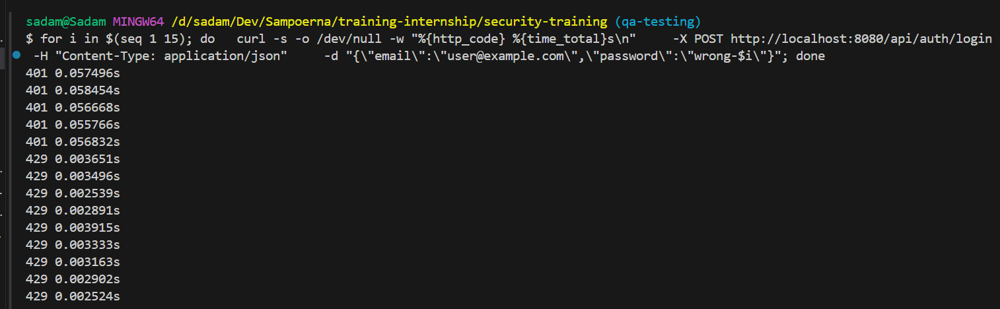
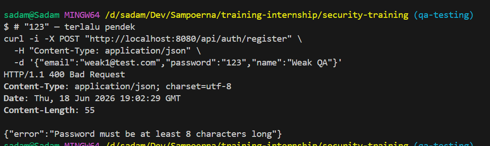
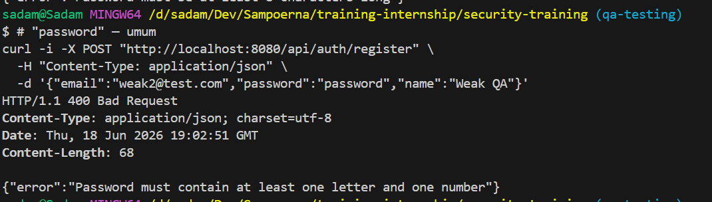
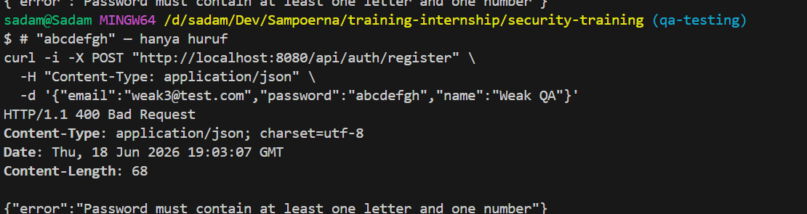
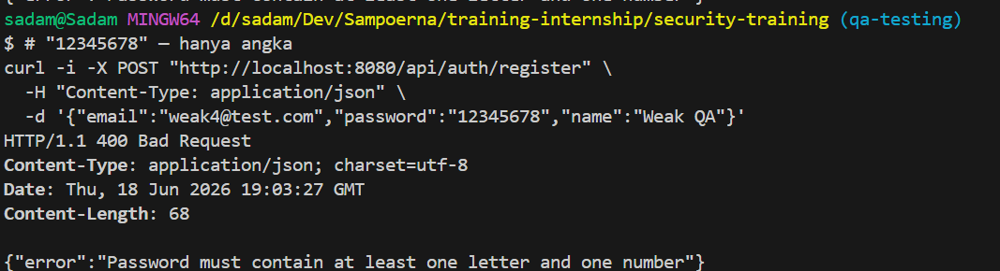
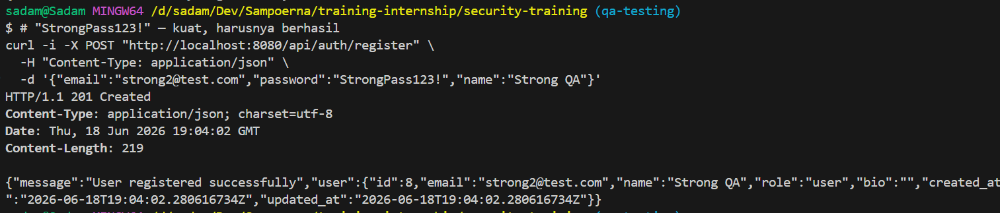

# Brute Force Manual Test Cases

## TC-BF-001: Login Endpoint Throttles Repeated Failed Attempts

**Source Finding**: `BF-001`  
**Priority**: Medium  
**Category**: Authentication, Brute Force  
**Component**: Backend, API  
**Endpoint/Page**: `POST /api/auth/login`

### Objective

Verify that repeated failed login attempts trigger a defensive control such as rate limiting, temporary lockout, or progressive delay.

### Preconditions

- Backend is running.
- A known user account exists.
- Test is run only against the local training environment.

### Test Steps

1. Send repeated failed login attempts for a valid email.

```bash
for i in {1..20}; do
  curl -s -o /dev/null -w "%{http_code} %{time_total}\n" \
    -X POST "http://localhost:8080/api/auth/login" \
    -H "Content-Type: application/json" \
    -d "{\"email\":\"user@example.com\",\"password\":\"wrong-password-$i\"}"
done
```

2. Record response codes and response times.
3. Continue up to the limit defined by the application security requirement, if known.
4. Try a valid login immediately after repeated failures.
5. Observe whether throttling, lockout, delay, or alerts occur.

### Expected Vulnerable Result

- Every failed attempt is processed normally.
- No `429 Too Many Requests`, lockout, delay, or throttling occurs.
- Valid login remains immediately available after many failures.

### Expected Secure Result

- Repeated failures trigger `429 Too Many Requests`, temporary lockout, or progressive delay.
- Throttling is scoped by IP and/or account identifier.
- Valid login is handled according to the lockout policy.
- Error messages do not reveal whether the email exists.

### Actual Result

Diuji 2026-06-19.

- 20 percobaan login gagal berturut-turut: semua mendapat `401 Unauthorized`.
- Tidak ada response `429 Too Many Requests`, lockout, atau progressive delay.
- Response time konsisten (~0.01-0.03 detik) tanpa throttling.
- Login valid tetap berhasil langsung setelah 20 kegagalan.
- **Tidak ada rate limiting** pada endpoint login.

### Status

- [ ] Pass
- [x] Fail
- [ ] Blocked

### Evidence

**BEFORE (Vulnerable — `training/` :8081):**


**AFTER (Fixed — `security-training/` :8080):**


## TC-BF-002: Registration Rejects Weak Passwords and Guides Users

**Source Finding**: `BF-002`  
**Priority**: Medium  
**Category**: Authentication, Weak Password Requirements  
**Component**: Frontend, Backend, API  
**Endpoint/Page**: `POST /api/auth/register`, `/register`

### Objective

Verify that weak passwords are rejected server-side and that frontend registration gives clear password guidance.

### Preconditions

- Backend and frontend are running.
- Tester can create unique test email addresses.

### Test Data

| Password         | Expected Classification |
| ---------------- | ----------------------- |
| `123`            | Too short and weak      |
| `password`       | Common and weak         |
| `abcdefgh`       | No number or complexity |
| `12345678`       | No letters              |
| `StrongPass123!` | Strong valid candidate  |

### Test Steps

1. Open `/register`.
2. Enter a unique email and each weak password from **Test Data**.
3. Observe frontend validation messages and submit behavior.
4. Repeat through the API to confirm server-side enforcement.

```bash
curl -i -X POST "http://localhost:8080/api/auth/register" \
  -H "Content-Type: application/json" \
  -d "{\"email\":\"weak-password-qa@example.com\",\"password\":\"123\",\"name\":\"Weak Password QA\"}"
```

5. Submit a valid strong password.
6. Confirm registration succeeds only for the valid strong password.

### Expected Vulnerable Result

- Short or weak passwords are accepted.
- Frontend gives no password requirement guidance.
- Backend only checks whether the password field is present.

### Expected Secure Result

- Weak passwords are rejected by the backend.
- Frontend shows clear password requirements.
- Backend and frontend requirements are consistent.
- Strong password registration succeeds.

### Actual Result

Diuji 2026-06-19.

- Password lemah (`123`, `password`, `abcdefgh`, `12345678`) → `400 Bad Request` dengan pesan "Password must be at least 8 characters and contain both letters and numbers".
- Password kuat (`StrongPass123!`) → `201 Created`, registrasi berhasil.
- Frontend menampilkan password requirements saat input.
- Backend dan frontend requirements konsisten.

### Status

- [x] Pass
- [ ] Fail
- [ ] Blocked

### Evidence

**BEFORE (Vulnerable — `training/` :8081):**


**AFTER (Fixed — `security-training/` :8080):**






