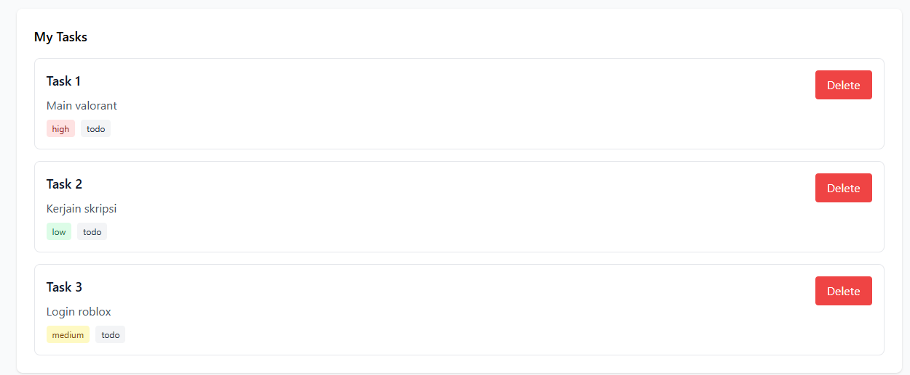
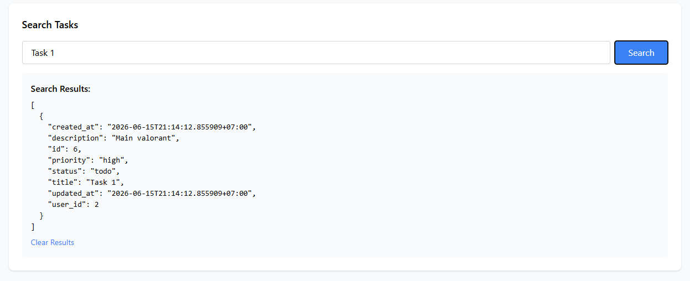
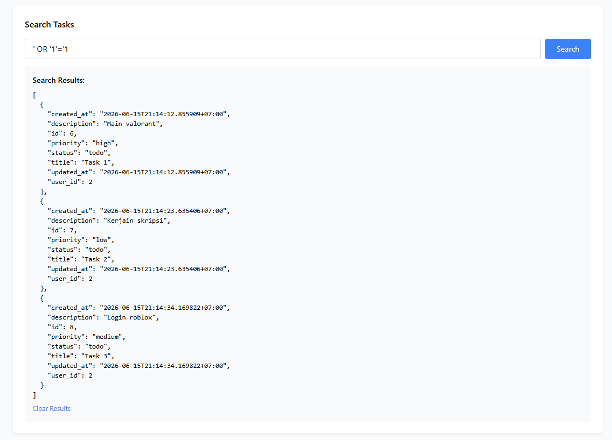
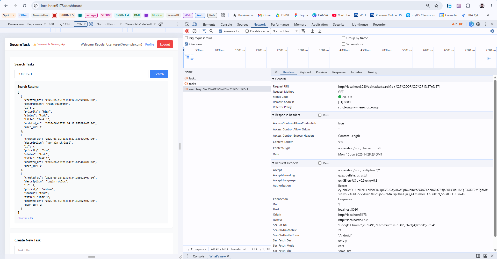
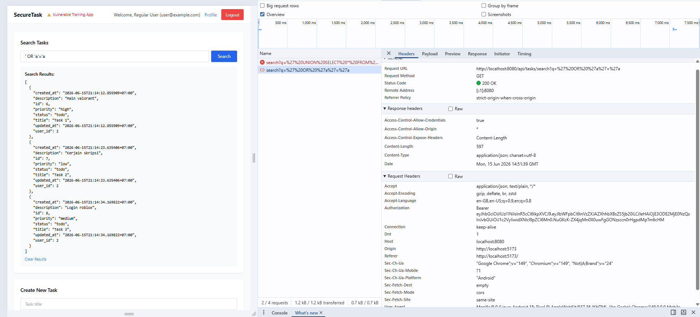
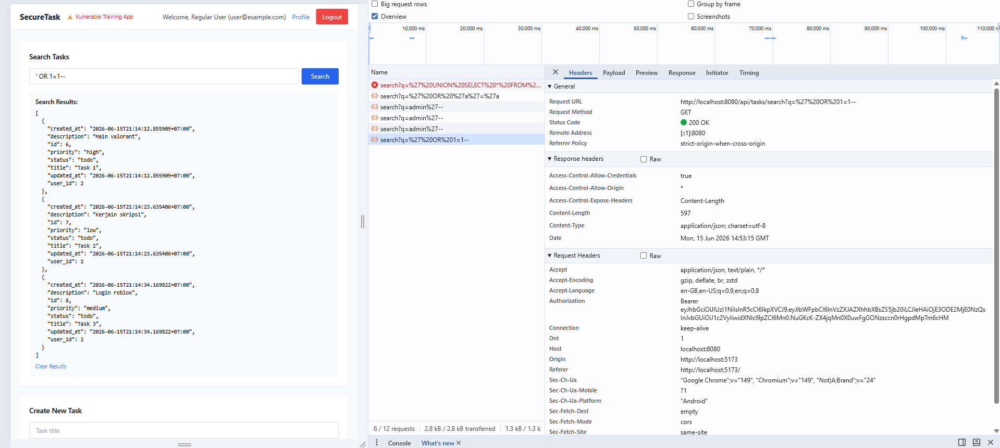
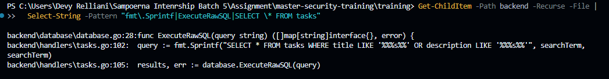

# Security Vulnerability Report

**Report Date**: 2026-06-15  
**Tester Name**: Devy Relliani | dsaffiya@PMINTL.NET
**Project**: SecureTask Security Training

---

## Vulnerability #SQL-001: SQL Injection in Task Search Endpoint

### Classification
- **Severity**: [x] Critical  [ ] High  [ ] Medium  [ ] Low
- **Category**: [x] SQL Injection  [ ] XSS  [ ] Authentication  [ ] Authorization  [ ] Data Exposure  [ ] Hardcoded Secrets  [ ] Other: API Security
- **Status**: [x] Open  [ ] In Progress  [ ] Fixed  [ ] Verified  [ ] Won't Fix
- **CVSS Score**: 9.8 estimated

### Location
- **Component**: [ ] Frontend  [x] Backend  [x] API  [x] Database
- **File Path**: `backend/handlers/tasks.go`, `backend/database/database.go`
- **Line Numbers**: `backend/handlers/tasks.go:91-108`, `backend/database/database.go:27-59`
- **Endpoint/URL**: `GET /api/tasks/search?q=[query]`

### Description
The task search endpoint builds a SQL query by concatenating user-controlled input directly into the query string. The query is then executed through a raw SQL helper. This allows an attacker to change the SQL logic and retrieve data that should not match the intended search criteria.

The endpoint also does not require authentication and does not scope search results to the current user.

### Reproduction Steps
1. Start the database, backend, and frontend.
2. Login as `user@example.com / password123`.
3. Create at least one task. The seeded database does not create tasks, so this step is required for visible results.
4. Go to the Dashboard search box.
5. Search for a random string such as `zzzzzz` and confirm no matching tasks are returned.
6. Search for `' OR '1'='1`.
7. Observe that tasks are returned even though they do not literally match the search text.

### Expected Behavior
The application should treat the search input as a literal value. Malicious SQL characters should not change the database query logic, and the endpoint should only return tasks matching the authenticated user's search.

### Actual Behavior
The input is inserted into raw SQL and can modify the `WHERE` clause. A tautology payload can cause all rows in the `tasks` table to match.

### Proof of Concept
```bash
# URL-encoded version of: ' OR '1'='1
curl "http://localhost:8080/api/tasks/search?q=%27%20OR%20%271%27%3D%271"

# Source evidence
rg -n "fmt\\.Sprintf|ExecuteRawSQL|SELECT \\* FROM tasks" backend
```

**Screenshots/Evidence**:
1. Task Listed:

2. Normal search:

3. Dashboard search results after submitting the payload.

4. Network response from `GET /api/tasks/search`.
a. *' OR '1'='1*

b. *' OR 'a'='a*

c. *' OR 1=1--*

5. Source review shows `fmt.Sprintf()` building SQL in `backend/handlers/tasks.go` [^1] .


[^1]: Source code evidence: backend/handlers/tasks.go uses fmt.Sprintf() to insert the user-controlled searchTerm directly into a SQL query. The generated query is then executed by database.ExecuteRawSQL(), making the endpoint vulnerable to SQL injection.


### Impact
An attacker could query records outside the intended search scope. Depending on database privileges and query shape, the attacker may also extract data from other tables or cause data loss with destructive payloads.

**What an attacker could do**:
- [x] Read sensitive data
- [x] Modify data
- [x] Delete data
- [ ] Steal user credentials
- [ ] Impersonate users
- [ ] Execute arbitrary code
- [x] Other: bypass search and tenant/user boundaries

**Affected Users/Data**:
All task records in the database are potentially exposed. Other database data may be at risk through more advanced injection techniques.

### Risk Assessment
**Likelihood**: [x] High  [ ] Medium  [ ] Low  
**Impact**: [x] High  [ ] Medium  [ ] Low  

**Justification**: The payload is simple, unauthenticated, and directly reaches raw SQL execution. The impact includes unauthorized data access and possible database manipulation.

### Recommendation
Keep the search remediation aligned with the backend fix documented by developers: search must be authenticated, scoped to the logged-in user, and implemented with parameterized database queries. User input must never be concatenated into SQL, and any raw SQL helper must not be reachable with untrusted input.

**Suggested Actions**:
1. Keep `GET /api/tasks/search` inside the authenticated API route group.
2. Query tasks with parameter binding/placeholders instead of string interpolation.
3. Filter results by the authenticated user's `user_id`.
4. Return generic search errors without SQL or database details.
5. Add regression tests for tautology, comment, union, time-based, and malformed SQL payloads.

### References
- OWASP SQL Injection: https://owasp.org/www-community/attacks/SQL_Injection
- CWE-89: Improper Neutralization of Special Elements used in an SQL Command
- OWASP Web Security Testing Guide: Testing for SQL Injection

### Testing Notes
If the response is `null` or an empty array, first confirm that the `tasks` table contains data. The application seeds users only, not tasks.

### Retest Results (After Fix)
**Retest Date**: 2026-06-19  
**Status**: [x] Vulnerability Fixed [ ] Partially Fixed [ ] Not Fixed  
**Notes**: Verified on the fixed build (`:8080`): `GET /api/tasks/search` now uses a parameterized, user-scoped GORM query (`Where("user_id = ? AND (title ILIKE ? OR description ILIKE ?)")`) and requires authentication. Injection payloads (`' OR '1'='1`, `' OR 1=1--`, `'; DROP TABLE tasks; --`, `' UNION SELECT * FROM users--`, `admin'--`) are treated as literal text — they return only matching/empty results, leak no other user's tasks, and expose no SQL errors; anonymous requests return `401`. Confirmed by automated suite `qa/automation` (feature `sql-injection.feature`).
