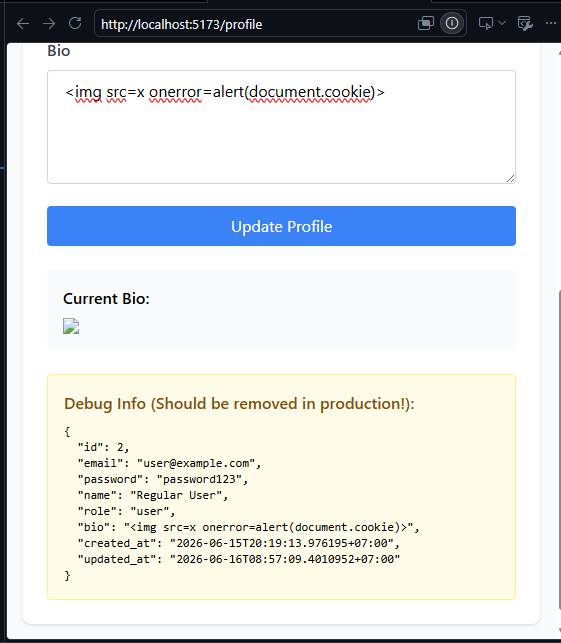

# Security Vulnerability Report

**Report Date**: 2026-06-15  
**Tester Name**: Devy Relliani | dsaffiya@PMINTL.NET
**Project**: SecureTask Security Training  

---

## Vulnerability #XSS-002: Stored XSS in Profile Bio Rendering

### Classification
- **Severity**: [ ] Critical  [x] High  [ ] Medium  [ ] Low
- **Category**: [ ] SQL Injection  [x] XSS  [ ] Authentication  [ ] Authorization  [x] Data Exposure  [ ] Hardcoded Secrets  [ ] Other: _______
- **Status**: [x] Open  [ ] In Progress  [ ] Fixed  [ ] Verified  [ ] Won't Fix
- **CVSS Score**: 8.8 estimated

### Location
- **Component**: [x] Frontend  [x] Backend  [x] API  [x] Database
- **File Path**: `frontend/src/pages/Profile.jsx`, `backend/handlers/users.go`, `backend/models/user.go`
- **Line Numbers**: `frontend/src/pages/Profile.jsx:113-137`, `backend/handlers/users.go:24-48`, `backend/models/user.go:13`
- **Endpoint/URL**: `/profile`, `PUT /api/users/:id/profile`

### Description
The user bio field is stored without sanitization and displayed using `dangerouslySetInnerHTML`. The profile update endpoint is also unauthenticated, so an attacker can plant a malicious bio in another user's profile.

### Reproduction Steps
1. Login to the application.
2. Navigate to Profile.
3. Update the Bio field with ``.
4. Save the profile.
5. Refresh or revisit the Profile page.
6. Observe JavaScript execution.

### Expected Behavior
The bio should be displayed as safe text or sanitized HTML. JavaScript should not execute.

### Actual Behavior
The bio is inserted into the DOM as raw HTML and can execute browser-side code.

### Proof of Concept
```html

```

**Screenshots/Evidence**:
- Browser alert after profile bio renders.
- Source review shows `dangerouslySetInnerHTML` with `user.bio`.
1. 

### Impact
An attacker can store JavaScript in profile data. Combined with token storage in localStorage, this can be used to steal tokens or perform actions as the victim.

**What an attacker could do**:
- [x] Read sensitive data
- [x] Modify data
- [ ] Delete data
- [x] Steal user credentials
- [x] Impersonate users
- [x] Execute arbitrary code
- [x] Other: persist malicious content in user profiles

**Affected Users/Data**:
Any user viewing a malicious profile bio. Because profile update is not protected, all profiles can be targeted.

### Risk Assessment
**Likelihood**: [x] High  [ ] Medium  [ ] Low  
**Impact**: [x] High  [ ] Medium  [ ] Low  

**Justification**: The vulnerable field is stored and rendered unsafely. The profile update endpoint further increases exploitability.

### Recommendation
Keep profile bios rendered as safe text and protect profile updates with authentication and ownership checks. This aligns with the developer fixes that replaced `dangerouslySetInnerHTML`, added profile input validation/escaping, and restricted profile updates to the logged-in owner.

**Suggested Actions**:
1. Render bio content as plain text by default.
2. If formatted bio content is ever allowed, sanitize it with a strict allowlist before rendering.
3. Validate profile `name` and `bio` length server-side.
4. Require authentication for profile updates.
5. Enforce ownership checks so users can update only their own profile.
6. Keep regression tests for ``, `<svg onload>`, and `javascript:` link payloads.

### References
- OWASP Cross Site Scripting Prevention Cheat Sheet
- CWE-79: Cross-Site Scripting

### Testing Notes
Retest after fixing both frontend rendering and backend profile update authorization.

### Retest Results (After Fix)
**Retest Date**: 2026-06-19  
**Status**: [x] Vulnerability Fixed [ ] Partially Fixed [ ] Not Fixed  
**Notes**: Verified on the fixed build (`:8080`): profile `name`/`bio` are HTML-escaped server-side (`html.EscapeString` in `UpdateProfile`) and rendered as escaped text by React. The `` payload in the bio is displayed as inert text and triggers no JS dialog/execution. Confirmed by automated suite `qa/automation` (feature `xss.feature`, profile-bio scenario). Note: `UpdateProfile` also enforces ownership (only own `id`), so cross-user bio injection is rejected with `403`.
