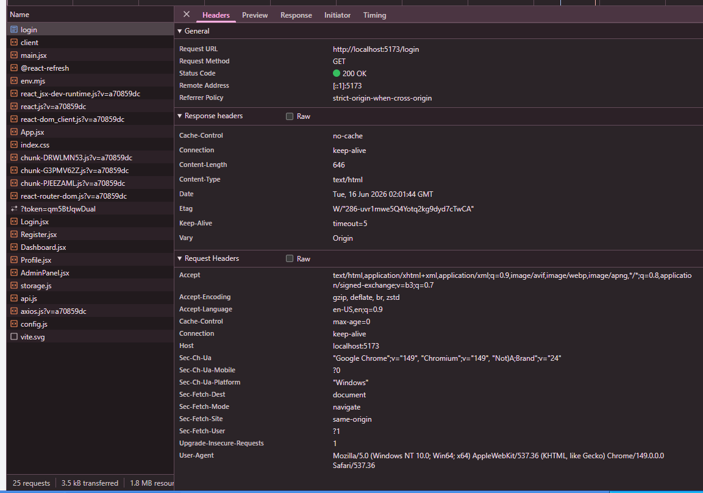

# Security Vulnerability Report

**Report Date**: 2026-06-15  
**Tester Name**: Devy Relliani | dsaffiya@PMINTL.NET
**Project**: SecureTask Security Training  

---

## Vulnerability #XSS-003: Missing Content Security Policy

### Classification
- **Severity**: [ ] Critical  [ ] High  [x] Medium  [ ] Low
- **Category**: [ ] SQL Injection  [x] XSS  [ ] Authentication  [ ] Authorization  [ ] Data Exposure  [ ] Hardcoded Secrets  [x] Other: Missing Security Headers
- **Status**: [x] Open  [ ] In Progress  [ ] Fixed  [ ] Verified  [ ] Won't Fix
- **CVSS Score**: 6.1 estimated

### Location
- **Component**: [x] Frontend  [x] Backend  [x] API  [ ] Database
- **File Path**: `frontend/index.html`, `frontend/vite.config.js`, `backend/main.go`
- **Line Numbers**: `frontend/index.html:1-12`, `frontend/vite.config.js:1-14`, `backend/main.go:32-68`
- **Endpoint/URL**: Web application pages

### Description
The application does not define a Content Security Policy through a meta tag or HTTP response header. CSP is a defense-in-depth control that can reduce the impact of XSS by restricting script execution sources.

### Reproduction Steps
1. Start the frontend.
2. Open `http://localhost:5173`.
3. Inspect `frontend/index.html` or the browser Network tab.
4. Confirm there is no `Content-Security-Policy` header or meta tag.
5. Trigger an XSS payload in task description or profile bio and observe there is no CSP blocking behavior.

### Expected Behavior
The application should define a CSP that restricts script sources and blocks unsafe inline script execution where possible.

### Actual Behavior
No CSP is configured.

### Proof of Concept
```bash
curl -i "http://localhost:5173"
```

**Screenshots/Evidence**:
1. Browser Network tab shows missing `Content-Security-Policy`.


### Impact
Missing CSP does not cause XSS by itself, but it increases the impact of existing XSS vulnerabilities because the browser has fewer restrictions on malicious scripts.

**What an attacker could do**:
- [x] Read sensitive data
- [x] Modify data
- [ ] Delete data
- [x] Steal user credentials
- [x] Impersonate users
- [x] Execute arbitrary code
- [x] Other: run injected scripts without CSP restrictions

**Affected Users/Data**:
All users of the web application.

### Risk Assessment
**Likelihood**: [x] High  [ ] Medium  [ ] Low  
**Impact**: [ ] High  [x] Medium  [ ] Low  

**Justification**: The application already has stored XSS paths. CSP absence increases exploit reliability but is a secondary control.

<!-- ### Recommendation
Define a CSP that restricts scripts, objects, frames, and other resource sources. Tune the policy for Vite development and production separately.

**Suggested Actions**:
1. Add a CSP header or meta tag.
2. Avoid unsafe inline scripts.
3. Block object embedding and restrict frame ancestors.
4. Verify CSP does not break legitimate app behavior. -->

### References
- MDN Content Security Policy
- OWASP Content Security Policy Cheat Sheet
- CWE-693: Protection Mechanism Failure

### Testing Notes
Final verification should be done in the browser because CSP behavior is browser-enforced.

### Retest Results (After Fix)
**Retest Date**: Not started  
**Status**: [ ] Vulnerability Fixed  [ ] Partially Fixed  [x] Not Fixed  
**Notes**: Retest by checking headers/meta tags and attempted script execution.
