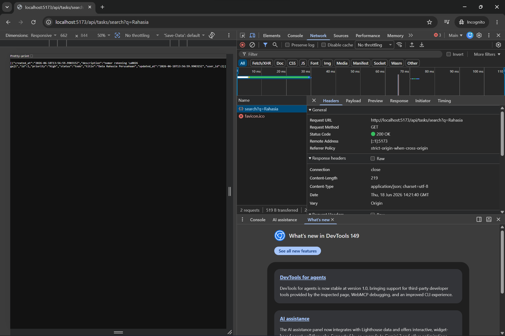
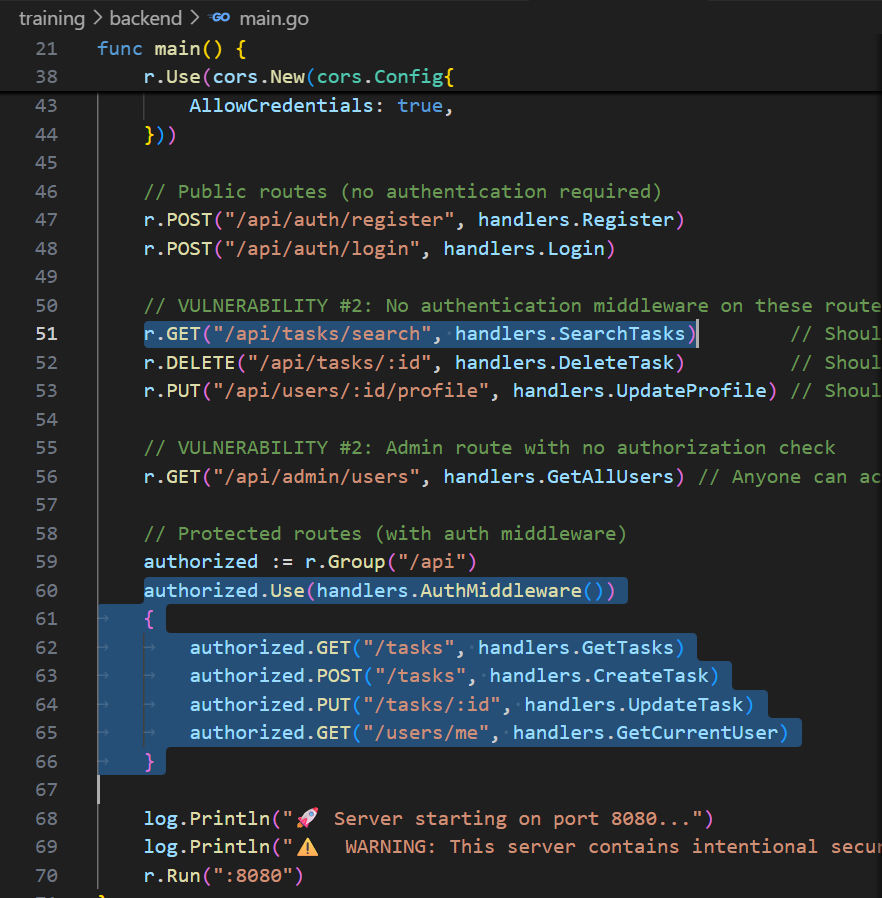

# Security Vulnerability Report

**Report Date**: 2026-06-15  
**Tester Name**: QA Tester  
**Project**: SecureTask Security Training

---

## Vulnerability #AUTH-001: Task Search Endpoint Does Not Require Authentication

### Classification

- **Severity**: [ ] Critical [x] High [ ] Medium [ ] Low
- **Category**: [ ] SQL Injection [ ] XSS [x] Authentication [x] Authorization [x] Data Exposure [ ] Hardcoded Secrets [ ] Other: **\_\_\_**
- **Status**: [ ] Open [ ] In Progress [x] Fixed [x] Verified [ ] Won't Fix
- **CVSS Score**: 8.1 estimated

### Location

- **Component**: [ ] Frontend [x] Backend [x] API [ ] Database
- **File Path**: `backend/main.go`, `backend/handlers/tasks.go`
- **Line Numbers**: `backend/main.go:50-51`, `backend/handlers/tasks.go:91-108`
- **Endpoint/URL**: `GET /api/tasks/search?q=[query]`

### Description

The task search endpoint is registered as a public route and does not use the authentication middleware. The handler also does not filter results by the current user, because there is no authenticated user context available.

### Reproduction Steps

1. Ensure at least one task exists in the application.
2. Logout or open a new browser session with no token.
3. Send a request directly to `/api/tasks/search`.
4. Observe that the endpoint responds without requiring an `Authorization` header.

### Expected Behavior

Task search should require a valid authenticated session and should only return tasks owned by the authenticated user.

### Actual Behavior

The endpoint can be called without authentication. Matching tasks can be returned to anonymous callers.

### Proof of Concept

```bash
curl -i "http://localhost:8080/api/tasks/search?q=test"
```

**Screenshots/Evidence**:

- Network response showing no `Authorization` header was sent.
  
- Route definition in `backend/main.go` places `/api/tasks/search` outside the authenticated route group.
  

### Impact

Anonymous users can query task data. Combined with SQL injection, this issue increases the blast radius because exploitation does not require an account.

**What an attacker could do**:

- [x] Read sensitive data
- [ ] Modify data
- [ ] Delete data
- [ ] Steal user credentials
- [ ] Impersonate users
- [ ] Execute arbitrary code
- [x] Other: enumerate task records without login

**Affected Users/Data**:
All task titles and descriptions that match a search query may be exposed.

### Risk Assessment

**Likelihood**: [x] High [ ] Medium [ ] Low  
**Impact**: [ ] High [x] Medium [ ] Low

**Justification**: The endpoint is intentionally public and easy to call. Impact depends on task data sensitivity but becomes high when combined with SQL injection.

### Recommendation

Move the endpoint into the authenticated route group and enforce user-specific filtering in the query.

**Suggested Actions**:

1. Require authentication middleware for task search.
2. Filter results by authenticated `user_id`.
3. Add tests confirming anonymous requests return `401 Unauthorized`.

### References

- OWASP Top 10 A01: Broken Access Control
- CWE-306: Missing Authentication for Critical Function

### Testing Notes

Create sample tasks first, because the default seed data contains users only.

### Retest Results (After Fix)

**Retest Date**: 2026-06-18  
**Status**: [x] Vulnerability Fixed [ ] Partially Fixed [ ] Not Fixed  
**Notes**: Diverifikasi pada build security-training (`:8080`): anonim `GET /api/tasks/search` kini `401` dan hasil ter-scope per-user (User B tidak melihat task User A). Build lama (`:8081`) membalas `200` + data. Ref: TC-AUTH-001, `_evidence/API-EVIDENCE-fixed.md`.
