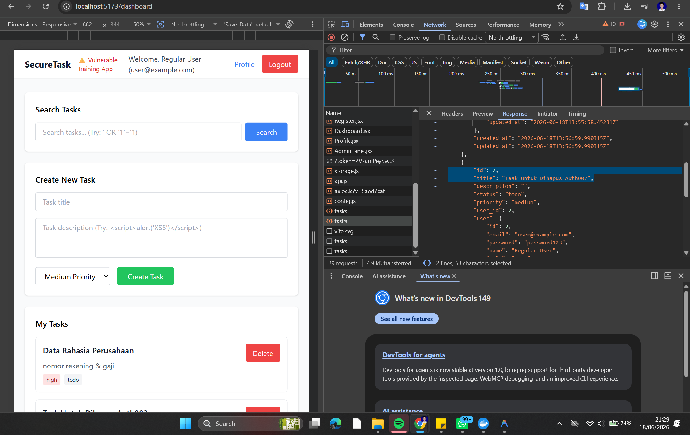
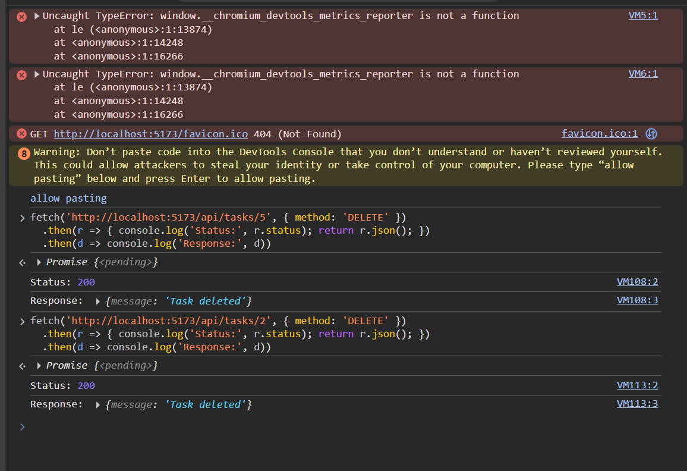
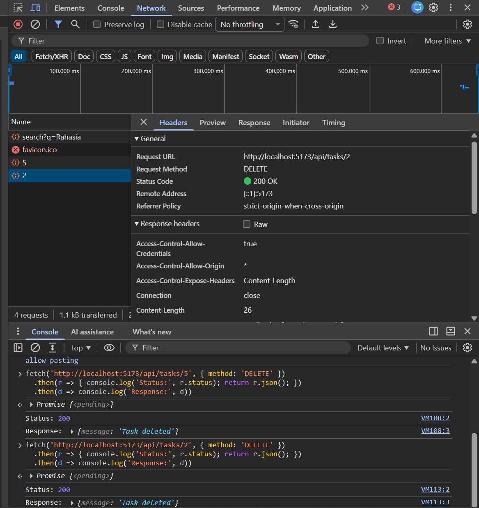
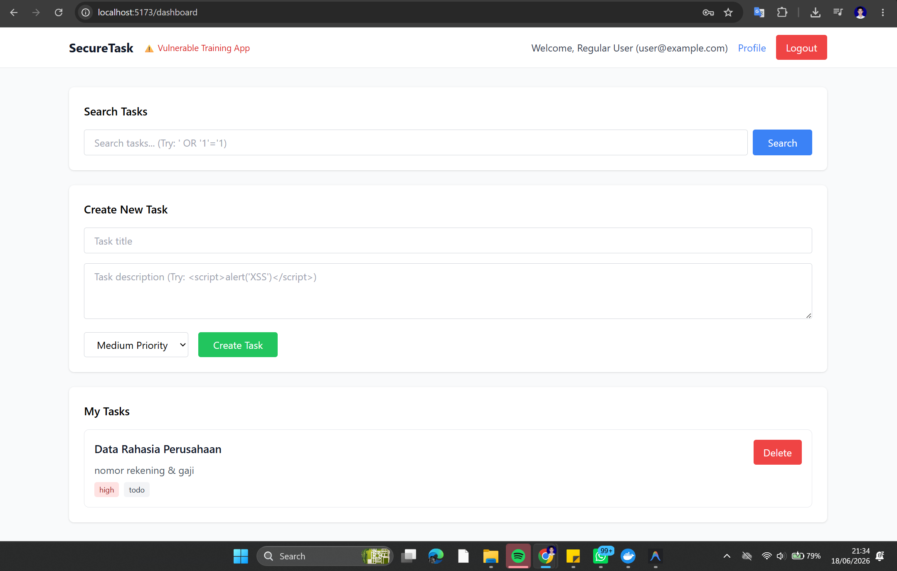
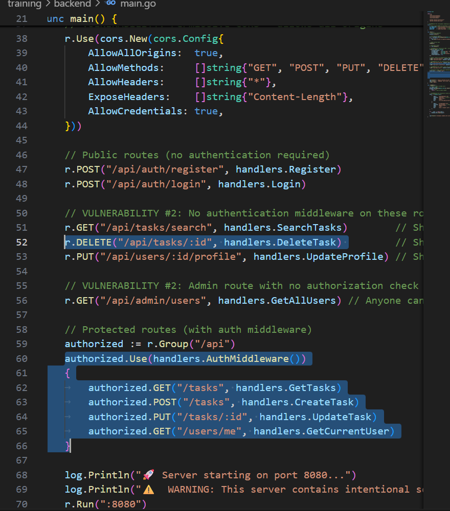

# Security Vulnerability Report

**Report Date**: 2026-06-15  
**Tester Name**: QA Tester  
**Project**: SecureTask Security Training

---

## Vulnerability #AUTH-002: Tasks Can Be Deleted Without Authentication

### Classification

- **Severity**: [x] Critical [ ] High [ ] Medium [ ] Low
- **Category**: [ ] SQL Injection [ ] XSS [x] Authentication [x] Authorization [ ] Data Exposure [ ] Hardcoded Secrets [ ] Other: **\_\_\_**
- **Status**: [ ] Open [ ] In Progress [x] Fixed [x] Verified [ ] Won't Fix
- **CVSS Score**: 9.1 estimated

### Location

- **Component**: [ ] Frontend [x] Backend [x] API [x] Database
- **File Path**: `backend/main.go`, `backend/handlers/tasks.go`
- **Line Numbers**: `backend/main.go:50-52`, `backend/handlers/tasks.go:77-88`
- **Endpoint/URL**: `DELETE /api/tasks/:id`

### Description

The delete task endpoint is registered as a public route and does not require authentication. The handler deletes a task by ID without checking whether the caller is logged in or owns the task.

### Reproduction Steps

1. Create a task in the application and note its task ID.
2. Logout or use a terminal with no token.
3. Send a `DELETE` request to `/api/tasks/{id}`.
4. Refresh the Dashboard or query tasks as the owner.
5. Observe that the task is deleted.

### Expected Behavior

Only an authenticated user should be able to delete their own tasks. Anonymous callers should receive `401 Unauthorized`, and users deleting other users' tasks should receive `403 Forbidden` or `404 Not Found`.

### Actual Behavior

The endpoint accepts unauthenticated requests and deletes by task ID without ownership validation.

### Proof of Concept

```bash
curl -i -X DELETE "http://localhost:8080/api/tasks/1"
```

**Screenshots/Evidence**:

- API response returns a task deletion message without an `Authorization` header.
  
  
  
  
- Source review shows the route is outside the authenticated group and the handler calls `Delete()` by ID only.
  

### Impact

Any unauthenticated user who can reach the API can delete tasks. This causes unauthorized data destruction and loss of integrity.

**What an attacker could do**:

- [ ] Read sensitive data
- [ ] Modify data
- [x] Delete data
- [ ] Steal user credentials
- [ ] Impersonate users
- [ ] Execute arbitrary code
- [x] Other: destroy another user's task records

**Affected Users/Data**:
All task records are affected if IDs are known or guessed.

### Risk Assessment

**Likelihood**: [x] High [ ] Medium [ ] Low  
**Impact**: [x] High [ ] Medium [ ] Low

**Justification**: The endpoint is unauthenticated, uses predictable numeric IDs, and directly performs deletion.

### Recommendation

Protect the endpoint with authentication middleware and require ownership checks before deletion.

**Suggested Actions**:

1. Move `DELETE /api/tasks/:id` into the authenticated route group.
2. Delete only when `id` and `user_id` match the authenticated user.
3. Return a safe error when the task is not owned by the caller.
4. Add negative tests for anonymous and cross-user deletion.

### References

- OWASP Top 10 A01: Broken Access Control
- CWE-306: Missing Authentication for Critical Function
- CWE-862: Missing Authorization

### Testing Notes

If no tasks exist, create one first through the UI or authenticated API.

### Retest Results (After Fix)

**Retest Date**: 2026-06-18  
**Status**: [x] Vulnerability Fixed  [ ] Partially Fixed  [ ] Not Fixed  
**Notes**: Build fixed (`:8080`): anonim `DELETE` → `401`, lintas-user → `404`, owner → `200`. Build lama (`:8081`) menghapus task tanpa auth (`200`). Ref: TC-AUTH-002, `_evidence/API-EVIDENCE-fixed.md`.
