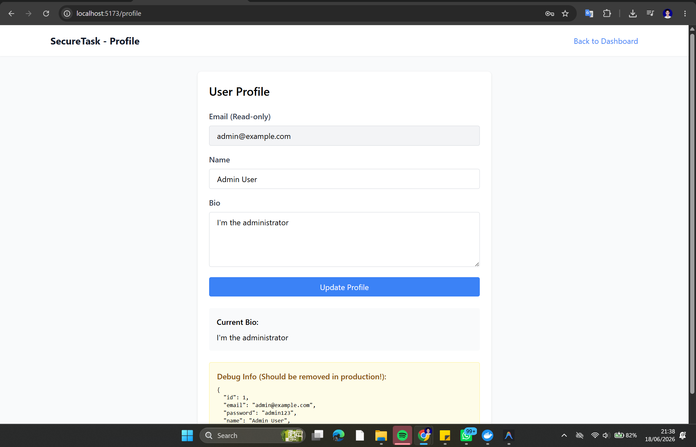
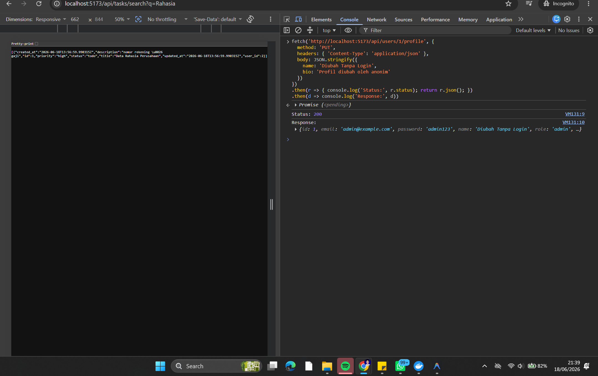
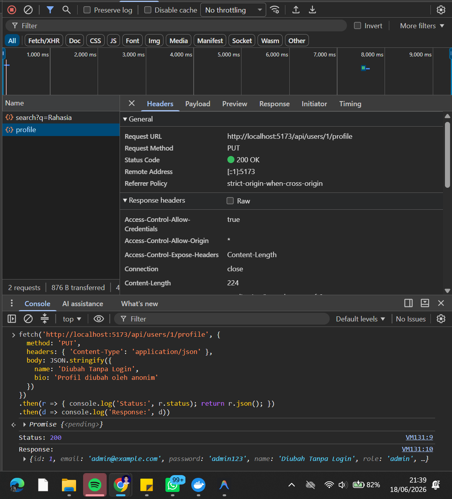
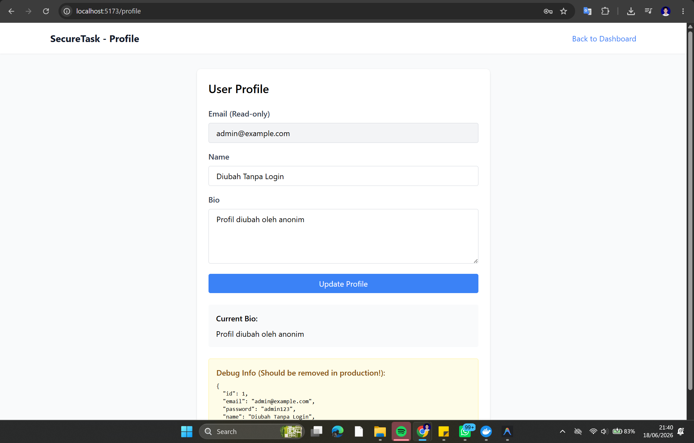
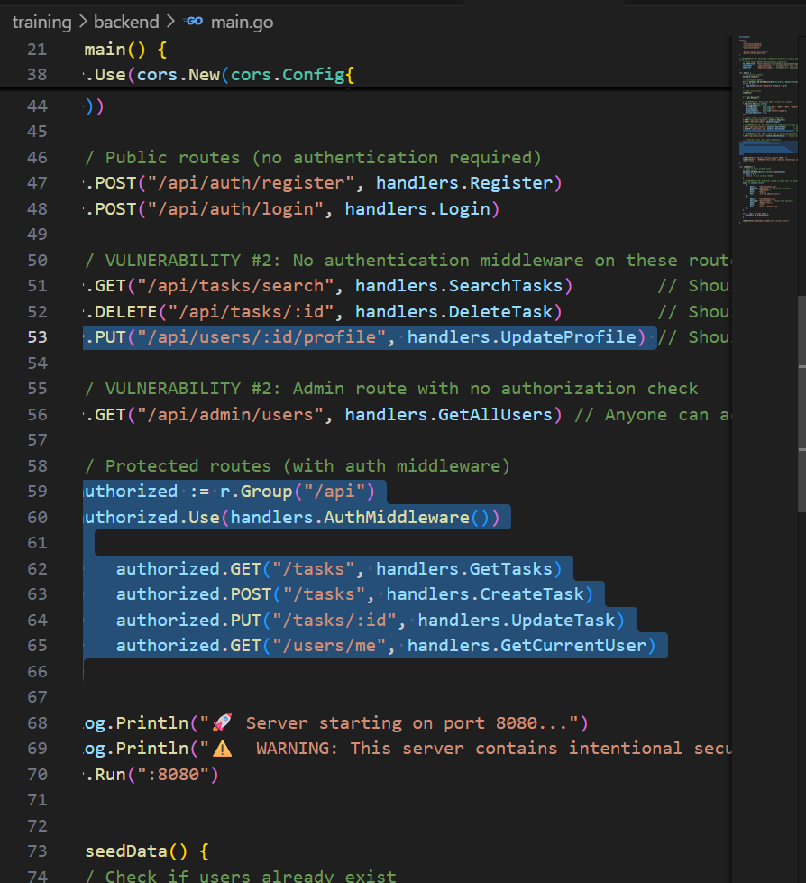

# Security Vulnerability Report

**Report Date**: 2026-06-15  
**Tester Name**: QA Tester  
**Project**: SecureTask Security Training

---

## Vulnerability #AUTH-003: User Profiles Can Be Updated Without Authentication or Ownership Checks

### Classification

- **Severity**: [x] Critical [ ] High [ ] Medium [ ] Low
- **Category**: [ ] SQL Injection [ ] XSS [x] Authentication [x] Authorization [x] Data Exposure [ ] Hardcoded Secrets [ ] Other: Mass Assignment
- **Status**: [ ] Open [ ] In Progress [x] Fixed [x] Verified [ ] Won't Fix
- **CVSS Score**: 9.1 estimated

### Location

- **Component**: [ ] Frontend [x] Backend [x] API [x] Database
- **File Path**: `backend/main.go`, `backend/handlers/users.go`
- **Line Numbers**: `backend/main.go:50-53`, `backend/handlers/users.go:24-48`
- **Endpoint/URL**: `PUT /api/users/:id/profile`

### Description

The profile update endpoint is public and accepts arbitrary JSON fields. It does not verify that the caller is authenticated, that the caller owns the target profile, or that only safe profile fields are updated.

### Reproduction Steps

1. Logout from the application.
2. Send a `PUT` request to `/api/users/2/profile`.
3. Include a JSON body that changes the user's name or bio.
4. Login as that user or query the admin users endpoint.
5. Observe that the profile was changed by an unauthenticated request.

### Expected Behavior

Only the authenticated owner should be able to update their own profile. The API should reject anonymous requests and block updates to protected fields.

### Actual Behavior

Any caller can update any user's profile by ID. The handler updates the database using the supplied JSON map.

### Proof of Concept

```bash
curl -i -X PUT "http://localhost:8080/api/users/2/profile" \
  -H "Content-Type: application/json" \
  -d "{\"name\":\"Changed By Anonymous QA\",\"bio\":\"Updated without authentication\"}"
```

**Screenshots/Evidence**:

- API response showing the modified user object.
  
  
  
  
- Source review shows no authentication middleware and no owner check.
  

### Impact

Attackers can alter another user's profile data. Because the handler accepts arbitrary fields, attackers may also attempt privilege escalation by submitting fields such as `role` or modifying other sensitive user properties.

**What an attacker could do**:

- [ ] Read sensitive data
- [x] Modify data
- [ ] Delete data
- [ ] Steal user credentials
- [x] Impersonate users
- [ ] Execute arbitrary code
- [x] Other: alter user roles or stored XSS payloads through profile fields

**Affected Users/Data**:
All user profile records are affected.

### Risk Assessment

**Likelihood**: [x] High [ ] Medium [ ] Low  
**Impact**: [x] High [ ] Medium [ ] Low

**Justification**: The endpoint is public, uses predictable numeric user IDs, and applies arbitrary updates.

### Recommendation

Require authentication, enforce ownership or admin authorization, and whitelist allowed profile fields.

**Suggested Actions**:

1. Move profile updates into the authenticated route group.
2. Compare route user ID with the authenticated user ID.
3. Reject updates to protected fields such as `id`, `email`, `password`, and `role`.
4. Validate and sanitize profile input.

### References

- OWASP Top 10 A01: Broken Access Control
- CWE-639: Authorization Bypass Through User-Controlled Key
- CWE-915: Improperly Controlled Modification of Dynamically-Determined Object Attributes

### Testing Notes

Retest both anonymous access and cross-user access after the fix.

### Retest Results (After Fix)

**Retest Date**: 2026-06-18  
**Status**: [x] Vulnerability Fixed  [ ] Partially Fixed  [ ] Not Fixed  
**Notes**: Build fixed (`:8080`): anonim → `401`, lintas-user → `403` ("You can only update your own profile"), owner → `200`. Build lama (`:8081`) mengubah profil admin tanpa auth. Ref: TC-AUTH-003, `_evidence/API-EVIDENCE-fixed.md`.
