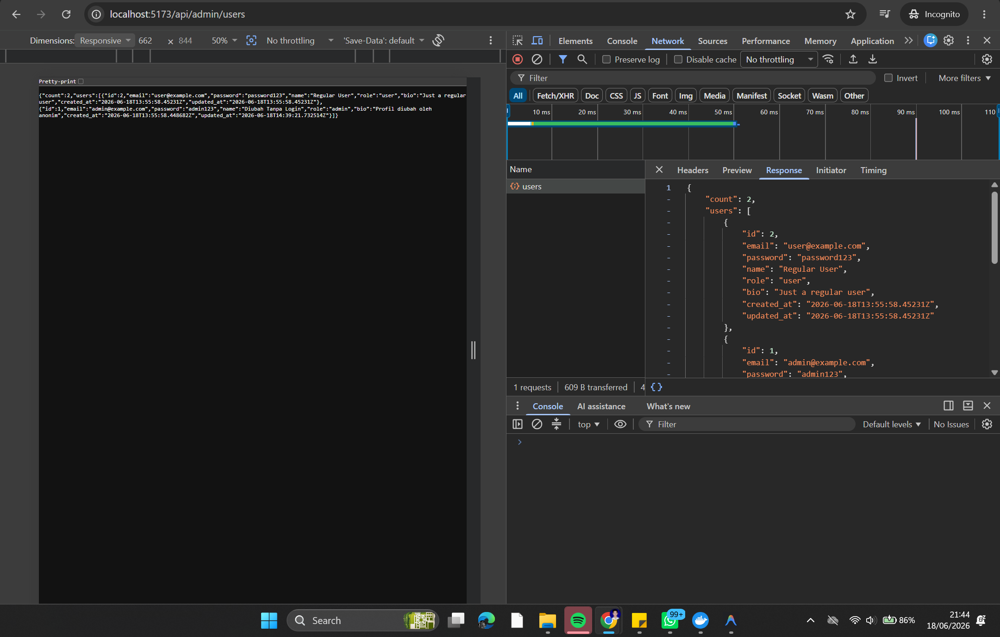
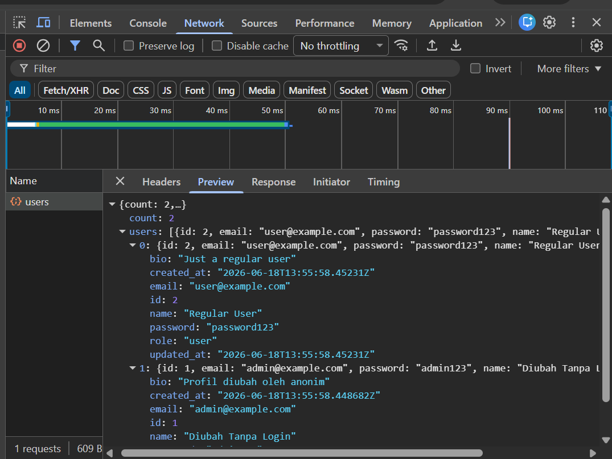
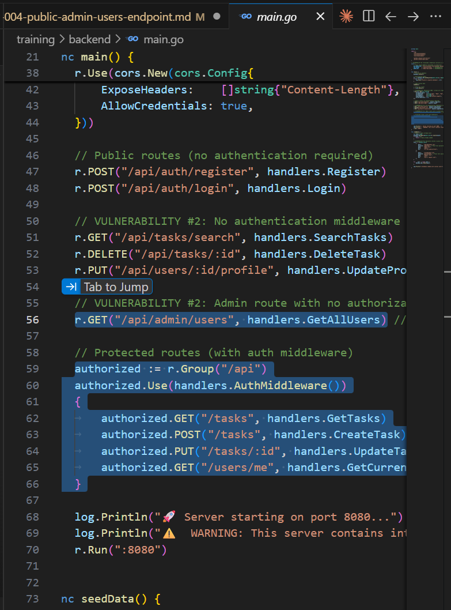

# Security Vulnerability Report

**Report Date**: 2026-06-15  
**Tester Name**: QA Tester  
**Project**: SecureTask Security Training

---

## Vulnerability #AUTH-004: Admin User Listing Endpoint Is Public

### Classification

- **Severity**: [x] Critical [ ] High [ ] Medium [ ] Low
- **Category**: [ ] SQL Injection [ ] XSS [x] Authentication [x] Authorization [x] Data Exposure [ ] Hardcoded Secrets [ ] Other: **\_\_\_**
- **Status**: [ ] Open [ ] In Progress [x] Fixed [x] Verified [ ] Won't Fix
- **CVSS Score**: 9.8 estimated

### Location

- **Component**: [ ] Frontend [x] Backend [x] API [x] Database
- **File Path**: `backend/main.go`, `backend/handlers/users.go`
- **Line Numbers**: `backend/main.go:55-56`, `backend/handlers/users.go:50-61`
- **Endpoint/URL**: `GET /api/admin/users`

### Description

The admin users endpoint is registered outside the authenticated route group. It does not require login and does not check for an admin role. The handler returns all users and includes password fields.

### Reproduction Steps

1. Logout from the application or use a terminal with no token.
2. Send a request to `/api/admin/users`.
3. Observe that the response returns all users.
4. Confirm the response includes password values.

### Expected Behavior

The endpoint should require a valid token and a server-side admin role check. Non-admin users should receive `403 Forbidden`, and anonymous users should receive `401 Unauthorized`.

### Actual Behavior

The endpoint returns all users to anonymous callers.

### Proof of Concept

```bash
curl -i "http://localhost:8080/api/admin/users"
```

**Screenshots/Evidence**:

- HTTP `200 OK` response from `/api/admin/users` without an `Authorization` header.
  
  
- Response body includes user records and password fields.
  

### Impact

This exposes all user accounts and credentials. In the current training app, passwords are stored in plain text, making this endpoint a direct credential disclosure issue.

**What an attacker could do**:

- [x] Read sensitive data
- [ ] Modify data
- [ ] Delete data
- [x] Steal user credentials
- [x] Impersonate users
- [ ] Execute arbitrary code
- [x] Other: enumerate users and roles

**Affected Users/Data**:
All user records, emails, roles, bios, and passwords are affected.

### Risk Assessment

**Likelihood**: [x] High [ ] Medium [ ] Low  
**Impact**: [x] High [ ] Medium [ ] Low

**Justification**: The endpoint is unauthenticated and returns highly sensitive data.

### Recommendation

Require authentication and server-side role authorization. Remove password fields from all API responses.

**Suggested Actions**:

1. Protect `/api/admin/users` with authentication middleware.
2. Add server-side role validation for `admin`.
3. Exclude password fields from serialized user responses.
4. Add tests for anonymous, regular user, and admin access.

### References

- OWASP Top 10 A01: Broken Access Control
- OWASP Top 10 A02: Cryptographic Failures
- CWE-306: Missing Authentication for Critical Function
- CWE-200: Exposure of Sensitive Information

### Testing Notes

This endpoint was also used as a health check and returned `200` with two seeded users.

### Retest Results (After Fix)

**Retest Date**: 2026-06-18  
**Status**: [x] Vulnerability Fixed [ ] Partially Fixed [ ] Not Fixed  
**Notes**: Build fixed (`:8080`): anonim → `401`, user reguler → `403` ("Admin access required"), admin → `200` **tanpa field `password`**. Build lama (`:8081`) membalas `200` + password plaintext. Ref: TC-AUTH-004, `_evidence/API-EVIDENCE-fixed.md`.
