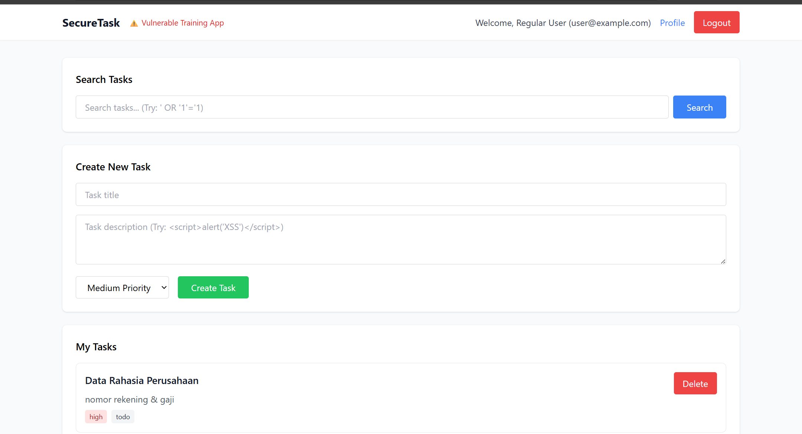
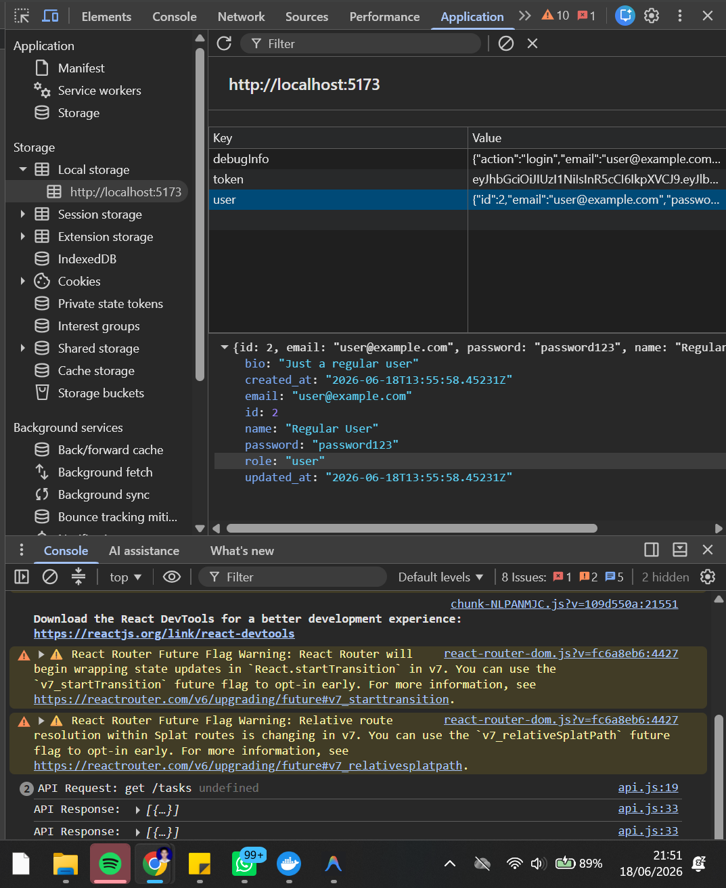
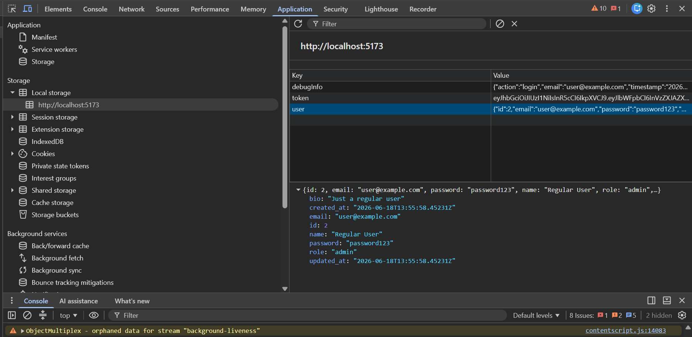
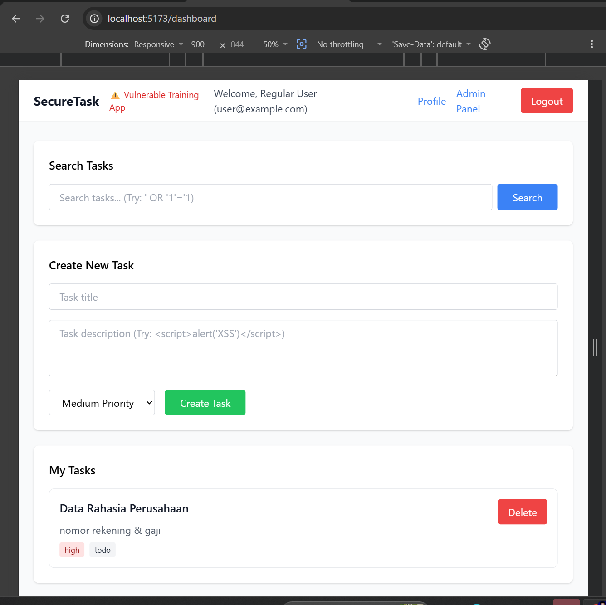
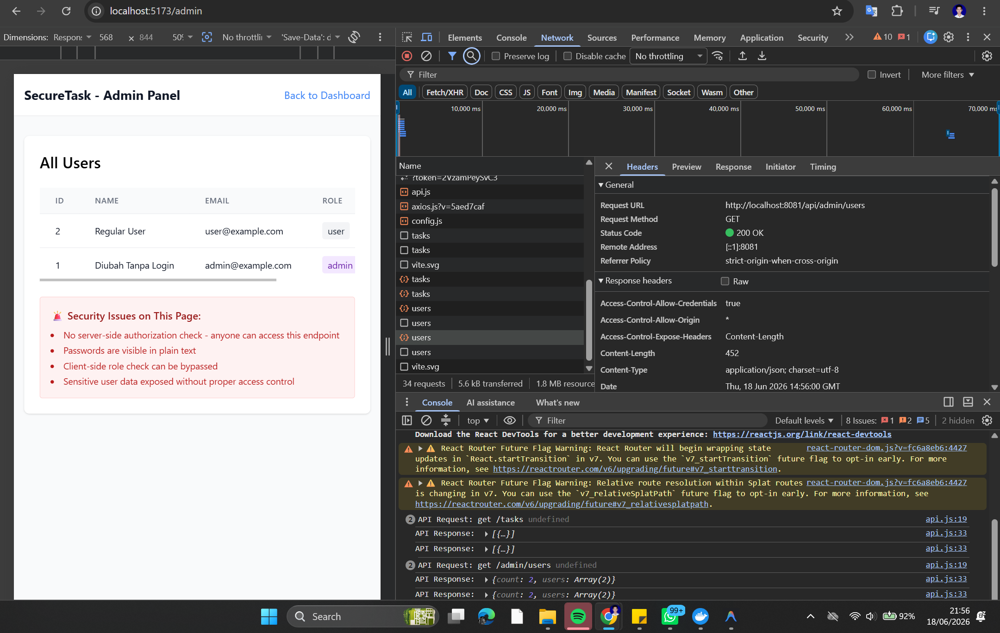

# Security Vulnerability Report

**Report Date**: 2026-06-15  
**Tester Name**: QA Tester  
**Project**: SecureTask Security Training

---

## Vulnerability #AUTH-005: Admin Panel Authorization Relies on Client-Side Role Data

### Classification

- **Severity**: [ ] Critical [x] High [ ] Medium [ ] Low
- **Category**: [ ] SQL Injection [ ] XSS [x] Authentication [x] Authorization [ ] Data Exposure [ ] Hardcoded Secrets [ ] Other: Client-Side Authorization
- **Status**: [ ] Open [ ] In Progress [x] Fixed [x] Verified [ ] Won't Fix
- **CVSS Score**: 8.1 estimated

### Location

- **Component**: [x] Frontend [x] Backend [x] API [ ] Database
- **File Path**: `frontend/src/App.jsx`, `frontend/src/pages/AdminPanel.jsx`, `frontend/src/utils/storage.js`
- **Line Numbers**: `frontend/src/App.jsx:37-44`, `frontend/src/pages/AdminPanel.jsx:16-29`, `frontend/src/utils/storage.js:16-28`
- **Endpoint/URL**: `/admin`, `GET /api/admin/users`

### Description

The frontend uses user role data from localStorage to decide whether to show admin navigation and warnings. A user can modify localStorage in the browser and make the UI behave as if they are an admin. The backend admin endpoint also lacks server-side authorization, so the client-side bypass leads to real data exposure.

### Reproduction Steps

1. Login as `user@example.com / password123`.
2. Open browser DevTools.
3. Go to Application > Local Storage.
4. Edit the stored `user` object and change `"role":"user"` to `"role":"admin"`.
5. Navigate to `/admin` or refresh the application.
6. Observe that the admin panel can be accessed and user data can be loaded.

### Expected Behavior

Client-side role checks should only improve user experience. The backend must enforce admin authorization before returning admin data.

### Actual Behavior

The frontend trusts localStorage role data, and the backend does not reject non-admin or anonymous requests to admin APIs.

### Proof of Concept

```javascript
// Browser console after login as a regular user
const user = JSON.parse(localStorage.getItem("user"));
user.role = "admin";
localStorage.setItem("user", JSON.stringify(user));
location.href = "/admin";
```

**Screenshots/Evidence**:

- LocalStorage before and after role modification.
  
  
  
- Admin page accessible as a regular user.
  
- `/api/admin/users` returns data without server-side role validation.
  

### Impact

A regular user can access administrative data and functionality if the backend does not enforce authorization.

**What an attacker could do**:

- [x] Read sensitive data
- [ ] Modify data
- [ ] Delete data
- [x] Steal user credentials
- [x] Impersonate users
- [ ] Execute arbitrary code
- [x] Other: bypass UI access control

**Affected Users/Data**:
All user records exposed through the admin panel.

### Risk Assessment

**Likelihood**: [x] High [ ] Medium [ ] Low  
**Impact**: [x] High [ ] Medium [ ] Low

**Justification**: localStorage is fully controlled by the user. Because backend authorization is missing, the bypass exposes sensitive data.

### Recommendation

Treat client-side authorization as cosmetic only. Enforce role checks on the backend and handle `401`/`403` responses in the UI.

**Suggested Actions**:

1. Add server-side admin role validation.
2. Do not trust localStorage for security decisions.
3. Fetch current user state from a trusted authenticated API.
4. Redirect or show access denied on `403` responses.

### References

- OWASP Top 10 A01: Broken Access Control
- CWE-602: Client-Side Enforcement of Server-Side Security

### Testing Notes

This finding depends on the backend admin endpoint also being unprotected.

### Retest Results (After Fix)

**Retest Date**: 2026-06-18  
**Status**: [x] Vulnerability Fixed [ ] Partially Fixed [ ] Not Fixed  
**Notes**: Build fixed (`:8080`): backend memvalidasi `role` dari JWT — user reguler `GET /api/admin/users` → `403`, token palsu `alg:none` (role:admin) → `401`. Mengubah `role` di localStorage tidak mengubah cookie/JWT sehingga akses admin tetap ditolak. Ref: TC-AUTH-005, TC-FIX-001, `_evidence/README.md`. Catatan: screenshot DevTools disarankan sebagai konfirmasi runtime.
