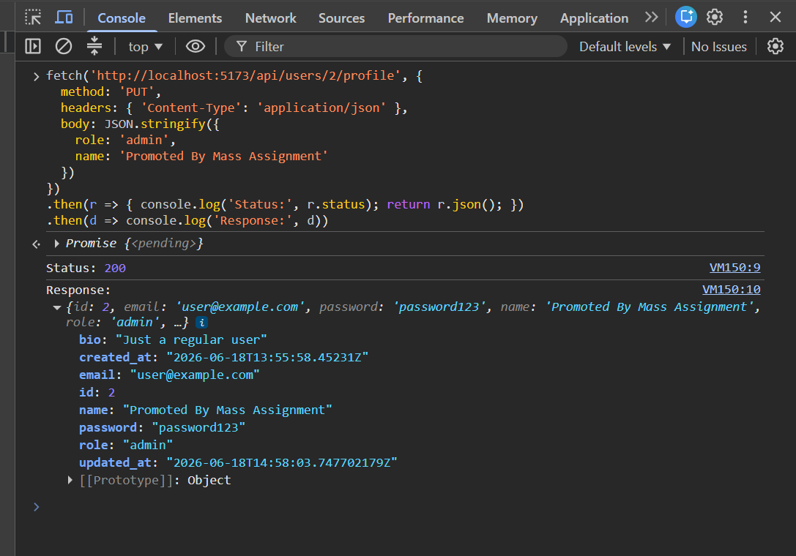
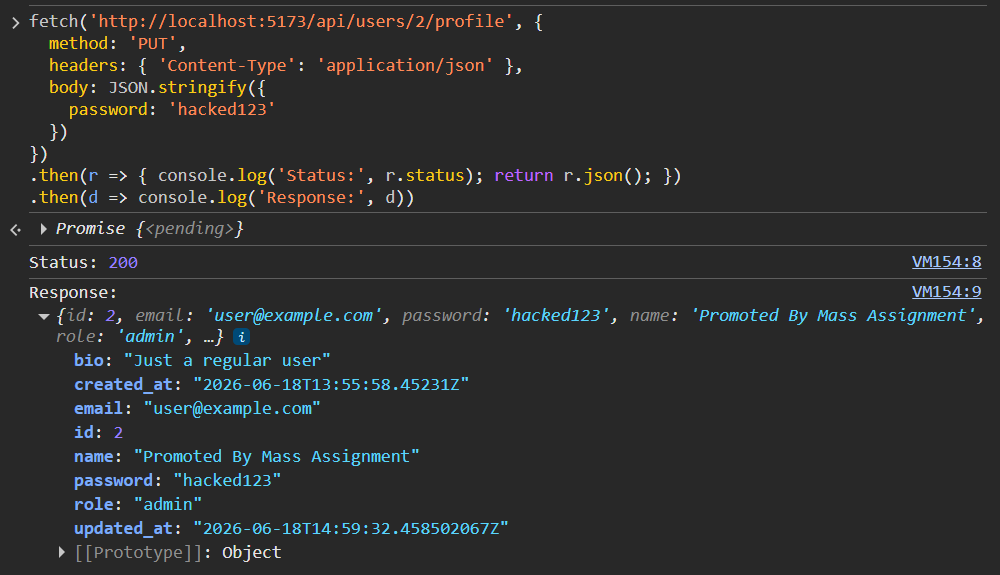
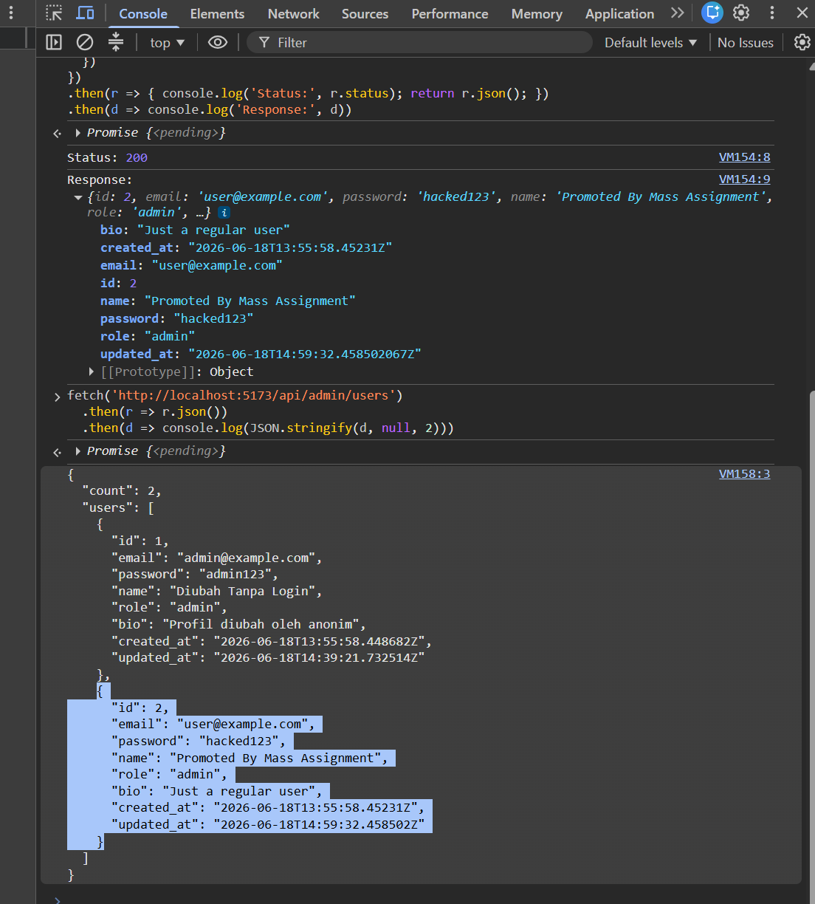
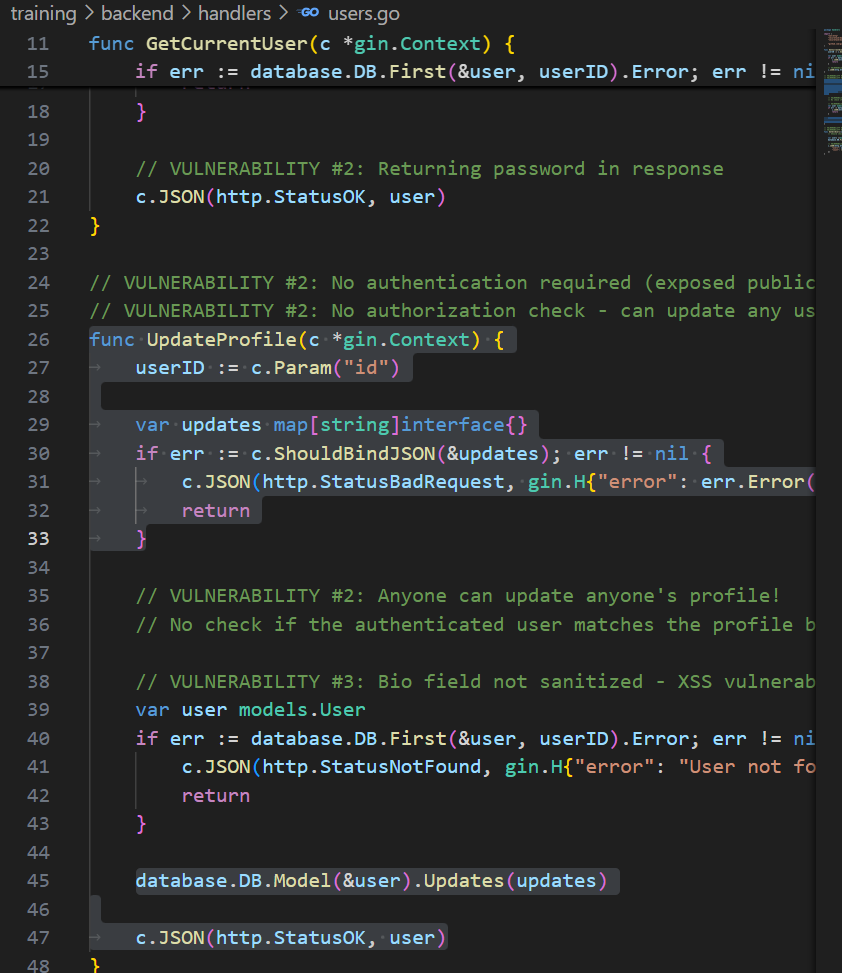

# Security Vulnerability Report

**Report Date**: 2026-06-15  
**Tester Name**: QA Tester  
**Project**: SecureTask Security Training

---

## Vulnerability #AUTH-006: Mass Assignment and Missing Server-Side Input Validation

### Classification

- **Severity**: [ ] Critical [x] High [ ] Medium [ ] Low
- **Category**: [ ] SQL Injection [ ] XSS [ ] Authentication [x] Authorization [ ] Data Exposure [ ] Hardcoded Secrets [x] Other: Input Validation
- **Status**: [ ] Open [ ] In Progress [x] Fixed [x] Verified [ ] Won't Fix
- **CVSS Score**: 8.1 estimated

### Location

- **Component**: [ ] Frontend [x] Backend [x] API [x] Database
- **File Path**: `backend/handlers/users.go`, `backend/handlers/tasks.go`
- **Line Numbers**: `backend/handlers/users.go:29-48`, `backend/handlers/tasks.go:60-73`
- **Endpoint/URL**: `PUT /api/users/:id/profile`, `PUT /api/tasks/:id`

### Description

Update handlers accept `map[string]interface{}` and pass the supplied fields directly to GORM updates. This allows callers to submit fields that should not be user-controlled, such as `role`, `password`, `user_id`, or other model attributes.

### Reproduction Steps

1. Send a profile update request with a field that is not part of the intended profile form.
2. Include fields such as `role` or `password`.
3. Observe whether the response or database record changes.
4. Repeat for task updates with fields such as `user_id` or arbitrary `status` values.

### Expected Behavior

The API should validate input and only update explicitly allowed fields.

### Actual Behavior

The update handlers accept arbitrary JSON fields and pass them into database updates.

### Proof of Concept

```bash
curl -i -X PUT "http://localhost:8080/api/users/2/profile" \
  -H "Content-Type: application/json" \
  -d "{\"role\":\"admin\",\"name\":\"Promoted By Mass Assignment\"}"
```

**Screenshots/Evidence**:

- Source review shows update payloads are accepted as generic maps.
  
- API response may include modified protected fields depending on submitted body.
  
  
  

### Impact

Attackers may alter protected properties, escalate privileges, corrupt data, or bypass business rules.

**What an attacker could do**:

- [ ] Read sensitive data
- [x] Modify data
- [ ] Delete data
- [ ] Steal user credentials
- [x] Impersonate users
- [ ] Execute arbitrary code
- [x] Other: privilege escalation through role changes

**Affected Users/Data**:
User profiles, roles, passwords, and task ownership/integrity may be affected.

### Risk Assessment

**Likelihood**: [x] High [ ] Medium [ ] Low  
**Impact**: [x] High [ ] Medium [ ] Low

**Justification**: Generic update maps are directly exposed through API handlers, and profile update is unauthenticated.

### Recommendation

Use strict request DTOs for update operations and whitelist allowed fields.

**Suggested Actions**:

1. Replace generic update maps with typed request structs.
2. Validate allowed values for fields such as status and priority.
3. Block client updates to protected fields.
4. Add tests for forbidden field updates.

### References

- CWE-915: Improperly Controlled Modification of Dynamically-Determined Object Attributes
- OWASP API Security: Mass Assignment

### Testing Notes

This issue overlaps with missing authentication on profile update but should be fixed independently.

### Retest Results (After Fix)

**Retest Date**: 2026-06-18  
**Status**: [x] Vulnerability Fixed [ ] Partially Fixed [ ] Not Fixed  
**Notes**: Build fixed (`:8080`): `role`/`password`/`user_id` diabaikan (DTO whitelist `name`/`bio`); `role` tetap `user` di `/users/me`. Enum task invalid (`status:invalid_status`, `priority:urgent`) → `400`; create tanpa title → `400`. Build lama (`:8081`) menerima mass assignment (role→admin, password berubah). Ref: TC-AUTH-006, `_evidence/API-EVIDENCE-fixed.md`.
