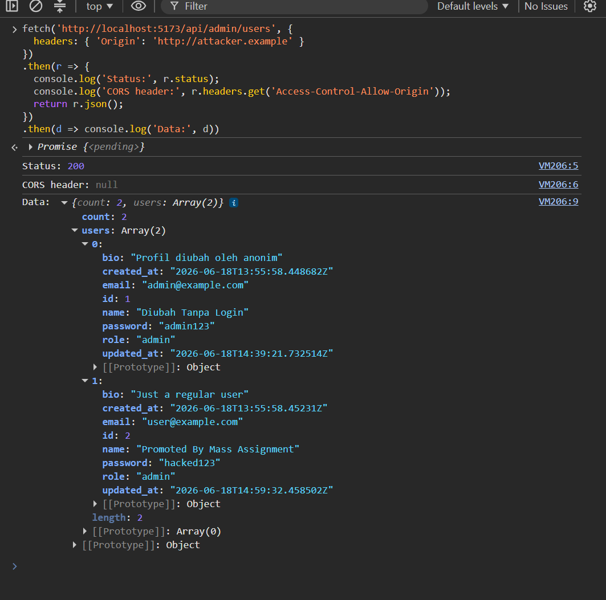
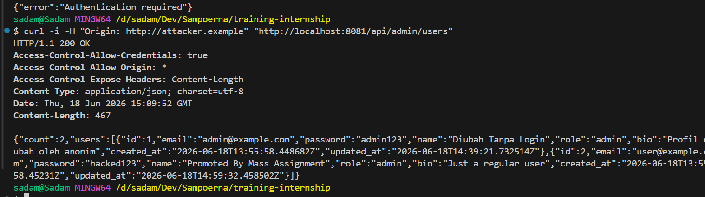
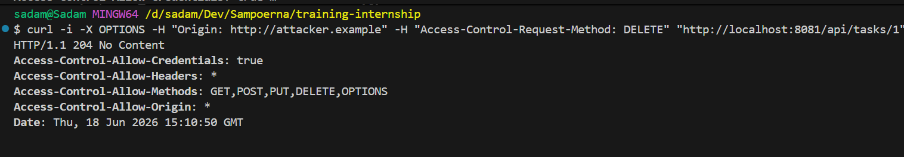
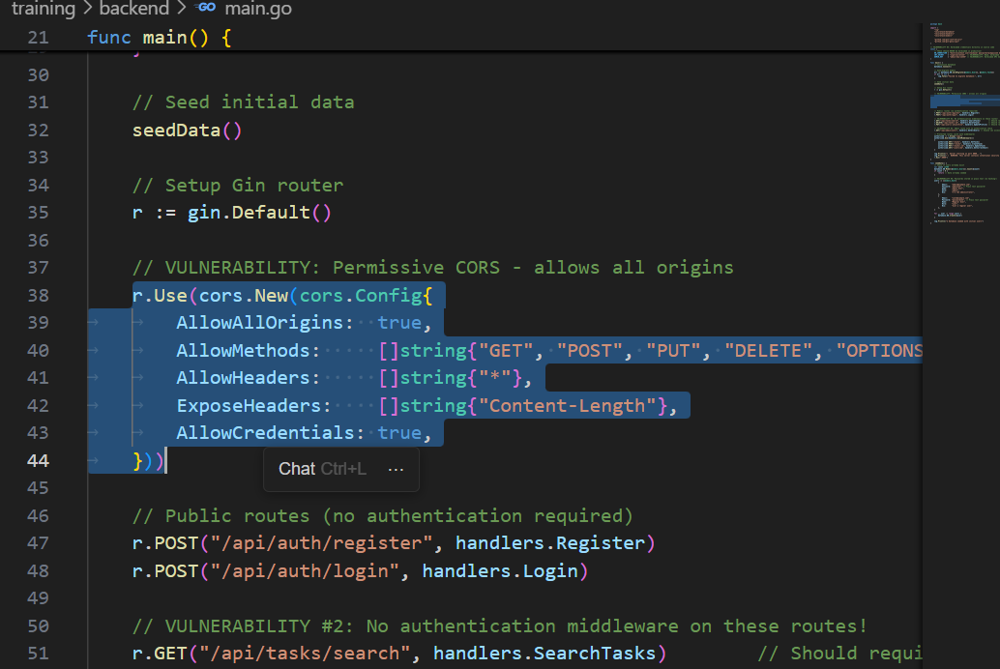

# Security Vulnerability Report

**Report Date**: 2026-06-15  
**Tester Name**: QA Tester  
**Project**: SecureTask Security Training

---

## Vulnerability #AUTH-007: Permissive CORS Policy Allows All Origins

### Classification

- **Severity**: [ ] Critical [ ] High [x] Medium [ ] Low
- **Category**: [ ] SQL Injection [ ] XSS [ ] Authentication [x] Authorization [ ] Data Exposure [ ] Hardcoded Secrets [x] Other: CORS Misconfiguration
- **Status**: [ ] Open [ ] In Progress [x] Fixed [x] Verified [ ] Won't Fix
- **CVSS Score**: 6.5 estimated

### Location

- **Component**: [ ] Frontend [x] Backend [x] API [ ] Database
- **File Path**: `backend/main.go`
- **Line Numbers**: `backend/main.go:37-45`
- **Endpoint/URL**: All API endpoints

### Description

The backend CORS configuration allows all origins, all headers, and common HTTP methods. This weakens browser-based protections and makes it easier for untrusted websites to interact with the API.

### Reproduction Steps

1. Review the backend CORS middleware configuration.
2. Observe that `AllowAllOrigins` is enabled.
3. Send cross-origin requests from a different origin and inspect response headers.

### Expected Behavior

The API should only allow trusted frontend origins and required headers/methods.

### Actual Behavior

The backend is configured to allow all origins and headers.

### Proof of Concept

```bash
curl -i -H "Origin: http://attacker.example" "http://localhost:8080/api/admin/users"
```

**Screenshots/Evidence**:

- Source review of `backend/main.go` shows permissive CORS settings.
- Response headers can be inspected in browser DevTools or curl.

### Impact

Permissive CORS does not create authentication by itself, but it increases exposure when combined with missing authorization, token storage weaknesses, or future cookie-based authentication.

**What an attacker could do**:

- [x] Read sensitive data
- [ ] Modify data
- [ ] Delete data
- [ ] Steal user credentials
- [ ] Impersonate users
- [ ] Execute arbitrary code
- [x] Other: use a malicious origin to interact with APIs

**Affected Users/Data**:
All API endpoints are affected by the overly broad policy.

### Risk Assessment

**Likelihood**: [ ] High [x] Medium [ ] Low  
**Impact**: [ ] High [x] Medium [ ] Low

**Justification**: The issue is broad but requires interaction with other vulnerabilities or browser context to create practical impact.

### Recommendation

Restrict CORS to trusted application origins and only required methods/headers.

**Suggested Actions**:

1. Replace `AllowAllOrigins` with explicit trusted origins.
   
   
2. Limit allowed headers and methods.
   

3. Review CORS again if authentication moves to cookies.
   

### References

- OWASP CORS Security Cheat Sheet
- CWE-942: Permissive Cross-domain Policy with Untrusted Domains

### Testing Notes

CORS risk should be retested with browser requests, not only curl.

### Retest Results (After Fix)

**Retest Date**: 2026-06-18  
**Status**: [x] Vulnerability Fixed [ ] Partially Fixed [ ] Not Fixed  
**Notes**: Build fixed (`:8080`): hanya `http://localhost:5173` dipantulkan di `Access-Control-Allow-Origin`; origin asing tidak menerima header CORS. Build lama (`:8081`) membalas `Access-Control-Allow-Origin: *` bersama `Allow-Credentials: true`. Ref: TC-AUTH-007, `_evidence/API-EVIDENCE-fixed.md`.
