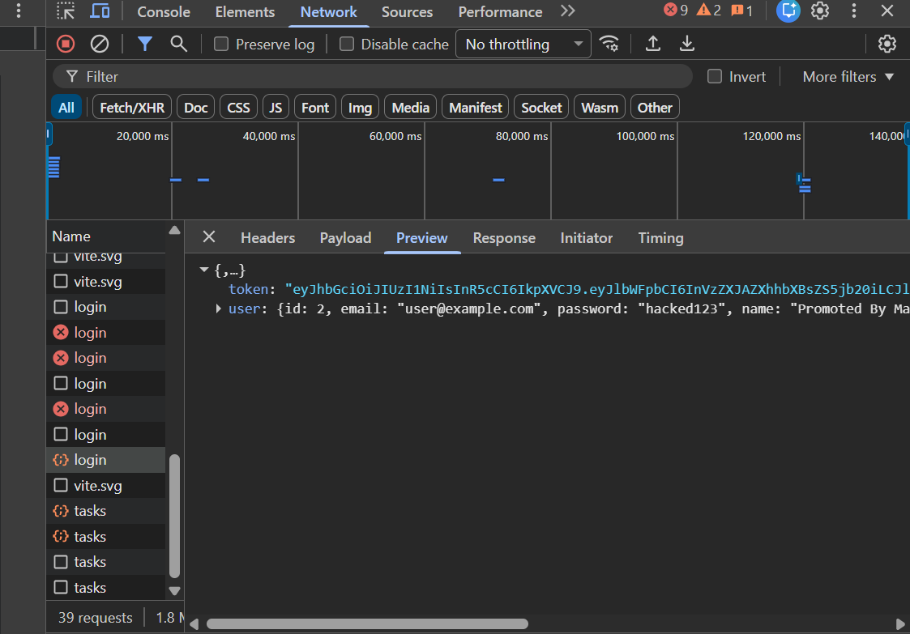
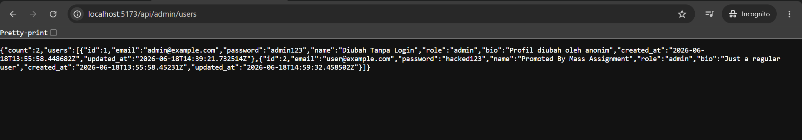
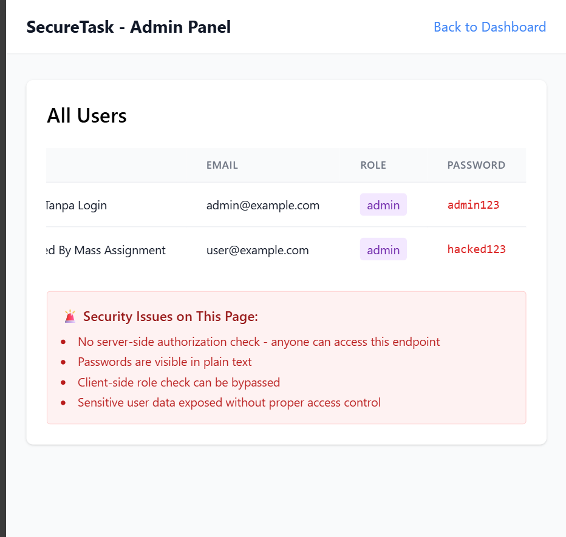
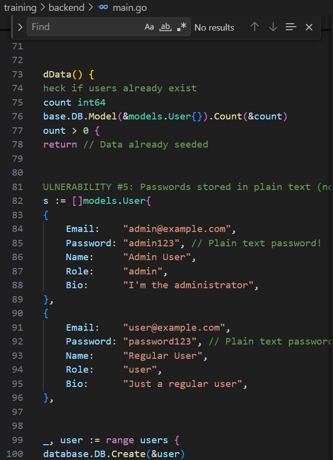

# Security Vulnerability Report

**Report Date**: 2026-06-15  
**Tester Name**: QA Tester  
**Project**: SecureTask Security Training

---

## Vulnerability #STORE-001: Passwords Are Stored and Returned in Plain Text

### Classification

- **Severity**: [x] Critical [ ] High [ ] Medium [ ] Low
- **Category**: [ ] SQL Injection [ ] XSS [ ] Authentication [ ] Authorization [x] Data Exposure [ ] Hardcoded Secrets [x] Other: Password Storage
- **Status**: [ ] Open [ ] In Progress [x] Fixed [x] Verified [ ] Won't Fix
- **CVSS Score**: 9.8 estimated

### Location

- **Component**: [ ] Frontend [x] Backend [x] API [x] Database
- **File Path**: `backend/models/user.go`, `backend/handlers/auth.go`, `backend/handlers/users.go`, `backend/main.go`
- **Line Numbers**: `backend/models/user.go:10`, `backend/handlers/auth.go:35-51,65-88`, `backend/handlers/users.go:17-22,58-61`, `backend/main.go:81-96`
- **Endpoint/URL**: `POST /api/auth/login`, `POST /api/auth/register`, `GET /api/users/me`, `GET /api/admin/users`

### Description

Passwords are stored in plain text in the database. The user model serializes the password field as JSON, so passwords are returned in API responses and displayed in the admin panel.

### Reproduction Steps

1. Login with `user@example.com / password123`.
2. Inspect the login response.
3. Call `/api/admin/users` without authentication.
4. Observe plain text passwords in the response.
5. Optionally inspect the database `users` table and confirm passwords are not hashed.

### Expected Behavior

Passwords should be hashed with a strong password hashing algorithm and never returned in API responses.

### Actual Behavior

Passwords are stored and returned as plain text strings.

### Proof of Concept

```bash
curl -s -X POST "http://localhost:8080/api/auth/login" \
  -H "Content-Type: application/json" \
  -d "{\"email\":\"user@example.com\",\"password\":\"password123\"}"

curl -s "http://localhost:8080/api/admin/users"
```

**Screenshots/Evidence**:

- Login response includes a `user.password` value.
  

- Admin panel table displays the password column.
  
  
- Database seed inserts `admin123` and `password123` as plain text.
  

### Impact

Any user data exposure immediately becomes credential exposure. Attackers can reuse passwords to impersonate users in this application or other services if users reuse passwords.

**What an attacker could do**:

- [x] Read sensitive data
- [ ] Modify data
- [ ] Delete data
- [x] Steal user credentials
- [x] Impersonate users
- [ ] Execute arbitrary code
- [x] Other: perform credential stuffing against other systems

**Affected Users/Data**:
All application user accounts and passwords.

### Risk Assessment

**Likelihood**: [x] High [ ] Medium [ ] Low  
**Impact**: [x] High [ ] Medium [ ] Low

**Justification**: Passwords are exposed by multiple endpoints, and the admin endpoint is public.

### Recommendation

Hash passwords before storage and exclude password fields from all serialized API responses.

**Suggested Actions**:

1. Use a strong password hashing algorithm such as bcrypt.
2. Add `json:"-"` or response DTOs to prevent password serialization.
3. Change login verification to compare password hashes.
4. Rotate all existing training credentials after the fix.

### References

- OWASP Password Storage Cheat Sheet
- CWE-256: Plaintext Storage of a Password
- CWE-522: Insufficiently Protected Credentials

### Testing Notes

The current seeded accounts intentionally use plain text passwords.

### Retest Results (After Fix)

**Retest Date**: 2026-06-18  
**Status**: [x] Vulnerability Fixed [ ] Partially Fixed [ ] Not Fixed  
**Notes**: Build fixed (`:8080`): tidak ada field `password` di response register/login/`/users/me`/`/admin/users`; DB menyimpan hash bcrypt (`SELECT` → prefix `$2a$`, panjang `60` untuk semua user). Build lama (`:8081`) mengembalikan password plaintext di body & menyimpannya plaintext di DB. Ref: TC-STORE-001, `_evidence/API-EVIDENCE-fixed.md`.
