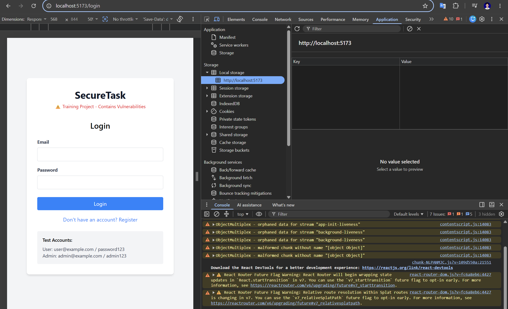
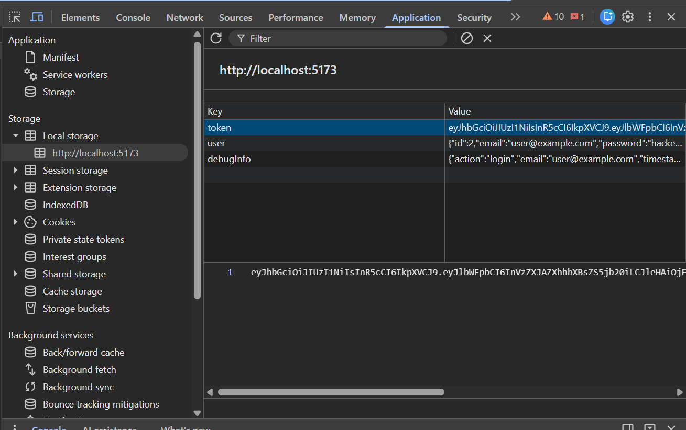
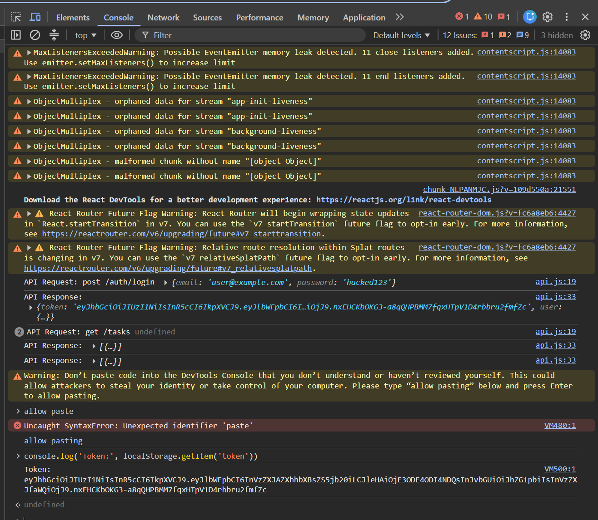
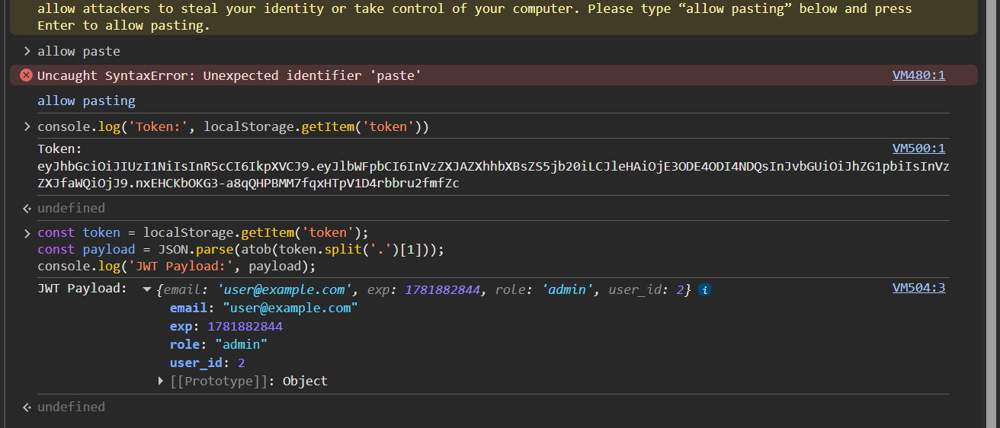
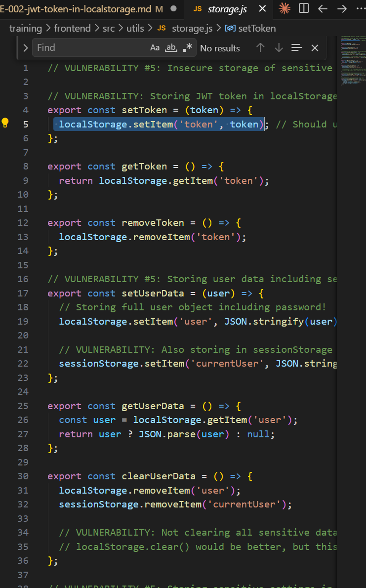
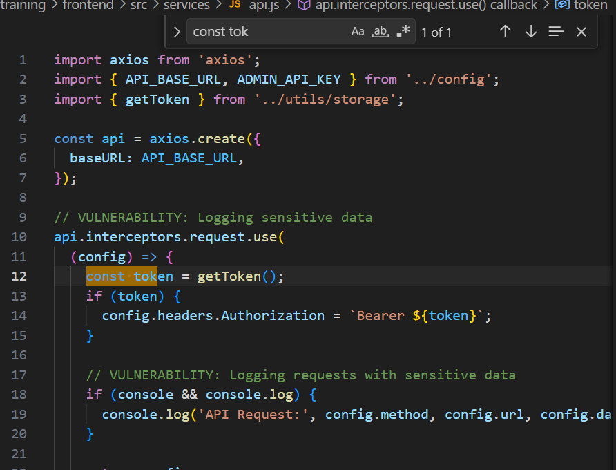

# Security Vulnerability Report

**Report Date**: 2026-06-15  
**Tester Name**: QA Tester  
**Project**: SecureTask Security Training

---

## Vulnerability #STORE-002: JWT Token Stored in localStorage

### Classification

- **Severity**: [ ] Critical [x] High [ ] Medium [ ] Low
- **Category**: [ ] SQL Injection [ ] XSS [ ] Authentication [ ] Authorization [x] Data Exposure [ ] Hardcoded Secrets [x] Other: Session Storage
- **Status**: [ ] Open [ ] In Progress [x] Fixed [x] Verified [ ] Won't Fix
- **CVSS Score**: 8.1 estimated

### Location

- **Component**: [x] Frontend [ ] Backend [ ] API [ ] Database
- **File Path**: `frontend/src/utils/storage.js`, `frontend/src/pages/Login.jsx`, `frontend/src/services/api.js`
- **Line Numbers**: `frontend/src/utils/storage.js:3-13`, `frontend/src/pages/Login.jsx:17-23`, `frontend/src/services/api.js:9-15`
- **Endpoint/URL**: Login flow and all authenticated API calls

### Description

After login, the application stores the JWT in localStorage. Any JavaScript running in the page can read localStorage, so stored XSS vulnerabilities can steal the token.

### Reproduction Steps

1. Login to the application.
2. Open browser DevTools.
3. Go to Application > Local Storage.
4. Inspect the `token` key.
5. Run `localStorage.getItem('token')` in the browser console.

### Expected Behavior

Authentication tokens should not be accessible to JavaScript. Sensitive session tokens should be stored in httpOnly cookies or another safer session design.

### Actual Behavior

The JWT is visible in localStorage and readable by any script in the page.

### Proof of Concept

```javascript
localStorage.getItem("token");
```

**Screenshots/Evidence**:

- LocalStorage contains a `token` key after login.
  
  
- `frontend/src/utils/storage.js` writes the token to localStorage.
  
  
  
  

### Impact

If an attacker can run JavaScript through XSS, they can steal the JWT and impersonate the victim until the token expires.

**What an attacker could do**:

- [x] Read sensitive data
- [x] Modify data
- [x] Delete data
- [x] Steal user credentials
- [x] Impersonate users
- [ ] Execute arbitrary code
- [x] Other: hijack sessions through stolen bearer tokens

**Affected Users/Data**:
All logged-in users.

### Risk Assessment

**Likelihood**: [x] High [ ] Medium [ ] Low  
**Impact**: [x] High [ ] Medium [ ] Low

**Justification**: Stored XSS exists in the application, and localStorage token theft is straightforward.

### Recommendation

Move session tokens out of localStorage. Use secure, httpOnly, SameSite cookies with server-side validation where appropriate.

**Suggested Actions**:

1. Stop storing JWTs in localStorage.
2. Use httpOnly cookies for session tokens.
3. Clear existing localStorage token data on logout and migration.
4. Reduce token lifetime and add refresh/session revocation strategy.

### References

- OWASP Session Management Cheat Sheet
- OWASP HTML5 Security Cheat Sheet

### Testing Notes

This issue should be retested together with XSS fixes because XSS is the primary token theft path.

### Retest Results (After Fix)

**Retest Date**: 2026-06-18  
**Status**: [x] Vulnerability Fixed [ ] Partially Fixed [ ] Not Fixed  
**Notes**: Build fixed (`:8080`): login tidak mengembalikan token di body; token diset sebagai cookie `auth_token` dengan flag `HttpOnly; SameSite=Lax` (tidak terbaca JS). Frontend `utils/storage.js` tidak lagi menyimpan token. Build lama menyimpan token di localStorage. Ref: TC-STORE-002, `_evidence/API-EVIDENCE-fixed.md`, `_evidence/README.md`. Catatan: screenshot DevTools disarankan sebagai konfirmasi runtime.
