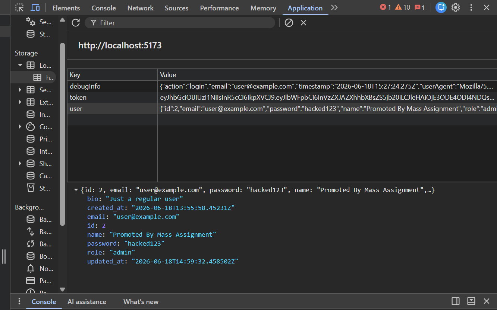
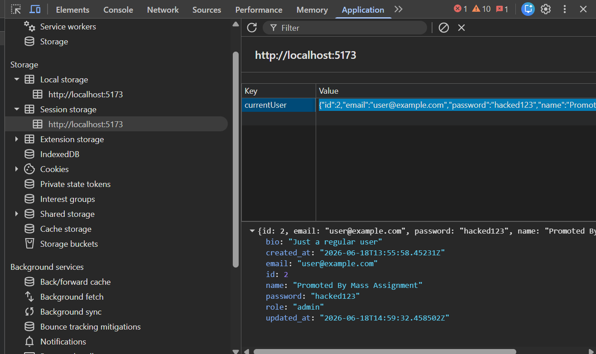
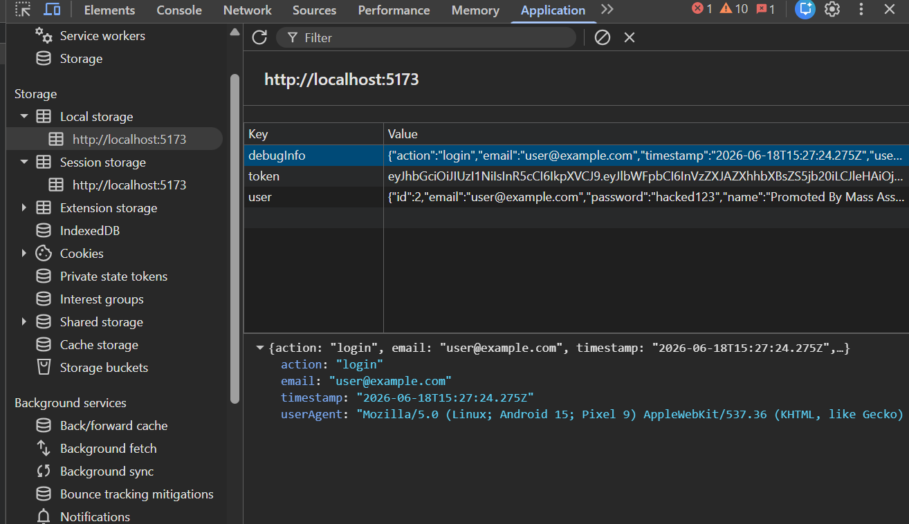
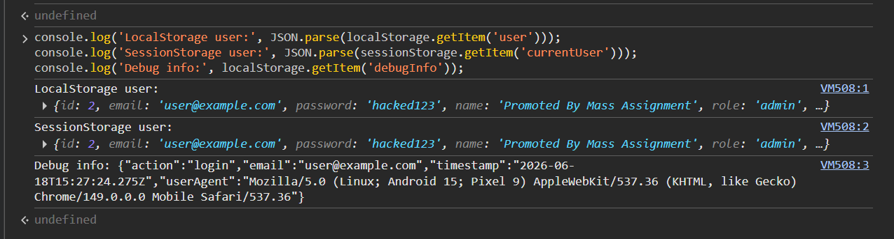
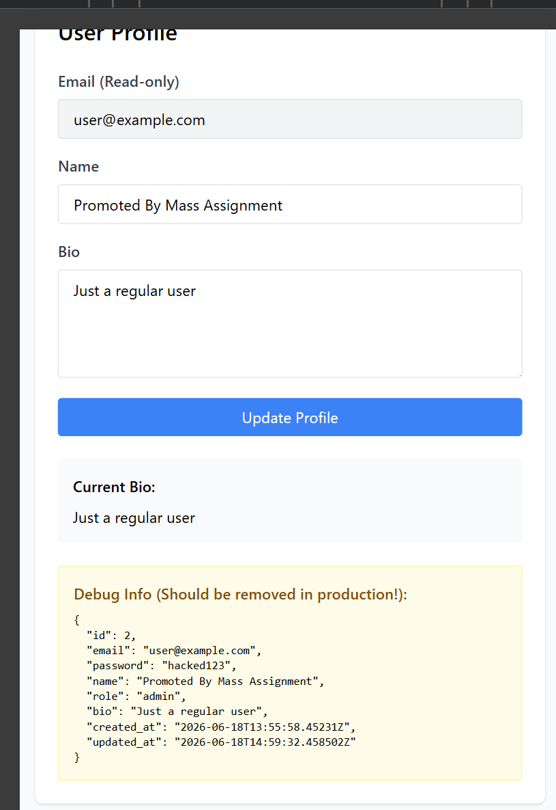
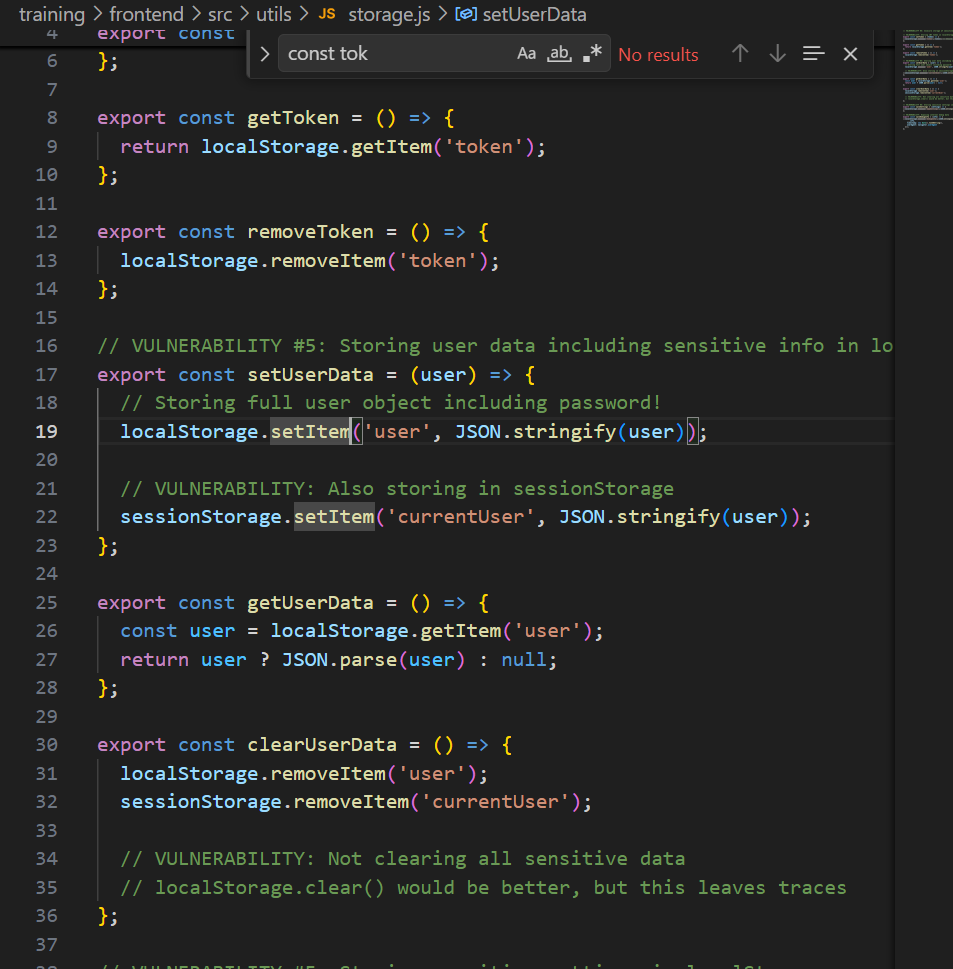

# Security Vulnerability Report

**Report Date**: 2026-06-15  
**Tester Name**: QA Tester  
**Project**: SecureTask Security Training

---

## Vulnerability #STORE-003: Sensitive User Data Stored in Browser Storage and Displayed in Debug UI

### Classification

- **Severity**: [ ] Critical [x] High [ ] Medium [ ] Low
- **Category**: [ ] SQL Injection [ ] XSS [ ] Authentication [ ] Authorization [x] Data Exposure [ ] Hardcoded Secrets [x] Other: Insecure Client Storage
- **Status**: [ ] Open [ ] In Progress [x] Fixed [x] Verified [ ] Won't Fix
- **CVSS Score**: 8.1 estimated

### Location

- **Component**: [x] Frontend [x] Backend [x] API [ ] Database
- **File Path**: `frontend/src/utils/storage.js`, `frontend/src/pages/Login.jsx`, `frontend/src/pages/Profile.jsx`
- **Line Numbers**: `frontend/src/utils/storage.js:16-47`, `frontend/src/pages/Login.jsx:22-30`, `frontend/src/pages/Profile.jsx:141-148`
- **Endpoint/URL**: Login flow, `/profile`

### Description

The frontend stores the full user object in localStorage and sessionStorage. Because backend responses include the password field, passwords can be stored in the browser. The Profile page also displays a debug JSON block containing the current user object.

### Reproduction Steps

1. Login to the application.
2. Open DevTools > Application.
3. Inspect Local Storage key `user`.
4. Inspect Session Storage key `currentUser`.
5. Navigate to Profile.
6. Observe the debug panel showing the user object.

### Expected Behavior

The browser should store only non-sensitive user display data. Passwords and sensitive debug information should not be stored or rendered.

### Actual Behavior

Full user objects are stored and displayed, including sensitive fields returned by the backend.

### Proof of Concept

```javascript
localStorage.getItem("user");
sessionStorage.getItem("currentUser");
```

**Screenshots/Evidence**:

- LocalStorage and sessionStorage show full user JSON.
  
- Profile page debug panel prints `JSON.stringify(user, null, 2)`.
  
  
  
  
  

### Impact

XSS or shared-device access can expose user details and passwords. Debug data also leaks internal structure to users.

**What an attacker could do**:

- [x] Read sensitive data
- [ ] Modify data
- [ ] Delete data
- [x] Steal user credentials
- [x] Impersonate users
- [ ] Execute arbitrary code
- [x] Other: harvest user metadata and debug information

**Affected Users/Data**:
Logged-in users and any sensitive fields returned in user objects.

### Risk Assessment

**Likelihood**: [x] High [ ] Medium [ ] Low  
**Impact**: [x] High [ ] Medium [ ] Low

**Justification**: The data is exposed in normal browser tools and is readable by injected scripts.

### Recommendation

Store only minimal non-sensitive display data. Remove debug panels and ensure backend responses do not include passwords.

**Suggested Actions**:

1. Remove password fields from backend responses.
2. Store only safe user fields such as ID, name, email, and role if needed.
3. Remove the Profile debug panel.
4. Clear all sensitive browser storage on logout.

### References

- OWASP HTML5 Security Cheat Sheet
- CWE-922: Insecure Storage of Sensitive Information
- CWE-200: Exposure of Sensitive Information

### Testing Notes

Retest after password serialization is fixed because this issue depends on backend response content.

### Retest Results (After Fix)

**Retest Date**: 2026-06-18  
**Status**: [x] Vulnerability Fixed [ ] Partially Fixed [ ] Not Fixed  
**Notes**: Build fixed: `utils/storage.js` hanya menyimpan `{id, name, role}` (tanpa password/token); `logout()` memanggil `localStorage.clear(); sessionStorage.clear()`. Build lama menyimpan objek user lengkap (+password) di localStorage & sessionStorage plus `debugInfo`. Ref: TC-STORE-003, `_evidence/README.md`. Catatan: screenshot DevTools disarankan sebagai konfirmasi runtime.
