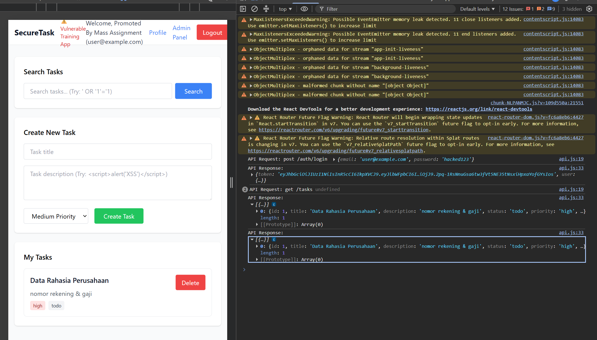
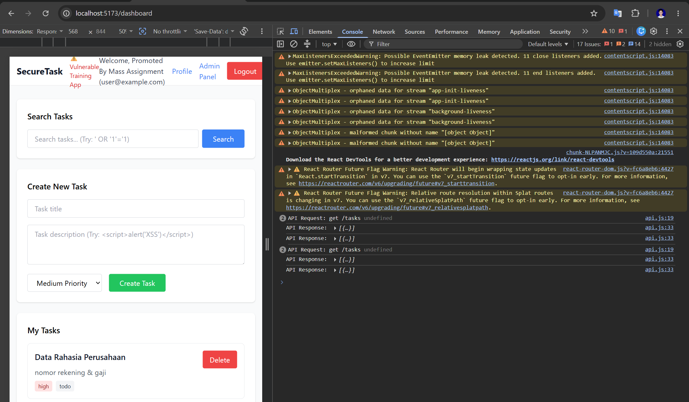
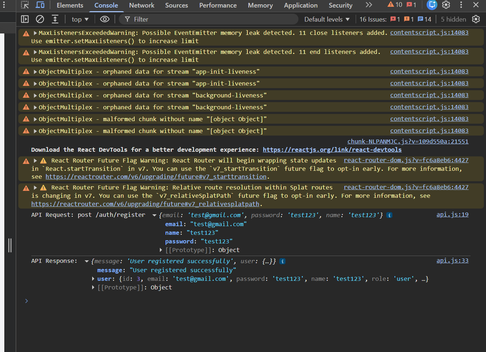
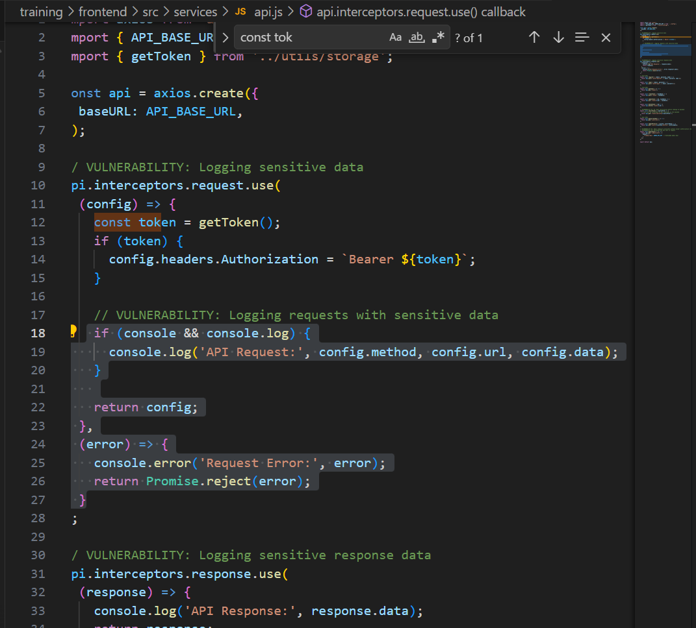

# Security Vulnerability Report

**Report Date**: 2026-06-15  
**Tester Name**: QA Tester  
**Project**: SecureTask Security Training

---

## Vulnerability #STORE-004: Sensitive API Data Logged to Browser Console

### Classification

- **Severity**: [ ] Critical [ ] High [x] Medium [ ] Low
- **Category**: [ ] SQL Injection [ ] XSS [ ] Authentication [ ] Authorization [x] Data Exposure [ ] Hardcoded Secrets [x] Other: Information Disclosure
- **Status**: [ ] Open [ ] In Progress [x] Fixed [x] Verified [ ] Won't Fix
- **CVSS Score**: 5.3 estimated

### Location

- **Component**: [x] Frontend [ ] Backend [x] API [ ] Database
- **File Path**: `frontend/src/services/api.js`, `frontend/src/pages/Login.jsx`, `frontend/src/pages/Register.jsx`
- **Line Numbers**: `frontend/src/services/api.js:17-34`, `frontend/src/pages/Login.jsx:36-38`, `frontend/src/pages/Register.jsx:38-40`
- **Endpoint/URL**: All frontend API calls

### Description

The Axios interceptors log request payloads and response data to the browser console. Login requests include credentials, and login/admin responses may include passwords or tokens.

### Reproduction Steps

1. Open browser DevTools Console.
2. Login to the application.
3. Observe logs for API requests and responses.
4. Navigate to Admin Panel or Profile.
5. Observe sensitive response data in the console.

### Expected Behavior

Sensitive request and response data should not be logged in production or normal training runs.

### Actual Behavior

The frontend logs API request data, response data, and detailed errors.

### Proof of Concept

```javascript
// Observe browser console during login and API calls.
```

**Screenshots/Evidence**:

- Console output showing login request or response data.
- Source review shows `console.log('API Request:', ...)` and `console.log('API Response:', response.data)`.

### Impact

Console logs can expose credentials, tokens, user records, and debugging


details to anyone with browser access or browser log collection.



**What an attacker could do**:

- [x] Read sensitive data
- [ ] Modify data
- [ ] Delete data
- [x] Steal user credentials
- [x] Impersonate users
- [ ] Execute arbitrary code
- [x] Other: learn internal API behavior

**Affected Users/Data**:
Users whose request or response data is logged.

### Risk Assessment

**Likelihood**: [x] High [ ] Medium [ ] Low  
**Impact**: [ ] High [x] Medium [ ] Low

**Justification**: The logs happen by default, but exploitation generally requires local browser access or an additional log collection path.

### Recommendation

Remove sensitive logging or guard it behind development-only checks that never log credentials, tokens, or passwords.

**Suggested Actions**:

1. Remove request and response body logging.
2. Use generic user-facing error messages.
3. Keep detailed diagnostics server-side with sensitive data redaction.

### References

- CWE-532: Insertion of Sensitive Information into Log File
- OWASP Logging Cheat Sheet

### Testing Notes

Retest with browser console open during login, registration, profile update, and admin access.

### Retest Results (After Fix)

**Retest Date**: 2026-06-18  
**Status**: [x] Vulnerability Fixed [ ] Partially Fixed [ ] Not Fixed  
**Notes**: Build fixed: `services/api.js` hanya log `method`+`url` (saat `NODE_ENV==='development'`) dan `error.response?.status`; tidak ada body/password/token. Build lama mencetak body request (`config.data`, termasuk password) & seluruh response body. Ref: TC-STORE-004, `_evidence/README.md`. Catatan: screenshot Console disarankan sebagai konfirmasi runtime.
