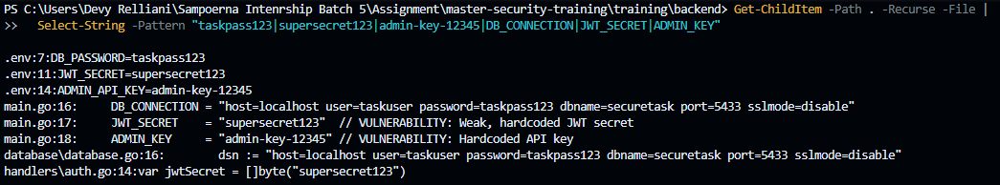
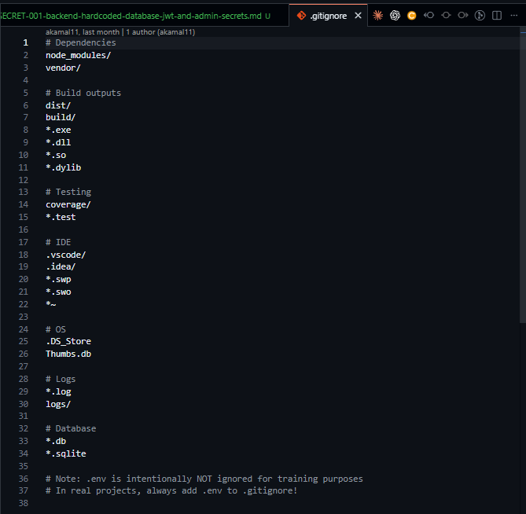

# Security Vulnerability Report

**Report Date**: 2026-06-15  
**Tester Name**: Devy Relliani | dsaffiya@PMINTL.NET
**Project**: SecureTask Security Training  

---

## Vulnerability #SECRET-001: Backend Contains Hardcoded Database, JWT, and Admin Secrets

### Classification
- **Severity**: [ ] Critical  [x] High  [ ] Medium  [ ] Low
- **Category**: [ ] SQL Injection  [ ] XSS  [ ] Authentication  [ ] Authorization  [x] Data Exposure  [x] Hardcoded Secrets  [ ] Other: _______
- **Status**: [x] Open  [ ] In Progress  [ ] Fixed  [ ] Verified  [ ] Won't Fix
- **CVSS Score**: 8.8 estimated

### Location
- **Component**: [ ] Frontend  [x] Backend  [x] API  [x] Database
- **File Path**: `backend/main.go`, `backend/database/database.go`, `backend/handlers/auth.go`, `backend/.env`, `.gitignore`
- **Line Numbers**: `backend/main.go:13-18`, `backend/database/database.go:13-19`, `backend/handlers/auth.go:13-14`, `backend/.env:1-14`, `.gitignore:24-25`
- **Endpoint/URL**: Not endpoint-specific

### Description
Sensitive backend configuration values are hardcoded in source files and `.env`. This includes the database connection string, database password, JWT signing secret, and admin API key. The `.gitignore` explicitly notes that `.env` is intentionally not ignored for training.

### Reproduction Steps
1. Search the backend source for known secret strings.
2. Review `backend/main.go`, `backend/database/database.go`, `backend/handlers/auth.go`, and `backend/.env`.
3. Confirm secrets are stored in committed project files.

### Expected Behavior
Secrets should be loaded from environment variables or a secure secret manager and should not be committed to source control.

### Actual Behavior
Secrets are visible directly in source and configuration files.

### Proof of Concept
```bash
rg -n "taskpass123|supersecret123|admin-key-12345|DB_CONNECTION|JWT_SECRET|ADMIN_KEY" backend .gitignore
```

**Screenshots/Evidence**:
1. Source search results showing hardcoded secret values.

2. `.gitignore` states `.env` is intentionally not ignored for training.


### Impact
Anyone with repository access can connect to the database, forge JWTs if the signing secret is used, or reuse exposed keys. Hardcoded secrets also make rotation difficult.

**What an attacker could do**:
- [x] Read sensitive data
- [x] Modify data
- [x] Delete data
- [x] Steal user credentials
- [x] Impersonate users
- [ ] Execute arbitrary code
- [x] Other: forge tokens or connect to services using leaked credentials

**Affected Users/Data**:
All application users and database records.

### Risk Assessment
**Likelihood**: [x] High  [ ] Medium  [ ] Low  
**Impact**: [x] High  [ ] Medium  [ ] Low  

**Justification**: Secrets are directly readable in source files and control authentication and database access.

### Recommendation
Move secrets to environment variables and remove committed `.env` files from real projects. Rotate all exposed values.

**Suggested Actions**:
1. Load database and JWT configuration from environment variables.
2. Provide `.env.example` with placeholder values only.
3. Add `.env` to `.gitignore` in non-training projects.
4. Rotate database passwords and JWT secrets after removal.

### References
- OWASP Top 10 A05: Security Misconfiguration
- CWE-798: Use of Hard-coded Credentials
- OWASP Secrets Management Cheat Sheet

### Testing Notes
This is intentional for training but should be rated as high in a real system.

### Retest Results (After Fix)
**Retest Date**: Not started  
**Status**: [ ] Vulnerability Fixed  [ ] Partially Fixed  [x] Not Fixed  
**Notes**: Retest with source search and environment-based startup.
