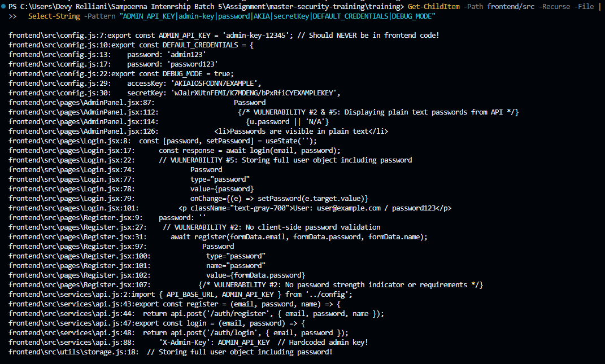
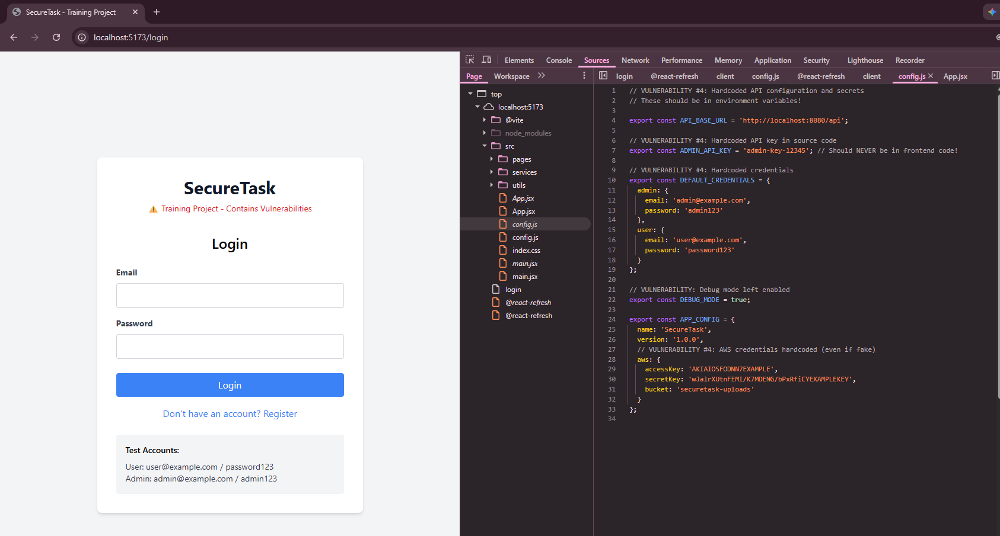

# Security Vulnerability Report

**Report Date**: 2026-06-15  
**Tester Name**: Devy Relliani | dsaffiya@PMINTL.NET
**Project**: SecureTask Security Training  

---

## Vulnerability #SECRET-002: Frontend Exposes Hardcoded API Keys, Default Credentials, and Cloud-Like Secrets

### Classification
- **Severity**: [ ] Critical  [x] High  [ ] Medium  [ ] Low
- **Category**: [ ] SQL Injection  [ ] XSS  [ ] Authentication  [ ] Authorization  [x] Data Exposure  [x] Hardcoded Secrets  [ ] Other: _______
- **Status**: [x] Open  [ ] In Progress  [ ] Fixed  [ ] Verified  [ ] Won't Fix
- **CVSS Score**: 8.1 estimated

### Location
- **Component**: [x] Frontend  [ ] Backend  [x] API  [ ] Database
- **File Path**: `frontend/src/config.js`, `frontend/src/services/api.js`, `frontend/src/pages/Login.jsx`
- **Line Numbers**: `frontend/src/config.js:1-33`, `frontend/src/services/api.js:1-4,83-90`, `frontend/src/pages/Login.jsx:99-103`
- **Endpoint/URL**: Browser bundle and login page

### Description
The frontend contains hardcoded API configuration, an admin API key, default user credentials, debug mode, and AWS-like access keys. Frontend code is delivered to every browser, so these values are public.

### Reproduction Steps
1. Open the frontend source or browser DevTools Sources tab.
2. Search for `ADMIN_API_KEY`, `admin-key`, `password`, or `AKIA`.
3. Observe hardcoded keys and credentials in frontend code.
4. Login page also displays default user credentials.

### Expected Behavior
The frontend should not contain secrets. Public configuration may be included, but credentials, API keys, and cloud secrets must not be shipped to browsers.

### Actual Behavior
Secrets and credential-like values are visible in frontend source and bundled output.

### Proof of Concept
```bash
rg -n "ADMIN_API_KEY|admin-key|password|AKIA|secretKey|DEFAULT_CREDENTIALS|DEBUG_MODE" frontend/src
```

**Screenshots/Evidence**:
1. `frontend/src/config.js` contains hardcoded values.

2. Browser DevTools Sources can reveal bundled frontend configuration.


### Impact
Attackers can collect keys and credentials from the public browser bundle. If any values are real or reused, they could be used to access services or administrative functions.

**What an attacker could do**:
- [x] Read sensitive data
- [ ] Modify data
- [ ] Delete data
- [x] Steal user credentials
- [x] Impersonate users
- [ ] Execute arbitrary code
- [x] Other: reuse exposed API or cloud credentials

**Affected Users/Data**:
Application users and any services represented by exposed keys.

### Risk Assessment
**Likelihood**: [x] High  [ ] Medium  [ ] Low  
**Impact**: [x] High  [ ] Medium  [ ] Low  

**Justification**: Frontend secrets are exposed to all users by design. The impact depends on whether the values are real or reused.

### Recommendation
Remove secrets from frontend code. Use backend-controlled secrets and environment-specific public configuration only.

**Suggested Actions**:
1. Remove hardcoded admin keys and cloud credentials from frontend code.
2. Move sensitive operations behind authenticated backend endpoints.
3. Use `import.meta.env.VITE_*` only for non-sensitive public configuration.
4. Remove default password display from production-like UI.

### References
- CWE-798: Use of Hard-coded Credentials
- OWASP Secrets Management Cheat Sheet
- Vite environment variables documentation

### Testing Notes
Even fake credentials should be removed or clearly isolated because they normalize unsafe patterns.

### Retest Results (After Fix)
**Retest Date**: Not started  
**Status**: [ ] Vulnerability Fixed  [ ] Partially Fixed  [x] Not Fixed  
**Notes**: Retest by searching source and built assets.
