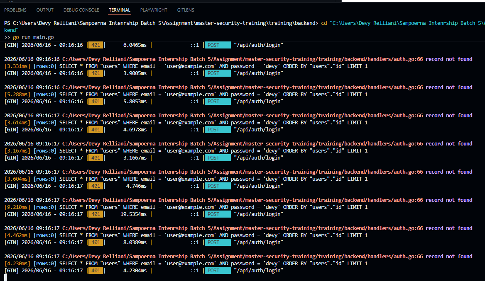
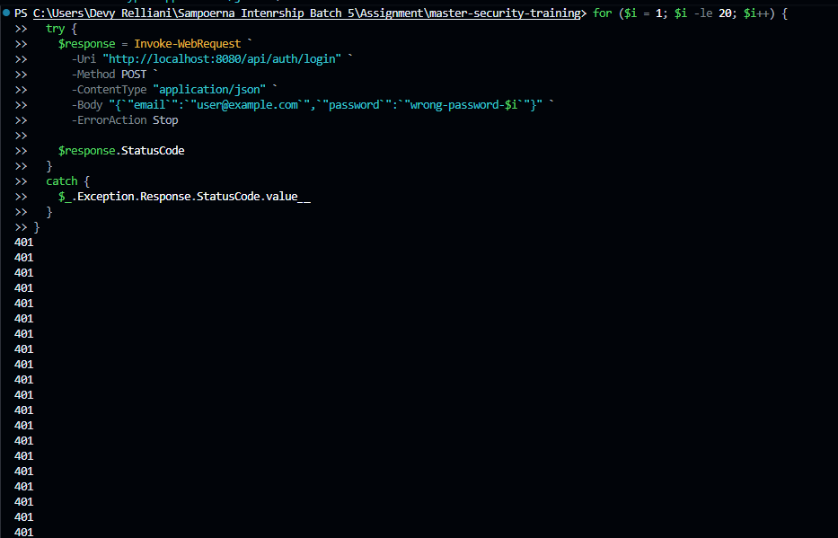

# Security Vulnerability Report

**Report Date**: 2026-06-15  
**Tester Name**: Devy Relliani | dsaffiya@PMINTL.NET
**Project**: SecureTask Security Training  

---

## Vulnerability #BF-001: Login Endpoint Has No Brute Force Protection

### Classification
- **Severity**: [ ] Critical  [ ] High  [x] Medium  [ ] Low
- **Category**: [ ] SQL Injection  [ ] XSS  [x] Authentication  [ ] Authorization  [ ] Data Exposure  [ ] Hardcoded Secrets  [x] Other: Brute Force
- **Status**: [x] Open  [ ] In Progress  [ ] Fixed  [ ] Verified  [ ] Won't Fix
- **CVSS Score**: 6.5 estimated

### Location
- **Component**: [ ] Frontend  [x] Backend  [x] API  [ ] Database
- **File Path**: `backend/handlers/auth.go`, `backend/main.go`
- **Line Numbers**: `backend/handlers/auth.go:55-90`, `backend/main.go:47-48`
- **Endpoint/URL**: `POST /api/auth/login`

### Description
The login endpoint does not implement rate limiting, account lockout, IP throttling, or other brute force controls. Attackers can repeatedly attempt passwords without delay or blocking.

### Reproduction Steps
1. Start the backend.
2. Send multiple login attempts with a valid email and incorrect password.
3. Observe that each request is processed normally.
4. Confirm there is no lockout, delay, or rate-limit response.

### Expected Behavior
Repeated failed login attempts should trigger throttling, temporary lockout, or another defensive control.

### Actual Behavior
The API responds to unlimited failed login attempts with no rate limiting.

### Proof of Concept
```bash
for i in {1..20}; do
  curl -s -o /dev/null -w "%{http_code}\n" \
    -X POST "http://localhost:8080/api/auth/login" \
    -H "Content-Type: application/json" \
    -d "{\"email\":\"user@example.com\",\"password\":\"wrong-password-$i\"}"
done
```

**Screenshots/Evidence**:
1. Repeated requests continue to receive normal authentication failure responses.

2. Source review shows no rate limiting middleware or failed login tracking. [^1]


[^1]: The login endpoint allows repeated failed login attempts without rate limiting.

### Impact
Attackers can automate password guessing. The risk is increased because the application uses known/default credentials and has weak password requirements.

**What an attacker could do**:
- [ ] Read sensitive data
- [ ] Modify data
- [ ] Delete data
- [x] Steal user credentials
- [x] Impersonate users
- [ ] Execute arbitrary code
- [x] Other: credential stuffing and password guessing

**Affected Users/Data**:
All user accounts, especially accounts with weak or reused passwords.

### Risk Assessment
**Likelihood**: [x] High  [ ] Medium  [ ] Low  
**Impact**: [ ] High  [x] Medium  [ ] Low  

**Justification**: The endpoint is public and easy to automate. Impact depends on password strength and monitoring.

### Recommendation
Add brute-force protection to the login endpoint. The developer fix list confirms password requirements were improved, but it does not show a completed rate-limiting or account-lockout fix, so this recommendation remains open until repeated failed login attempts are throttled.

**Suggested Actions**:
1. Rate limit login attempts by IP and account identifier.
2. Add temporary lockout or progressive delay after repeated failures.
3. Monitor failed login attempts.
4. Return generic authentication errors that do not reveal whether the email exists.
5. Keep automated and manual regression tests for repeated failed login attempts.

### References
- OWASP Authentication Cheat Sheet
- CWE-307: Improper Restriction of Excessive Authentication Attempts

### Testing Notes
Run brute force tests only against the local training environment.

### Retest Results (After Fix)
**Retest Date**: Not started  
**Status**: [ ] Vulnerability Fixed  [ ] Partially Fixed  [x] Not Fixed  
**Notes**: Retest repeated failed login attempts after rate limiting is added.
