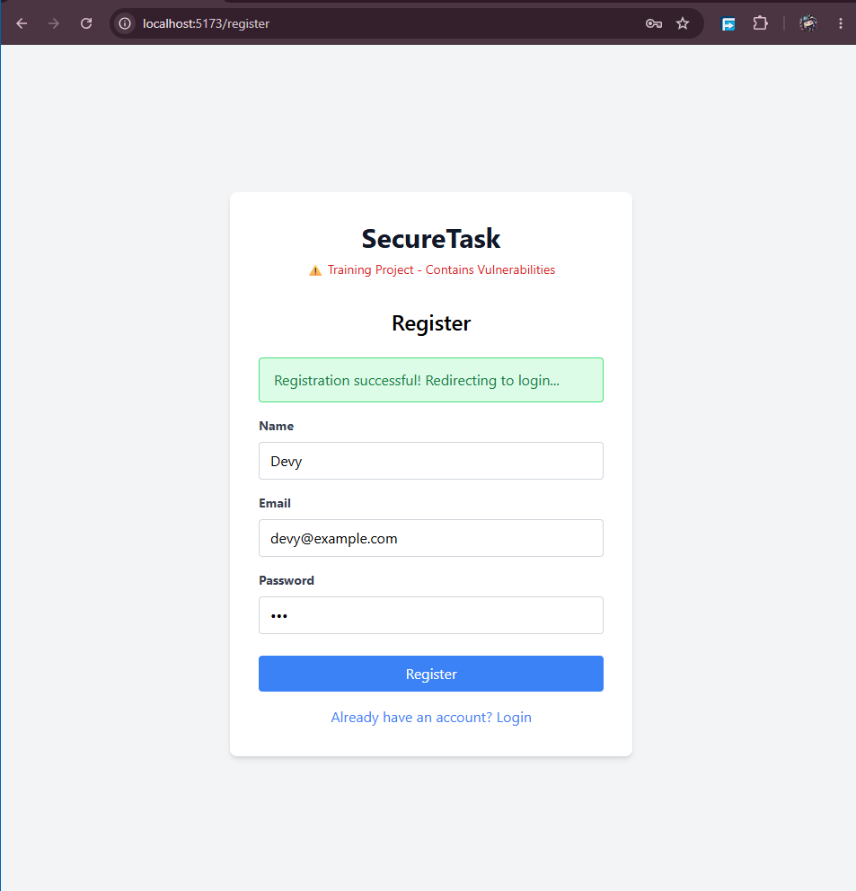
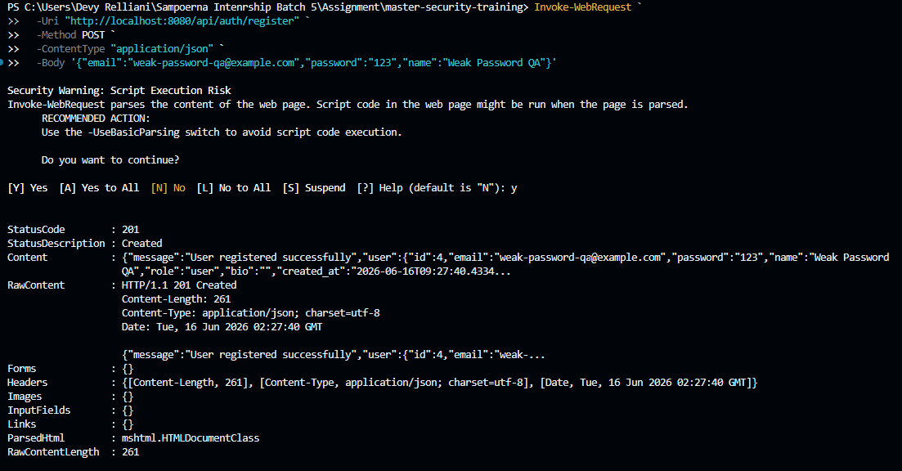

# Security Vulnerability Report

**Report Date**: 2026-06-15  
**Tester Name**: Devy Relliani | dsaffiya@PMINTL.NET
**Project**: SecureTask Security Training  

---

## Vulnerability #BF-002: Weak Password Policy During Registration

### Classification
- **Severity**: [ ] Critical  [ ] High  [x] Medium  [ ] Low
- **Category**: [ ] SQL Injection  [ ] XSS  [x] Authentication  [ ] Authorization  [ ] Data Exposure  [ ] Hardcoded Secrets  [x] Other: Weak Password Requirements
- **Status**: [x] Open  [ ] In Progress  [ ] Fixed  [ ] Verified  [ ] Won't Fix
- **CVSS Score**: 6.5 estimated

### Location
- **Component**: [x] Frontend  [x] Backend  [x] API  [ ] Database
- **File Path**: `backend/handlers/auth.go`, `frontend/src/pages/Register.jsx`
- **Line Numbers**: `backend/handlers/auth.go:17-44`, `frontend/src/pages/Register.jsx:27-33,99-108`
- **Endpoint/URL**: `POST /api/auth/register`, `/register`

### Description
The registration flow requires a password field but does not enforce minimum length, complexity, or known-weak password checks. The frontend also has no password requirement guidance.

### Reproduction Steps
1. Open the Register page.
2. Submit a new account with a short password such as `123`.
3. Observe whether registration succeeds.
4. If the email already exists, use a new email address.

### Expected Behavior
The application should reject weak passwords and return a clear validation message.

### Actual Behavior
The backend only requires the password field to be present.

### Proof of Concept
```bash
curl -i -X POST "http://localhost:8080/api/auth/register" \
  -H "Content-Type: application/json" \
  -d "{\"email\":\"weak-password-qa@example.com\",\"password\":\"123\",\"name\":\"Weak Password QA\"}"
```

**Screenshots/Evidence**:
1. Registration request with weak password succeeds.

2. Source review shows `binding:"required"` only for password.


### Impact
Weak passwords increase the likelihood of account takeover through brute force or credential guessing.

**What an attacker could do**:
- [ ] Read sensitive data
- [ ] Modify data
- [ ] Delete data
- [x] Steal user credentials
- [x] Impersonate users
- [ ] Execute arbitrary code
- [x] Other: guess weak account passwords

**Affected Users/Data**:
All accounts created with weak passwords.

### Risk Assessment
**Likelihood**: [x] High  [ ] Medium  [ ] Low  
**Impact**: [ ] High  [x] Medium  [ ] Low  

**Justification**: Weak passwords are easy to create and the login endpoint has no brute force protection.

### Recommendation
Enforce password length and quality requirements server-side, with matching frontend guidance. This aligns with the developer fixes that added backend minimum length and letter/number checks, plus frontend password-strength feedback and submit blocking for weak passwords.

**Suggested Actions**:
1. Keep backend validation as the final authority for password acceptance.
2. Keep frontend password guidance consistent with backend rules.
3. Reject short passwords and passwords without both letters and numbers.
4. Consider rejecting common or known-compromised passwords where practical.
5. Retest short, common, numeric-only, letter-only, and valid strong passwords.

### References
- OWASP Authentication Cheat Sheet
- NIST Digital Identity Guidelines, password guidance

### Testing Notes
Use unique test emails when retesting registration.

### Retest Results (After Fix)
**Retest Date**: 2026-06-19  
**Status**: [x] Vulnerability Fixed [ ] Partially Fixed [ ] Not Fixed  
**Notes**: Verified on the fixed build (`:8080`): `POST /api/auth/register` enforces a server-side password policy (`binding:"required,min=8,max=72"` plus `isStrongPassword`, requiring at least one letter and one digit). Weak passwords (e.g. `123`) are rejected with HTTP `400`; valid strong passwords are accepted. Confirmed by automated suite `qa/automation` (feature `brute-force.feature`, weak-password scenario).
